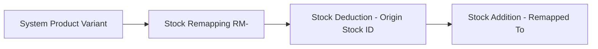
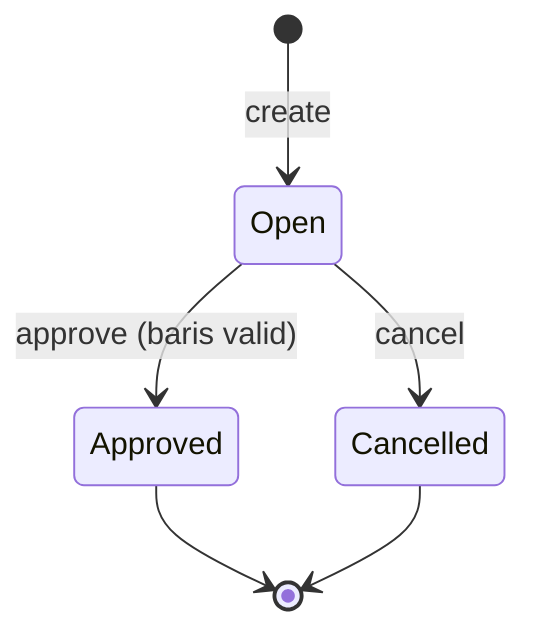

# Stock Remapping — Requirement Documentation

**Modul:** Finance Accounting (FA) — mutasi stok memakai entitas Supply Chain  
**UI route:** `/accounting/stock-remapping`  
**API base:** `{VITE_API_URL}accounting/stock-remapping`  
**Audience:** PM, Operations (Finance), QA, Support, Developer  
**PM source:** Change card 2026-08-04 (revisi SoT v2.0) — Remapped To boleh duplicate; Origin per Stock ID; Unit Class preventive; **eligibilitas tetap 1 parent** (perluasan lintas parent **dibatalkan**)

---

## 0. Metadata & Changelog

| Version | Date | Author | Changes |
|---------|------|--------|---------|
| 2.1 | 2026-08-04 | QA - Yemima | Revisi scope: **batalkan** lintas parent + Identification Icon; eligibilitas tetap Variant 1 parent; duplicate Remapped To; Origin per Stock ID; Unit Base + Avl. Base Unit; Unit Class gate (inline/import/**approve**); import tanpa kolom Unit (qty Base Unit) + auto-split FIFO; Gap Registry di-sync |
| 2.0 | 2026-07-30 | QA - Yemima | SoT v2.0 awal (lintas parent) — **superseded** oleh v2.1 |
| 1.0 | 2026-07-09 | QA - Yemima | Initial QA doc |

---

## 1. Ringkasan Eksekutif

**Stock Remapping** (prefix **`RM-`**) meremap identitas stok dari **SKU Origin** ke **SKU Remapped To**. Saat approve, sistem generate **Stock Deduction** lalu **Stock Addition**.


```mermaid
flowchart LR
    SP[System Product Variant] --> RM[Stock Remapping RM-]
    RM --> SD[Stock Deduction - Origin Stock ID]
    SD --> SA[Stock Addition - Remapped To]
```

**Inti perubahan v2.1 (vs AS-IS live):**

| Tetap | Berubah |
|-------|---------|
| Remapped To = **Variant dalam 1 parent** yang sama dengan Origin | Duplicate Remapped To antar baris **diizinkan** |
| | Origin dipilih **per Stock ID** (bukan agregat FIFO) |
| | Unit **read-only Base Unit** + kolom **Avl. Base Unit** |
| | Unit Price **1:1** dari Stock ID (tanpa averaging) |
| | Validasi **Unit Class** Origin = Remapped To di inline, import, **dan approve** |
| | Import: **tanpa kolom Unit**; qty = Base Unit; auto-split FIFO per Stock ID |

**Dibatalkan dari draft SoT v2.0:** perluasan Remapped To ke Single/BOM/Bundle; kolom Identification Icon (warning lintas parent).

---

## 2. Status implementasi (AS-IS vs TO-BE v2.1)

| Area | Target v2.1 | Codebase AS-IS (2026-08-04) | Gap |
|------|-------------|----------------------------|-----|
| Eligibilitas Remapped To = Variant 1 parent | Tetap | **Sudah** block same-parent | — |
| Duplicate Remapped To antar baris | Diizinkan | Masih ditolak | GAP-RM-06 |
| Origin per Stock ID + Unit Price 1:1 | Wajib | Modal agregat `product+WH`; detail tanpa `item_stock_id`; price blended FIFO | GAP-RM-07 |
| Unit read-only Base + Avl. Base Unit | Wajib | Unit masih Primary/Alternate | GAP-RM-08 |
| Unit Class match (inline / import / **approve**) | Block total | Belum ada | GAP-RM-05 |
| Import tanpa Unit + auto-split FIFO | Wajib | Template masih ada Unit; 1 baris = 1 detail | GAP-RM-07 |
| Identification Icon / lintas parent | **Out of scope** | Tidak ada (OK) | — (cancelled) |
| Release reserved per Stock ID | Ikut model Stock ID | Perlu pastikan | GAP-RM-03 |

Header lifecycle, prefix `RM-`, sequencing Deduction→Addition, blok Random/Service/Asset: sudah live.

---

## 3. Penempatan modul

| Aspek | Keputusan |
|-------|-----------|
| Modul | Finance Accounting |
| Alasan | Detail menampilkan Unit Price / nilai persediaan |
| Operator gudang murni | Tidak punya menu ini |
| Permission | `StockRemappingPolicy` |

---

## 4. Prasyarat

| Prasyarat | Sumber | Catatan |
|-----------|--------|---------|
| System Product Active (Variant) | System Product | Origin & Remapped To |
| Unit Class & Base Unit | Master Unit | Preventive: Origin ↔ Remapped To harus sama Unit Class (jaga broken master) |
| Warehouse Origin Active | Warehouse Structure | Sama exclusion outbound |
| Product COA Group | Product COA Group | Purchased / Manufactured saja |
| Stock tersedia per Stock ID | Item Stock | Availability & Unit Price per batch |

> BOM/Bundle **bukan** sumber eligibilitas Remapped To di v2.1.

---

## 5. Siklus status


```mermaid
stateDiagram-v2
    [*] --> Open: create
    Open --> Approved: approve (baris valid)
    Open --> Cancelled: cancel
    Approved --> [*]
    Cancelled --> [*]
```

| Status | Editable detail? | Catatan |
|--------|------------------|---------|
| Open | Ya | Draft baris |
| Approved | Tidak | Mutasi sudah generate |
| Cancelled | Tidak | |

---

## 6. Header & datalist

(Tidak berubah dari perilaku live: warehouse origin, transaction date, code `RM-`, status, export, dll. — lihat technical.)

---

## 7. Detail baris (TO-BE v2.1)

| # | Field | Wajib | Editable | Sumber | Catatan |
|---|-------|-------|----------|--------|---------|
| 1 | SKU Origin (Stock ID) | Ya | Via modal Available Product | Item Stock **per Stock ID** | Bukan agregat SKU |
| 2 | Remapped To | Ya | Ya | Variant **same parent** saja | **Boleh duplicate** antar baris |
| 3 | Unit | — | **Read-only** | Base Unit Origin | Selalu Base Unit |
| 4 | Availability | — | — | Qty Stock ID (satuan tampilan Availability) | |
| 5 | Avl. Base Unit | — | — | Availability × conversion → Base | Batas max qty |
| 6 | Qty | Ya | Ya | Input user | **Wajib Base Unit**; ≤ Avl. Base Unit |
| 7 | Unit Price | — | Tidak | Dari Stock ID terpilih | **Tanpa averaging** |
| 8 | Description | Tidak | Ya | — | Max 150 |

**Tidak ada** kolom Identification Icon.

### 7.1 Eligibilitas Remapped To

Hanya **Variant** dengan `parent_id` sama dengan SKU Origin.

| Tidak eligible | Alasan |
|----------------|--------|
| Single / Detail BOM / Header BOM / Detail Bundle / Bundle Header | Out of scope v2.1 |
| Random SKU, inactive, Parent SKU, COA Service/Asset | Tetap diblok seperti AS-IS |
| Self-remap (Origin = Remapped To) | Ditolak |

### 7.2 Origin per Stock ID

Modal **Available Product** (Single Use & Bulk Use) di menu ini menampilkan **satu baris per Stock ID** (bukan agregat `product_id + warehouse`).

> **Dev note (wajib):** modal/endpoint Available Product **Stock Remapping sengaja berbeda** dari Transfer / Picking List / Inventory Other. Jangan samakan ke pola agregat menu lain. Breakdown Stock ID harus ter-deliver di FE + BE menu ini.

Unit Price detail = harga Stock ID yang dipilih (1:1).

### 7.3 Unit Base + Avl. Base Unit

```
Primary Unit Origin = BOX (1 BOX = 10 PCS)
Stock ID Availability = 100 BOX
Unit (read-only) = PCS
Avl. Base Unit = 1.000
Qty input = 1.000 (PCS)
```

### 7.4 Duplicate Remapped To

```
Baris 1: Origin Stock ID A → Remapped To SKU-X, qty 100
Baris 2: Origin Stock ID B → Remapped To SKU-X, qty 50
→ Diizinkan → 2 Stock Addition terpisah untuk SKU-X
```

### 7.5 Unit Class (preventive)

Dalam 1 parent, Unit Class biasanya sama. Validasi tetap **wajib** di 3 titik sebagai first line of defense jika master System Product punya **broken unit data** yang baru ketahuan di transaksi:

1. Inline create/update detail  
2. Import  
3. **Approve** (gate akhir — data tidak boleh lolos broken)

Mismatch → **block total** (bukan warning).

---

## 8. Validasi

### 8.1 AS-IS yang tetap

| # | Kondisi | Behavior |
|---|---------|----------|
| 1 | Origin = Remapped To | Ditolak |
| 2 | Random / inactive / Parent / COA invalid | Ditolak |
| 3 | Remapped To beda parent | Ditolak (`does not belong to the same parent…`) |
| 4 | Qty ≤ 0 / melebihi availability | Ditolak |

### 8.2 Perubahan / tambahan v2.1

| # | Kondisi | AS-IS | TO-BE v2.1 |
|---|---------|-------|------------|
| A | Remapped To sudah dipakai baris lain | Ditolak | **Diizinkan** |
| B | Unit Class Origin ≠ Remapped To | Tidak dicek | **Ditolak** di inline, import, approve |
| C | Unit bukan Base Unit | Boleh Primary/Alternate | **Dipaksa Base Unit** |
| D | Origin tanpa Stock ID spesifik | Agregat FIFO | **Wajib Stock ID** (kecuali jalur import yang auto-split) |

### 8.3 Approve (gate akhir)

Sebelum generate Deduction/Addition, server **wajib** re-validate seluruh baris Open:

- Same parent  
- Unit Class match  
- Qty vs availability Stock ID (atau reserved yang valid)  
- Origin/Remapped To masih eligible (active, bukan random, COA OK)  

Satu baris gagal → approve gagal dengan pesan jelas (tidak partial-approve silent broken).

---

## 9. Import (TO-BE v2.1)

| Aspek | Target |
|-------|--------|
| Kolom input user | **SKU Origin**, **Remapped To SKU**, **Qty** (+ Description opsional jika masih dipertahankan template). **Tanpa kolom Unit** — qty selalu Base Unit |
| Stock ID di file | **Tidak ada** |
| Auto-split | 1 baris file qty besar → N baris detail per Stock ID urutan **FIFO** |
| Duplicate Remapped To | Diizinkan antar baris hasil split / antar baris file |
| Unit Class / same parent | Validasi sama inline |

> AS-IS template masih 5 kolom termasuk Unit — harus diubah (GAP-RM-07).

---

## 10. Relasi menu

| Menu | Peran |
|------|-------|
| System Product | Parent/variant + unit master |
| Master Unit | Unit Class / Base Unit |
| Adjustment Inbound / Deduction | Dokumen auto-generated |
| Warehouse Structure | Origin WH |
| Product COA Group | Filter tipe item |

---

## 11. Acceptance Criteria

| ID | Kriteria |
|----|----------|
| SRM-01 | Duplicate Remapped To antar baris diizinkan |
| SRM-02 | Opsi Remapped To hanya Variant same parent — bukan Single/BOM/Bundle |
| SRM-03 | Origin via modal per Stock ID; Unit Price 1:1 tanpa averaging |
| SRM-04 | Unit read-only Base Unit; Avl. Base Unit = Availability × conversion |
| SRM-05 | Unit Class mismatch ditolak di inline, import, **dan approve** |
| SRM-06 | Import tanpa Unit; auto-split FIFO; tanpa kolom Stock ID di file |
| SRM-07 | Tidak ada Identification Icon / warning lintas parent |
| SRM-08 | Modal Available Product Stock Remapping breakdown Stock ID (bukan copy agregat menu Transfer/Picking) |

---

## 12. Gap Registry

| ID | Deskripsi | Status |
|----|-----------|--------|
| GAP-RM-03 | Release reserved harus benar per Stock ID setelah model detail berubah | Open |
| GAP-RM-05 | Validasi Unit Class di inline / import / approve belum ada | Open (TO-BE) |
| GAP-RM-06 | Duplicate Remapped To masih diblok | Open (TO-BE) |
| GAP-RM-07 | Stock ID selection, Unit Price 1:1, import tanpa Unit + auto-split | Open (TO-BE) |
| GAP-RM-08 | Unit Base read-only + Avl. Base Unit | Open (TO-BE) |
| GAP-RM-01 | Bundle Header eligibility | **Cancelled** — lintas parent out of scope |
| GAP-RM-02 | COA restriction kategori baru | **Cancelled** |
| GAP-RM-04 | Lintas parent + Identification Icon | **Cancelled** |

---

## 13. FAQ

**Q: Bisa remap ke SKU Single / BOM / Bundle?**  
A: Tidak. Scope v2.1 tetap Variant satu parent.

**Q: Kenapa tetap cek Unit Class kalau 1 parent biasanya sama?**  
A: Jaga-jaga broken data unit di master System Product yang baru kelihatan saat transaksi.

**Q: Kenapa modal Available Product beda dari Transfer?**  
A: Remapping butuh Unit Price & qty per **Stock ID**; menu lain boleh agregat.

---

## Related Documents

| Doc | Path |
|-----|------|
| Knowledge Base | [knowledge-base.md](./knowledge-base.md) |
| Technical | [technical.md](./technical.md) |
| User Guide | [user-guide.md](./user-guide.md) |
