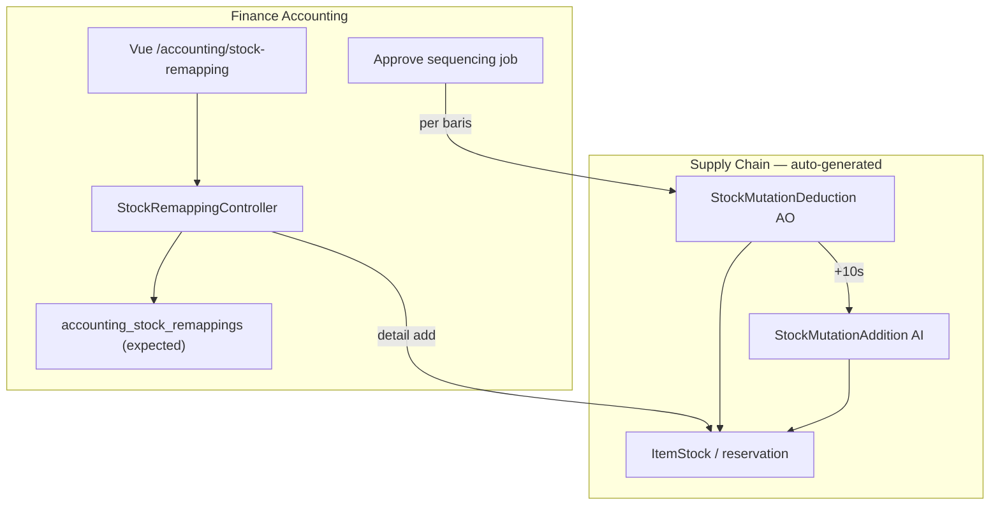

# Stock Remapping — Technical Documentation

> **Status:** TO-BE — fitur belum ada di codebase per 2026-07-09. Dokumen ini memetakan arsitektur expected + titik integrasi SCM.

**Stack (expected):** Laravel 13 · Horizon · Vue 3 · MariaDB  
**Module utama:** Accounting (FA) · cross-read/write SupplyChain

---

## 0. Metadata & Changelog

| Version | Date | Author | Changes |
|---------|------|--------|---------|
| 1.0 | 2026-07-09 | QA - Yemima | Initial TO-BE technical dari PM v1.1 |

---

## 1. Architecture Overview



**Prinsip:** UI & API utama di **Accounting**; mutasi stok memakai entity SCM existing.

---

## 2. Routes & API (TO-BE)

### 2.1 Frontend (expected)

| Item | Path |
|------|------|
| Route | `/accounting/stock-remapping` |
| Menu seeder | `AccountingMenuSeeder` — grup FA, **bukan** SCM |
| Policy | `StockRemappingPolicy` (expected) — `viewAny` scoped FA |

### 2.2 Backend API (expected)

| Method | Path | Notes |
|--------|------|-------|
| GET | `/stock-remapping` | Datalist |
| POST | `/stock-remapping` | Create header (autosave) |
| PUT | `/stock-remapping/{id}` | Update header |
| DELETE | `/stock-remapping/{id}` | Soft delete + release reserved `[VERIFY]` |
| CRUD | `/stock-remapping/{id}/detail` | Remapping lines |
| POST | `/stock-remapping/{id}/approve` | Trigger sequencing job |
| POST | `/stock-remapping/{id}/detail/upload` | Import |
| GET | `/stock-remapping/export-*` | Export `[VERIFY]` |

**Prefix route:** `accounting/stock-remapping` — mirror pola `accounting/opening-stock`, `accounting/product-benchmark-price`.

---

## 3. Database (expected / VERIFY)

| Entity | Notes |
|--------|-------|
| Header | Code `RM-*`, `warehouse_origin`, `transaction_date`, `transaction_status`, `trx_ref`, `description` |
| Detail | `product_id_origin`, `product_id_remapped_to`, qty, unit, `unit_price` (snapshot read-only), `description` |
| Link to SCM | `transaction_reference_id/class` pada `scm_stock_mutations` → parent Stock Remapping |

`[VERIFY: CODEBASE]` — nama tabel & kolom final saat implementasi.

---

## 4. Integrasi SCM

### 4.1 Stock Deduction auto-generated

| Field | Value |
|-------|-------|
| Class | `StockMutationDeduction` |
| Code prefix | `AO` |
| `is_inventory_adjustment` | `1` |
| `transaction_reference_*` | → Stock Remapping header |
| Approve | Auto — tidak lewat UI SCM manual |

**File referensi existing:** `StockMutationDeductionController`, `Accounting\StockMutationDeductionController@approve`

### 4.2 Stock Addition auto-generated

| Field | Value |
|-------|-------|
| Class | `StockMutationAddition` |
| Code prefix | `AI` |
| `transaction_date` | RM trx date **+ 10 detik** per baris |
| `each_price_before_vat` | = unit price dari stock ID origin |

**File referensi existing:** `StockMutationAdditionDetailController`, `InboundValueAdjustmentController`

### 4.3 Sequencing service (expected)

```
foreach (detail rows ordered) {
    approve Deduction(origin)
    wait until Deduction approved
    approve Addition(remapped_to)
}
```

`[VERIFY: CODEBASE]` — queue job vs synchronous; rollback policy P-SRM-05.

### 4.4 Stock reservation

Saat detail create/update:

- Kurangi `available`, tambah `reserved` pada `ItemStock` SKU origin
- `[VERIFY]` — apakah pakai field existing `reserved` atau tabel hold terpisah

Saat detail delete / header delete:

- Release reserved — P-SRM-04

---

## 5. Unit Price resolution (VERIFY)

Expected flow:

1. Resolve stock ID(s) untuk SKU origin di warehouse origin (FIFO konsisten Outbound/Deduction)
2. Ambil `each_price_before_vat` / stock value
3. Snapshot ke baris detail Stock Remapping (read-only)
4. Pass nilai sama ke Outbound detail (deduction) & Inbound detail (addition)

Cross-ref: pola `StockMutationDeductionDetailController`, `RealStockController` availability.

---

## 6. Import (expected)

| Item | Detail |
|------|--------|
| Class | `StockRemappingDetailImport` + Job (pola Opname/Addition) |
| Template | 5 kolom — tanpa unit price |
| Processing | Sequential rows — akumulasi quota |
| Error log | `StockRemappingDetailImportLog` (expected) |
| File retention | 1 hari — scheduled cleanup `[VERIFY]` |

---

## 7. Permission & visibility

| Layer | Rule |
|-------|------|
| Menu gate | FA module only — `AccountingMenuSeeder` |
| Policy | `StockRemappingPolicy` — separate dari SCM adjustment policies |
| FE columns | `unit_price`, `total_amount` — render hanya jika policy allows |
| SCM turunan | AO/AI dari Stock Remapping — `[VERIFY]` hide amount columns untuk role SCM di datalist SCM |

---

## 8. Cross-References

| Topic | Doc |
|-------|-----|
| Business rules & AC | [requirement.md](./requirement.md) |
| Operator guide | [knowledge-base.md](./knowledge-base.md) |
| Pending items | [requirement.md §15](./requirement.md#15-hal-yang-perlu-diperhatikan--pending-items) |
| Stock Deduction | [../supplychain-adjustment-deduction/technical.md](../supplychain-adjustment-deduction/technical.md) |
| Stock Addition | [../supplychain-adjustment-addition/technical.md](../supplychain-adjustment-addition/technical.md) |
| Random SKU | [../random-sku/technical.md](../random-sku/technical.md) |

---

## Related Documents

| Doc | Path |
|-----|------|
| Requirement | [requirement.md](./requirement.md) |
| Knowledge Base | [knowledge-base.md](./knowledge-base.md) |
