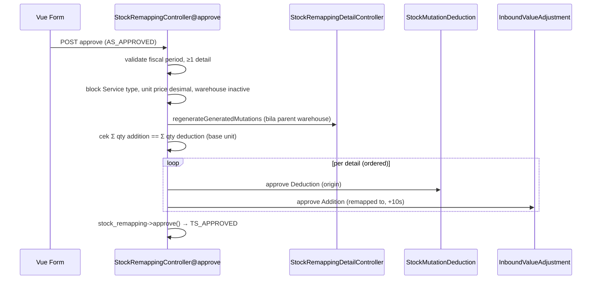

# Stock Remapping — Technical Documentation

> **Status codebase:** AS-IS **implemented** di modul Accounting. Perilaku target **v2.0** (Stock ID selection, lintas parent, Unit Class guard, base unit) sebagian masih TO-BE — lihat Known Issues (GAP-RM-04..08) & [requirement §2](./requirement.md#2-status-implementasi-v20-as-is-vs-to-be).

**Stack:** Laravel 13 · Horizon · Vue 3 · MariaDB
**Behavior SoT:** requirement v2.0

---

## 0. Metadata & Changelog

| Version | Date | Author | Changes |
|---------|------|--------|---------|
| 1.0 | 2026-07-09 | QA - Yemima | Initial TO-BE technical dari PM v1.1 |
| 2.0 | 2026-07-30 | QA - Yemima | Rewrite AS-IS dari codebase (controller/detail/import/export/policy) + delta target v2.0 (GAP-RM-04..08) |

---

## 1. File Map

### Backend (`Modules/Accounting`)

| Layer | Path |
|-------|------|
| Header controller | `Modules/Accounting/Http/Controllers/StockRemappingController.php` |
| Detail controller | `Modules/Accounting/Http/Controllers/StockRemappingDetailController.php` |
| Entity header | `Modules/Accounting/Entities/StockRemapping.php` (extends `Modules\SupplyChain\Entities\StockMutation`) |
| Entity detail | `Modules/Accounting/Entities/StockRemappingDetail.php` |
| Import | `Modules/Accounting/Import/StockRemappingDetailImport.php` · `Jobs/StockRemappingDetailImportRowJob.php` |
| Import log/history | `Entities/StockRemappingDetailImportLog.php` · `Entities/StockRemappingImportHistory.php` |
| Export | `Jobs/StockRemappingExportJob.php` · `Exports/StockRemappingExportAll.php` · `Exports/StockRemappingTemplateExport.php` · `Entities/StockRemappingExportTemp.php` |
| Policy | `Modules/Accounting/Policies/StockRemappingPolicy.php` (extends `MainPolicy`) |
| Routes | `Modules/Accounting/Routes/api.php` (grup `stock-remapping.` & `stock-remapping-detail.`) |
| Menu seeder | `Modules/Gate/Database/Seeders/ModuleMenu/AccountingMenuSeeder.php` |
| Generate mutasi | reuse `StockMutationDeduction/Addition` (SCM) + `InboundValueAdjustment` / `StockMutationDeductionFA` (Accounting) |

### Frontend (`olshoperp-frontend/src/pages/Accounting/StockRemapping/`)

| Item | Path |
|------|------|
| Datalist | `DataList.vue` |
| Form | `Form.vue` |
| Detail datalist | `DatalistDetail.vue` |
| Approval eligibility | `ApprovalEligibility.vue` |
| Approval log | `DatalistLogApproval.vue` |
| Available warehouse | `AvailableWarehouse.vue` |
| Router | `src/router/index.ts` (`/accounting/stock-remapping`) |

---

## 2. API Routes

| Method | Path | Controller | Notes |
|--------|------|------------|-------|
| GET | `stock-remapping` | `StockRemappingController@index` | Datalist (`is_stock_remapping=1`, `warehouse_origin` not null) |
| POST | `stock-remapping` | `@store` | Create header → `TS_OPEN`, code `RM` |
| GET | `stock-remapping/{id}` | `@show` | Detail header + warehouse tree |
| PUT | `stock-remapping/{id}` | `@update` | Warehouse origin locked bila ada detail |
| DELETE | `stock-remapping/{id}` | `@destroy` | Hapus AO/AI turunan + soft delete detail/header |
| POST | `stock-remapping/{id}/approve` | `@approve` | Sequencing Deduction→Addition |
| GET | `stock-remapping/{id}/approve` · `/log/approve` · `/audit` | info/log/audit approval |
| GET | `stock-remapping/export-excel` · `export-file` · `export-progress` | Export batch |
| GET/POST/PUT/DELETE | `stock-remapping/{id}/stock-remapping-detail/...` | `StockRemappingDetailController` | CRUD detail (`primevue` index) |
| GET | `stock-remapping-detail/{id}/available-products` | `@available_products` | **Modal Available Product** — item stock digroup per SKU/warehouse (item_stock_ids) |
| GET | `stock-remapping-detail/{id}/item-stock/{item_stock}` | `@showItemStock` | Detail 1 Stock ID |
| POST | `stock-remapping-detail/{id}/bulk-use` · `bulk-create` | `@bulkUse` / `@bulkCreate` | Terima `item_stock_ids` (batch) |
| GET | `stock-remapping-detail/get-base-unit` | `@getBaseUnit` | Base unit per unit class |
| POST | `stock-remapping/{id}/stock-remapping-detail/upload` | `@uploadFileRemappingDetail` | Import |
| GET | `stock-remapping-detail/download-template` | `@downloadTemplateExcel` | Template 5 kolom |
| GET | `stock-remapping-detail/{id}/import-log` · `import-history` · `check-import-log` · `progress/{id}` | Import log/history |

---

## 3. Database Key Tables

Header & detail memakai infrastruktur `scm_stock_mutations` (StockRemapping extends `StockMutation`).

| Entity | Field kunci |
|--------|-------------|
| `StockRemapping` (scm_stock_mutations) | `code` (`RM-*`), `warehouse_origin`, `transaction_date`, `transaction_status`, `transaction_reference_text` (Trx Ref), `description`, `is_stock_remapping=1`, `owned_by` |
| `StockRemappingDetail` | `stock_mutation_id`, `product_origin_id`, `product_remapped_to_id`, `remapping_quantity`, `remapping_quantity_unit_id`, `remapping_quantity_conversion_rate`, `remapping_quantity_in_base_unit`, `remapping_quantity_base_unit_id`, `origin_avail_quantity_in_base_unit`, `description` |
| Dokumen turunan | `StockMutationDeduction`/`InboundValueAdjustment` + `Outbound/InboundMutationDetail` dgn `transaction_reference_class = StockRemapping(Detail)::class` |

Global scope: `StockRemapping` menambah `where('is_stock_remapping', true)`; `creating` set `is_stock_remapping=true`.

> **Catatan v2.0:** kolom untuk **Unit Price snapshot per Stock ID** & **item_stock_id** pada detail belum dipakai jalur store (Unit Price masih diturunkan saat generate mutasi) — GAP-RM-07.

---

## 4. Services / Pricing (Unit Price resolution)

Alur AS-IS di `StockRemappingDetailController@generateRemappingMutations` / `generateRemappingAdditions`:

1. Alokasi stok Origin via `getFulfillAfterFifo(warehouse_origin, unit, product, trx_date, qty, 'outbound_quantity')` → daftar `item_stock_id` + qty (FIFO).
2. Group alokasi per `warehouse_id` (leaf) → buat/isi Stock Deduction (`StockMutationDeduction`, `is_inventory_adjustment=1`).
3. Stock Addition per warehouse leaf: `unitPrice = Σ(outbound_qty_base × item_stock.each_price_before_vat) / Σ outbound_qty_base` — **rata-rata tertimbang (blended)**.
4. Addition `transaction_date = remapping.transaction_date + 10 detik`; `each_price_before_vat = unitPrice`.

> **Target v2.0 (GAP-RM-07):** Unit Price 1:1 dari Stock ID yang dipilih user (bukan blended). Perlu store `item_stock_id` di detail & bypass FIFO otomatis.

---

## 5. Flow utama — Approve

```mermaid
sequenceDiagram
    participant FE as Vue Form
    participant RC as StockRemappingController@approve
    participant DC as StockRemappingDetailController
    participant SD as StockMutationDeduction
    participant SA as InboundValueAdjustment
    FE->>RC: POST approve (AS_APPROVED)
    RC->>RC: validate fiscal period, ≥1 detail
    RC->>RC: block Service type, unit price desimal, warehouse inactive
    RC->>DC: regenerateGeneratedMutations (bila parent warehouse)
    RC->>RC: cek Σ qty addition == Σ qty deduction (base unit)
    loop per detail (ordered)
        RC->>SD: approve Deduction (origin)
        RC->>SA: approve Addition (remapped to, +10s)
    end
    RC->>RC: stock_remapping->approve() → TS_APPROVED
```

Reject: `transaction_status = AS_REJECTED`. Semua dibungkus `DB::transaction` dengan cache guard (`addCacheApproveStockMutation`) untuk mencegah double-approve.

---

## 6. Invariants

- `is_stock_remapping = true` untuk semua record menu ini (global scope).
- `product_origin_id != product_remapped_to_id` (rule `different`).
- `remapping_quantity_in_base_unit = remapping_quantity × remapping_quantity_conversion_rate` (`qtyInBaseUnitRounding`).
- `Σ remapping_quantity_in_base_unit (detail) == Σ outbound_quantity_in_base_unit (deduction) == Σ quantity_in_base_unit (addition)` — guard sebelum commit approve.
- `Σ qty(item_stock alloc FIFO) <= available_quantity` SKU Origin di warehouse tree origin, `transaction_date <= remapping.transaction_date`.
- Addition `transaction_date = deduction/remapping date + 10s`.
- **(Target v2.0)** `unit_class(origin) == unit_class(remapped_to)` — belum di-assert (GAP-RM-05).

---

## 7. Validation Highlights

| Titik | Aturan |
|-------|--------|
| `store`/`update` header | `warehouse_origin` required+exists; trx_ref/description max 150; warehouse locked bila ada detail |
| `validateRemappingInput` | origin/remapped_to exists+different; qty numeric gt:0; unit exists; **same parent** (AS-IS); **duplicate remapped_to diblok** (AS-IS); qty ≤ availability base |
| `validateRemappingProduct` | status aktif; bukan random; COA Purchased/Manufactured |
| `validateRemappingUnit` | unit ∈ {stock_unit, stock_base} atau alternative aktif (AS-IS — belum dipaksa base) |
| Import `checkFormat` | header `SKU Origin`,`Remapped To SKU`,`Qty` wajib; total 5 kolom |
| `approve` | fiscal period; Service block; unit price whole-number; warehouse aktif; Σ qty match |

---

## 8. Failure Modes & Transaction Boundary

- **Approve** dibungkus `DB::transaction`; error di deduction/addition mana pun → `rollBack()` + hapus cache guard, transaksi tetap Open.
- Guard `Σ qty addition == Σ qty deduction`; bila tidak match → error "This document has details that failed to generate addition or deduction." (tidak approve).
- **Delete** (`destroy`): hanya bila `can_update`; hapus AO/AI turunan lebih dulu, lalu soft delete detail + header dalam 1 transaksi.
- **Import**: partial — baris valid didispatch sebagai batch job; baris gagal → `StockRemappingDetailImportLog`; history status `success|partial|failed`. Max child `general.max_child_500`.
- Concurrency: `addCacheApproveStockMutation` + cek "Updating process is in progress" mencegah approve saat update berjalan.

---

## 9. Data Lifecycle

| Tahap | Efek stok |
|-------|-----------|
| Detail ditambahkan | Availability origin dihitung ulang (per warehouse tree, base unit) |
| Approve — Deduction | Stok Origin keluar (FIFO per item_stock, per warehouse leaf) |
| Approve — Addition | Stock ID baru untuk Remapped To (+10s), unit price blended |
| Delete transaksi | AO/AI turunan dihapus; detail & header soft delete |

Dokumen turunan tampil di **Adjustment Outbound** (AO) & **Adjustment Inbound** (AI) + jurnal (kolom `generated_trx_formatted` / `gl_trx_formatted` di datalist).

---

## 10. Tests & QA Notes

- Prioritas regression: guard `Σ qty` approve, sequencing Deduction→Addition (+10s), partial import log, warehouse-origin lock saat ada detail.
- **Wajib re-test saat v2.0 dirilis:** Unit Class guard (GAP-RM-05), lintas parent + Identification Icon (GAP-RM-04), duplicate Remapped To (GAP-RM-06), Stock ID selection + Unit Price 1:1 (GAP-RM-07), Base Unit lock + Avl. Base Unit (GAP-RM-08).
- Frontend: validasi Vue harus selaras dengan pesan FormRequest/controller di atas.

---

## 11. Known Issues

Refer Gap Registry di [requirement §11](./requirement.md#11-gap-registry): **GAP-RM-01..03** (Bundle Header eligibility, COA restriction kategori baru, release reserved per Stock ID) dan **GAP-RM-04..08** (delta v2.0 yang belum diimplementasi: lintas parent, Unit Class guard, duplicate Remapped To, Stock ID selection + Unit Price 1:1, Base Unit lock).

---

## Related Documents

| Doc | Path |
|-----|------|
| Requirement | [requirement.md](./requirement.md) |
| Knowledge Base | [knowledge-base.md](./knowledge-base.md) |
| User Guide | [user-guide.md](./user-guide.md) |
