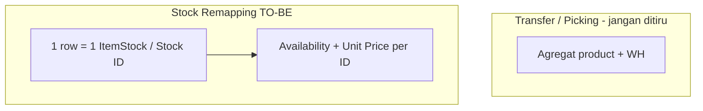

# Stock Remapping — Technical Documentation

> **Review** — AS-IS 2026-08-04 + delta **TO-BE v2.1**. Behavior target: [requirement v2.1](./requirement.md).  
> Implementator brief (detail ticket): file terpisah di Downloads / handoff PM.

---

## 0. Metadata & Changelog

| Version | Date | Author | Changes |
|---------|------|--------|---------|
| 2.1 | 2026-08-04 | QA - Yemima | Scope v2.1: batalkan lintas parent; Stock ID modal wajib beda dari Transfer; Unit Class + approve gate; import tanpa Unit |
| 2.0 | 2026-07-30 | QA - Yemima | Rewrite AS-IS + delta SoT v2.0 (superseded) |

---

## 1. File Map (AS-IS)

| Layer | Path |
|-------|------|
| Controllers | `Modules/Accounting/Http/Controllers/StockRemappingController.php`, `StockRemappingDetailController.php` |
| Entities | `Entities/StockRemapping.php`, `StockRemappingDetail.php` (`accounting_stock_remapping_details`) |
| Import | `Import/StockRemappingDetailImport.php`, `Jobs/StockRemappingDetailImportRowJob.php` |
| Export | `Jobs/StockRemappingExportJob.php`, `Exports/StockRemappingTemplateExport.php` |
| Policy | `Policies/StockRemappingPolicy.php` |
| FE | `olshoperp-frontend/src/pages/Accounting/StockRemapping/*` (`AvailableWarehouse.vue`, `DatalistDetail.vue`, `Form.vue`) |

**Jangan reuse** `SCM/.../Transfer/AvailableWarehouse.vue` atau PickingList — komponen Remapping **lokal** dan harus diubah ke breakdown Stock ID.

---

## 2. AS-IS behavior (kunci)

| Area | Implementasi sekarang |
|------|------------------------|
| Same parent | `validateRemappingInput` + import: `parent_id` Origin == Remapped To |
| Duplicate Remapped To | Diblok di `validateRemappingInput` + import `usedRemappedToIds` |
| Available products | `available_products`: `GROUP BY product_id, warehouse_id` + `GROUP_CONCAT(id)` — **agregat** |
| Detail store | Fillable **tanpa** `item_stock_id`; qty/unit dari request |
| Unit | Primary / base / alternate Origin (dan cek Remapped To) |
| Unit Price | FIFO `getFulfillAfterFifo` saat generate; blended per WH |
| Unit Class | Tidak di-assert |
| Approve | Generate Deduction→Addition; **tanpa** re-validate Unit Class / same-parent ulang secara eksplisit sebagai gate broken-data |
| Import template | Headers: `SKU Origin`, `Remapped To SKU`, `Qty`, `Unit`, `Description` |

---

## 3. TO-BE v2.1 — kontrak teknis

### 3.1 Detail schema / payload

| Field | Aksi |
|-------|------|
| `item_stock_id` (atau setara) | **Tambah** di detail + API store/update (manual & bulk from modal) |
| `product_origin_id` | Tetap (denormalized dari Stock ID) |
| `remapping_quantity_unit_id` | Selalu = Origin `stock_base_unit_id` |
| Unit Price snapshot | Simpan dari Stock ID terpilih (hindari re-blend saat approve) |

### 3.2 Available Product (CRITICAL — beda menu lain)

```mermaid
flowchart TB
    subgraph TransferPicking[Transfer / Picking - jangan ditiru]
        A[Agregat product + WH]
    end
    subgraph Remapping[Stock Remapping TO-BE]
        B[1 row = 1 ItemStock / Stock ID]
        B --> C[Availability + Unit Price per ID]
    end
```

| Endpoint / UI | TO-BE |
|---------------|-------|
| `GET .../available-products` | List **per** `item_stocks.id` (filter WH tree + product eligibility Origin) |
| Single Use / Bulk Use | Pilih Stock ID → create detail dengan `item_stock_id` |
| FE `Accounting/StockRemapping/AvailableWarehouse.vue` | Ubah kolom/query; **jangan** merge ke komponen SCM Transfer |

### 3.3 Validasi shared helper (disarankan)

Satu method private/service dipanggil dari:

1. `validateRemappingInput` (store/update)  
2. Import row processor  
3. **`approve`** (loop semua detail sebelum mutate)

Checks (minimal):

- same parent  
- `origin.unit_class_id === remapped.unit_class_id` (via productUnit)  
- eligible product (active, not random, COA, not parent)  
- qty Base Unit ≤ available pada **Stock ID** (manual) / FIFO plan (import)  
- **hapus** unique-check `product_remapped_to_id` per header  

### 3.4 Import

| Sekarang | TO-BE |
|----------|-------|
| Wajib kolom Unit | **Hapus** Unit dari template & `checkFormat` |
| Qty dalam unit file | Qty = **Base Unit** |
| 1 file row → 1 detail | Split N detail by FIFO Stock IDs sampai qty terpenuhi |
| Dup Remapped To ditolak | Izinkan |

Suggested headers: `SKU Origin`, `Remapped To SKU`, `Qty` [, `Description`].

### 3.5 Approve gate

Di `StockRemappingController@approve` **sebelum** approve Deduction/Addition:

1. Load all details + Origin/Remapped + ItemStock  
2. Jalankan shared validation; fail fast dengan pesan per baris  
3. Deduction harus konsumsi **Stock ID tersimpan** (bukan re-FIFO beda batch), kecuali import-created rows yang sudah di-split FIFO saat import  

---

## 4. Invariants

- Remapped To eligible ⊆ Variant same `parent_id`  
- Max one Base Unit per Unit Class; qty transactional in Base Unit  
- Multiple details may share same `product_remapped_to_id`  
- One detail ↔ one Origin Stock ID (manual path)  
- Unit Class mismatch never reaches posted Deduction/Addition  

---

## 5. Known Issues / Gaps

Lihat [requirement §12](./requirement.md#12-gap-registry): aktif **GAP-RM-03, 05, 06, 07, 08**; **01/02/04 cancelled**.

---

## Related Documents

| Doc | Path |
|-----|------|
| Requirement | [requirement.md](./requirement.md) |
| Knowledge Base | [knowledge-base.md](./knowledge-base.md) |
| User Guide | [user-guide.md](./user-guide.md) |
