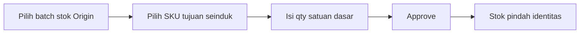

# Panduan Pengguna — Stock Remapping

**Siapa yang baca:** tim Finance / Accounting  
**Menu:** Finance Accounting → Stock Remapping  
**Route:** `/accounting/stock-remapping`

---

## 1. Apa Itu & Kenapa Penting

**Stock Remapping** mengubah identitas stok dari satu SKU ke SKU lain dalam satu transaksi. Sistem mengurangi stok asal dan menambah stok tujuan saat kamu approve — termasuk nilai harganya.

Menu ini ada di Finance Accounting karena menampilkan **harga satuan**, yang tidak untuk operator gudang biasa.

---

## 2. Overview Flow & Proses Bisnis

**Versi teks:**

1. Buat transaksi Remapping.  
2. Pilih **batch stok (Stock ID)** yang mau diubah identitasnya.  
3. Pilih SKU tujuan dari **variant induk yang sama**.  
4. Isi jumlah dalam **satuan dasar**; simpan.  
5. Boleh ulang langkah 2–4; SKU tujuan yang sama boleh dipakai di baris lain.  
6. Approve — sistem memproses pengurangan lalu penambahan stok.

### Status

| Status | Arti |
|--------|------|
| Open | Masih bisa diedit |
| Approved | Sudah diproses; tidak diedit |
| Cancelled | Dibatalkan |

---

## 3. Sebelum Mulai

- Gudang origin aktif dan punya stok.  
- SKU Origin & tujuan: variant aktif, bukan SKU acak, COA Purchased/Manufactured.  
- SKU tujuan harus **satu induk** dengan Origin.  
- Pastikan satuan di master product Origin & tujuan masuk akal (satu Unit Class).

🎬 [Interactive demo akan ditambahkan di sini]

---

## 4. Setelah Selesai

- Stok Origin (batch yang dipilih) berkurang.  
- Stok SKU tujuan bertambah dengan harga mengikuti batch asal.  
- Dokumen pengurangan/penambahan stok muncul otomatis.

---

## 5. Yang Perlu Diperhatikan

- Pilih **batch (Stock ID)**, bukan sekadar “total SKU di gudang”.  
- Qty selalu dalam **satuan dasar** (kolom Avl. Base Unit = batas).  
- SKU tujuan **boleh sama** di beberapa baris (misalnya dua batch beda → satu SKU hasil).  
- Tidak bisa remap ke Single / BOM / Bundle di luar variant seinduk.  
- Import: isi SKU Origin, Remapped To, Qty — **tanpa Unit**; sistem memecah otomatis jika qty melebihi satu batch.  
- Jika approve ditolak karena Unit Class: perbaiki master product dulu.

---

## 6. Langkah-Langkah

1. Buka **Stock Remapping** → Create.  
2. Isi gudang & tanggal → simpan header.  
3. Available Product → pilih Stock ID → set Remapped To & Qty → simpan baris.  
4. Ulangi bila perlu.  
5. Approve.

🎬 [Interactive demo akan ditambahkan di sini]

---

## 7. Tips & Hal yang Sering Bikin Bingung

- **"Remapped To tidak muncul."** Bukan variant seinduk / tidak eligible.  
- **"Harga berubah-ubah dulu."** Perilaku lama (rata-rata); setelah update harus ikut batch yang dipilih.  
- **"Import tanpa Unit."** Memang — qty = satuan dasar.

---

## 8. Referensi

| Sumber | Untuk apa |
|--------|-----------|
| [Knowledge Base](./knowledge-base.md) | Troubleshooting |
| [Requirement](./requirement.md) | Aturan & AC |
| [Technical](./technical.md) | Developer |
