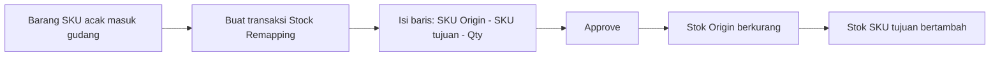

# Panduan Pengguna — Stock Remapping

Panduan ini membantu tim Finance/Accounting memakai menu **Stock Remapping** dari awal sampai transaksi disetujui.

---

## 1. Apa Itu & Kenapa Penting

**Stock Remapping** (kadang disebut **Stock Acak**) dipakai untuk **mengubah identitas stok** dari satu SKU ke SKU lain. Contoh paling umum: kamu membeli barang impor dengan SKU acak (satu "kardus campur"), lalu setelah disortir kamu ingin memecahnya menjadi variant yang sebenarnya — misalnya pensil warna pink, biru, dan putih.

Tanpa menu ini, kamu harus membuat pengurangan stok dan penambahan stok secara manual satu per satu. Dengan Stock Remapping, cukup satu transaksi: sistem yang mengerjakan pergerakan stoknya otomatis, lengkap dengan nilai barangnya.

Menu ini berada di **Finance Accounting** karena menampilkan **nilai harga (Unit Price)** barang, yang tidak boleh dilihat oleh operator gudang biasa.

---

## 2. Overview Flow & Proses Bisnis

**Alur singkat (tanpa diagram):**

1. Barang SKU acak sudah ada stoknya di gudang.
2. Kamu membuat transaksi Stock Remapping dan mengisi baris-baris remap.
3. Setelah Approve, stok SKU asal berkurang.
4. Beberapa detik kemudian stok SKU tujuan bertambah dengan nilai yang sama.

---

## 3. Sebelum Mulai (Flow Sebelum)

Pastikan hal berikut sudah siap:

- **Stok SKU Origin tersedia** di gudang asal (barang sudah masuk lewat pembelian/inbound).
- **SKU tujuan sudah aktif** di Master System Product.
- Kamu punya **akses menu Finance Accounting** (menu ini tidak muncul untuk operator gudang biasa).
- Kamu tahu **gudang asal** barang yang akan diremap.

---

## 4. Setelah Selesai (Flow Sesudah)

Setelah transaksi disetujui:

- Muncul dokumen **pengurangan stok** (di menu Adjustment Outbound) untuk SKU Origin.
- Muncul dokumen **penambahan stok** (di menu Adjustment Inbound) untuk SKU tujuan, dengan nilai harga yang sama.
- Kedua dokumen beserta jurnalnya bisa ditelusuri dari baris transaksi Stock Remapping.

Kamu tidak perlu membuat dokumen pengurangan/penambahan itu secara manual — semuanya otomatis.

---

## 5. Yang Perlu Diperhatikan

- **Warehouse Origin wajib diisi lebih dulu**, dan **tidak bisa diganti** setelah ada baris. Kalau salah gudang, hapus dulu barisnya.
- **Unit Price tidak bisa diedit** — nilainya otomatis dari stok SKU Origin.
- **SKU acak (random) ditolak** di semua posisi.
- **SKU Service dan Asset ditolak** — hanya Purchased Item & Manufactured Item yang boleh.
- Saat Approve, **Unit Price harus bilangan bulat** (tanpa desimal) dan **gudang asal harus aktif**.
- Ada **jeda beberapa detik** antara stok berkurang dan bertambah — ini normal.
- **Peningkatan yang sedang disiapkan:** memilih batch stok tertentu untuk SKU Origin, membuka SKU tujuan lintas induk (asal kelompok satuannya sama), dan memakai SKU tujuan yang sama di beberapa baris. Untuk sekarang, SKU tujuan masih dibatasi ke variant satu induk dan hanya boleh sekali per transaksi.

---

## 6. Langkah-Langkah (Step by Step)

1. Buka **Finance Accounting → Stock Remapping**, lalu klik tambah transaksi baru.
2. Isi **Warehouse Origin** (gudang asal). Isi **Trx Ref** dan **Description** bila perlu (opsional). Transaksi tersimpan otomatis.
3. Tambah baris detail: pilih **SKU Origin**. Kamu bisa memakai **Available Product** untuk melihat stok — **Single Use** (pilih satu) atau **Bulk Use** (pilih banyak sekaligus).
4. Pilih **SKU Remapped To** (SKU tujuan) dan isi **Qty**. Pastikan Qty tidak melebihi stok yang tersedia.
5. Ulangi langkah 3–4 untuk baris lain sesuai hasil sortir.
6. Bila datanya banyak, gunakan **Import**: unduh template (SKU Origin, Remapped To SKU, Qty, Unit, Description), isi, lalu unggah. Cek **import log** bila ada baris yang gagal.
7. Klik **Approve**. Bila ada pesan penolakan (misal barang Service, Unit Price desimal, atau gudang non-aktif), perbaiki dulu lalu Approve ulang.
8. Setelah sukses, telusuri dokumen pengurangan/penambahan stok dan jurnalnya dari baris transaksi.

🎬 [Interactive demo akan ditambahkan di sini]

---

## 7. Tips & Hal yang Sering Bikin Bingung

- **"Qty saya ditolak padahal stok kelihatan cukup."** Qty dihitung terhadap stok tersedia; kalau kamu punya beberapa baris dengan SKU Origin sama, stoknya dibagi. Kurangi qty atau cek baris lain.
- **"Kenapa SKU tujuan tertentu tidak muncul?"** Saat ini SKU tujuan masih dibatasi ke variant dari induk yang sama, bukan random, dan belum dipakai di baris lain.
- **"Import baris terakhir gagal."** Stok dihitung menumpuk dari atas ke bawah. Urutkan qty besar lebih dulu, atau pecah menjadi transaksi terpisah.
- **"Tidak melihat kolom Unit Price."** Kolom nilai hanya untuk peran Finance Accounting.
- **Hindari membuat dokumen pengurangan/penambahan manual** untuk barang yang sudah diproses lewat Stock Remapping — berisiko dobel pergerakan stok.

---

## 8. Referensi

| Sumber | Untuk apa |
|--------|-----------|
| [Knowledge Base](./knowledge-base.md) | Panduan operator & troubleshooting lengkap |
| [Requirement](./requirement.md) | Aturan bisnis, validasi, status implementasi v2.0 |
| [Random SKU](../random-sku/README.md) | Aturan SKU acak |
| [System Product](../system-product/README.md) | Struktur induk/variant SKU |
