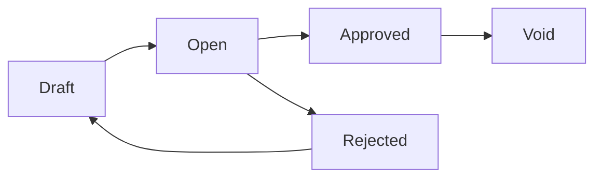

# Purchase Invoice — Knowledge Base

> **DRAFT** — Dokumentasi AS-IS dari codebase (19 Juni 2026). Belum final review QA/PM.

## 1. Apa itu Purchase Invoice?

**Purchase Invoice** (Faktur Pembelian) mencatat tagihan dari supplier atas barang yang sudah diterima (inbound). Invoice approved menjadi **hutang** (AP) dan dapat dibayar via **Account Payment**.

**Menu:** FA → Account Payable → Purchase Invoice (`/accounting/supplier-invoice`)

Nomor transaksi otomatis dengan prefix **PI**.

## 2. Glosarium

| Istilah | Arti |
|---------|------|
| PI | Prefix kode Purchase Invoice |
| AP / Hutang | Account Payable |
| Inbound / IV-IN | Purchase Inbound — mutasi stok masuk dari PO |
| Outstanding inbound | Baris `InboundMutationDetail` yang belum/sebagian di-invoice |
| PO Other Cost / Discount | Biaya atau diskon dari Purchase Order yang bisa ikut di-invoice |
| Payable COA | Akun hutang supplier — di-resolve saat approve |

## 3. Yang Bisa / Tidak Bisa Dilakukan

### Bisa

- Buat invoice untuk supplier aktif
- Tambah baris dari **outstanding inbound mutation detail** (terhubung PO)
- Tambah other cost & other discount (termasuk copy dari PO)
- Lampiran, print, export Excel
- Approval multi-level → **journal otomatis** (tipe Purchase Invoice)
- Void / reject sesuai status

### Tidak Bisa

- Edit setelah **Approved**
- Approve tanpa baris detail
- Transaksi di luar fiscal period aktif
- Ubah supplier/currency/rate/tanggal jika sudah ada detail (rule sama seperti AR invoice)

## 4. Status transaksi

## 5. Cara Pakai (How-To)

### Skenario: Invoice dari Purchase Inbound

1. **Create** → pilih supplier, tanggal, currency, due date, referensi supplier
2. Tab **Item Configuration** → tambah dari outstanding inbound (per item atau group)
3. (Opsional) Other Cost / Other Discount dari PO
4. Set status **Open**
5. **Approve** — sistem update qty invoiced di inbound detail & generate journal
6. Lanjut **Account Payment** untuk pembayaran supplier

## 6. Troubleshooting

| Gejala | Penyebab | Solusi |
|--------|----------|--------|
| Approve gagal: AP COA | Supplier belum punya Account Payable COA | Konfigurasi di master supplier/company |
| Approve gagal: Exchange Diff COA | Company belum set Exchange Diff. COA | Company accounting settings |
| No detail | Belum ada baris inbound | Tambah outstanding inbound |
| Qty inbound tidak update | Approve belum sukses / rollback | Cek log; pastikan approve complete |
| Sudah approved tidak bisa edit | By design | Void atau buat debit note sesuai kebijakan |

## 7. FAQ

**Q: Dari mana baris invoice?**  
A: Dari **InboundMutationDetail** (purchase inbound) yang masih punya qty outstanding untuk invoice.

**Q: Apa hubungan dengan PO?**  
A: Detail inbound terhubung ke PO; other cost/discount bisa diambil dari `PurchaseOrderOtherCost` / `PurchaseOrderOtherDiscount`.

**Q: Kapan journal dibuat?**  
A: Saat approve — `JournalProcess::supplierInvoiceAutoJournal`.

## Related Documents

| Doc | Path |
|-----|------|
| Requirement | [requirement.md](./requirement.md) |
| Technical | [technical.md](./technical.md) |
