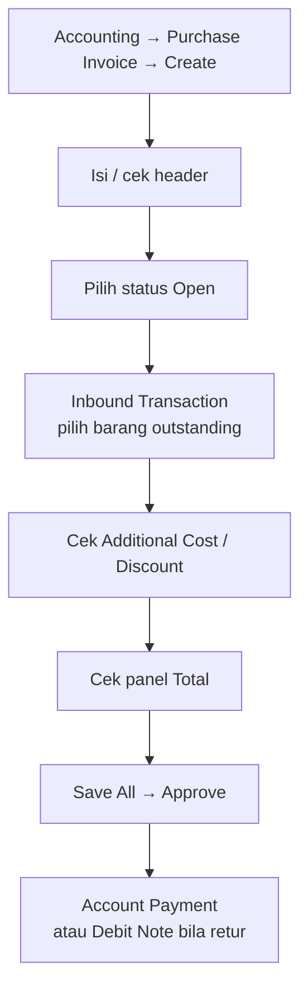

# Purchase Invoice — Knowledge Base (Operator)

**Audience:** Finance, AP clerk, Operations support  
**Route:** `/accounting/supplier-invoice`

---

## 1. Apa itu Purchase Invoice?

Purchase Invoice (PI) adalah dokumen **pengakuan hutang resmi** ke supplier setelah barang sudah **diterima** (Purchase Inbound disetujui). PI:

- Menagihkan barang yang sudah masuk gudang
- Mencatat **PPN Masukan** (pajak pembelian yang bisa dikreditkan) — tidak lagi di saat barang masuk
- Memindahkan saldo dari utang sementara (**Unbilled Goods**) ke **Account Payable**
- Menjadi dasar **Account Payment** (pelunasan)
- Setelah approved, retur memakai Purchase Return tipe **Billed** (hasilnya **Debit Note**)

**Kode transaksi:** `PI-XXXXX`

---

## 2. Kapan membuat PI?

| ✅ Buat PI jika | ❌ Jangan buat PI jika |
|----------------|------------------------|
| Inbound sudah **Approved** | Hanya punya inbound draft — supplier bisa muncul di dropdown tapi barang belum bisa dipilih |
| Ada outstanding qty yang belum ditagih / diretur | Qty inbound sudah habis ditagih atau diretur |
| Product COA (Unbilled Goods, Tax, AP) sudah di-setup | COA produk belum lengkap — Approve akan gagal |
| Mata uang sesuai aturan (maks. 1 asing + lokal) | Mau campur 2 mata uang asing berbeda dalam 1 PI |

---

## 3. Alur kerja standar

Setelah inbound disetujui, buat PI untuk mengakui hutang (termasuk PPN) ke supplier. Happy path:

**Keterangan langkah:**

- **Create / header:** isi Supplier, Tanggal, Mata Uang, Kurs. Opsional: **Supplier's Reference** (nomor faktur/dokumen supplier), **Due Date** (isi manual — belum otomatis dari termin supplier). Saat Create, sistem bisa auto-simpan draft; Supplier sering terisi dari PI terakhir Anda. Jika belum pernah punya PI, isi field wajib (termasuk Supplier) manual dulu.
- **Status Open:** wajib sebelum Approve (bukan Draft).
- **Inbound Transaction:** pakai **Bulk Use** (banyak baris sekaligus) atau **Single Use** (isi qty per baris lewat modal). Hanya barang dari inbound **Approved** yang muncul.
- **Additional Cost / Discount:** otomatis ikut dari PO saat SKU ditambah — hapus baris yang ingin ditunda ke PI berikutnya.
- **Panel Total:** cek **Net Purchase Invoice** sebelum approve.
- **Setelah Approve:** lanjut **Account Payment** untuk pelunasan; jika ada retur setelah PI approved, pakai Purchase Return tipe **Billed** (hasilnya **Debit Note**).

---

## 4. Panel Inbound Transaction

Panel ini menampilkan barang dari PO yang inbound-nya sudah disetujui — hanya itu yang boleh ditagih.

| Fitur | Cara pakai |
|-------|------------|
| **Bulk Use** (pilih banyak baris sekaligus) | Centang baris → Bulk Use; qty default = seluruh sisa |
| **Single Use** (isi qty per baris) | Klik baris → modal → Quantity to Invoice → Save |
| **Already Prepared** | Sisa qty 0 tapi masih dipesan transaksi belum final — tunggu proses selesa |

**Sisa qty yang bisa ditagih** = qty barang masuk dikurangi yang sudah/sedang ditagih dan yang sudah/sedang diretur (hitungan di unit dasar; tampilan bisa unit lain seperti Box).

Pesan umum: qty melebihi sisa → kurangi; baris sudah di PI ini → pilih baris lain; mata uang asing kedua berbeda → tidak diizinkan.

---

## 5. Additional Cost & Discount

Biaya/diskon PO tidak harus ditagih sekaligus — supaya Anda bisa tagih barang dulu, freight di PI berikutnya.

Begitu Anda menambah SKU dari suatu PO, **semua** biaya/diskon PO itu otomatis masuk. Hapus baris yang belum ingin ditagih sekarang; sisa bisa di PI berikutnya **selama masih ada SKU outstanding** dari PO yang sama.

| Sumber baris | Nama / Nominal | COA |
|--------------|----------------|-----|
| Dari PO | Nama & nominal terkunci | Boleh diganti sebelum Approve |
| Dari Master | Nominal bisa diubah | Boleh diganti sebelum Approve |

- Ganti COA hanya sebelum Approve. Override **tidak** mengubah master.
- Opsi COA: akun aktif yang **tidak punya sub-akun** (hati-hati — langsung memengaruhi jurnal).
- Jika PO currency beda dari PI, kolom selisih kurs bisa muncul di baris cost/disc.

**Catatan:** kalau semua SKU PO sudah habis ditagih/diretur sebelum semua baris cost dipilih, sebagian cost bisa tidak muncul lagi di PI berikutnya. Itu perilaku sistem yang sudah diinformasikan — koordinasikan sebelum closing PO.

---

## 6. Tombol & status

| Tombol | Kapan | Fungsi |
|--------|-------|--------|
| **Save & Next / Save All** | Belum approved | Simpan header / perubahan |
| **Approve** | Status Open + ada detail | Posting jurnal + hutang |
| **Reject** | Status Open | Kembali ke alur edit (setelah save → Draft) |
| **Delete** | Belum approved | Hapus transaksi |
| **Print** | Setelah bisa akses cetak | Cetak dokumen PI |
| **Draft / Open** | Side panel | Harus **Open** sebelum Approve |

**Status yang dipakai:** Draft → Open → Approved; atau Open → Rejected (lalu edit+Save → Draft). Setelah **Approved**, tidak bisa diubah. **Void / Processed / Closed belum tersedia** untuk user.

---

## 7. Panel Total

| Baris | Arti |
|-------|------|
| Total Products | Total harga barang (sebelum pajak efektif di baris) |
| Disc Products | Diskon baris barang |
| Total VAT | Total PPN |
| Additional Cost / Disc | Biaya & diskon tambahan |
| **Net Purchase Invoice** | Total jadi hutang (termasuk PPN), dalam currency PI |
| Net (IDR) | Konversi ke mata uang lokal perusahaan |

Jika ada baris pajak dengan setting coefficient, angka Total Products bisa terlihat lebih kecil dari hitungan DPP “penuh” — itu disengaja agar total akhir sesuai aturan PPN yang berlaku.

---

## 8. Hubungan dengan menu lain

**Purchase Inbound** mencatat barang masuk (utang sementara). **PI** adalah tagihan resmi (termasuk PPN) ke supplier.

**Account Payment** — setelah PI Approved, muncul di daftar outstanding untuk dilunasi. Bisa pakai Cash/Bank dan/atau Debit Note.

**Retur setelah PI Approved** — pakai Purchase Return tipe **Billed**. Hasilnya **Debit Note** (saldo ke supplier untuk potong tagihan berikutnya), bukan potong hutang PI secara langsung.

---

## 9. Troubleshooting

| Gejala | Penyebab | Solusi |
|--------|----------|--------|
| Supplier tidak di dropdown | Belum ada referensi inbound sama sekali | Buat/approve inbound dulu |
| Supplier dipilih, modal kosong | Inbound masih draft | Approve inbound dulu (bukan bug) |
| Outstanding kosong / qty 0 | Sudah full tagih atau retur | Cek PI/return lain untuk SKU yang sama |
| Approve gagal | COA Unbilled Goods / Tax / AP kosong, atau tidak ada detail | Lengkapi Product COA Group; pastikan ada baris |
| Cost dari PO tidak muncul lagi | SKU PO sudah full invoice/return | Koordinasi sebelum closing; lihat FAQ cost stuck |
| Tidak bisa 2 foreign currency | Aturan sistem | Satu PI = max 1 asing + lokal |
| Nominal cost tidak bisa diubah | Sumber dari PO | By design — locked |
| Mau void PI approved | Fitur belum tersedia | Koordinasi manual dengan tim terkait |

---

## 10. FAQ

**Q: Harga bisa diubah di PI?**  
A: Tidak. Harga & PPN mengikuti PO.

**Q: Partial invoice boleh?**  
A: Ya — isi qty di bawah sisa outstanding.

**Q: PPN kapan dijurnal?**  
A: Saat **Approve PI**, bukan saat inbound.

**Q: Due date otomatis dari termin supplier?**  
A: Belum — isi manual. Fitur otomatis belum tersedia.

**Q: Supplier's Reference untuk apa?**  
A: Nomor faktur pajak / dokumen dari supplier (opsional); tampil di daftar sebagai Supplier's Ref.

**Q: Bisa void PI approved?**  
A: Belum. Fitur belum matang. Jika salah approve, koordinasikan secara manual.

**Q: Retur setelah PI approved?**  
A: Purchase Return **Billed** → Debit Note → dipakai di payment berikutnya.

---

## Related Documents

| Doc | Path |
|-----|------|
| Requirement | [requirement.md](./requirement.md) |
| Technical | [technical.md](./technical.md) |
| Purchase Inbound | [../supplychain-new-purchase-inbound/knowledge-base.md](../supplychain-new-purchase-inbound/knowledge-base.md) |
| Account Payment | [../accounting-supplier-payment/knowledge-base.md](../accounting-supplier-payment/knowledge-base.md) |
