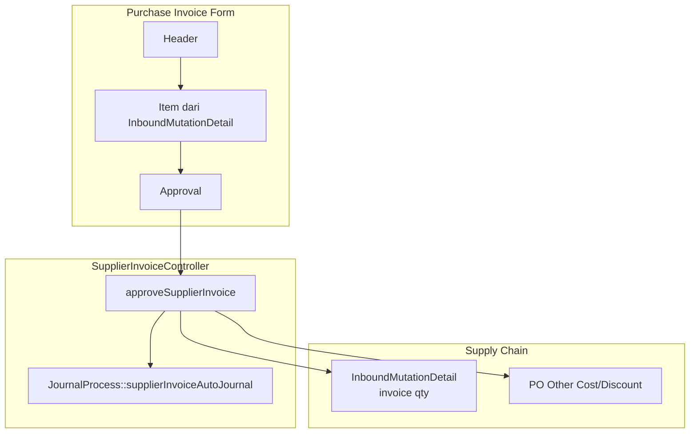
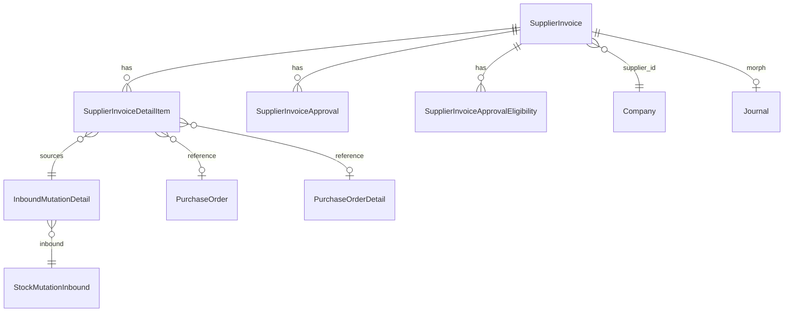

# Purchase Invoice — Requirement Documentation (AS-IS)

> **DRAFT** — Dokumentasi AS-IS dari codebase (19 Juni 2026). Belum final review QA/PM.

**Modul:** Accounting  
**Menu UI:** FA → Account Payable → Purchase Invoice (`/accounting/supplier-invoice`)  
**Audience:** PM, QA, Support, Developer

---

## 0. Metadata & Changelog

| Version | Date | Author | Changes |
|---------|------|--------|---------|
| 1.0 | 2026-06-19 | QA - Yemima | Initial draft AS-IS dari kode |

---

## 1. Ringkasan Eksekutif

Purchase Invoice mencatat hutang ke supplier atas penerimaan barang (purchase inbound). Header di `accounting_supplier_invoices` dengan kode **PI**. Baris item dari `InboundMutationDetail` (terhubung PO). Approval multi-level; approve mem-posting AP & inventory/expense via `JournalProcess::supplierInvoiceAutoJournal` dan meng-update qty invoiced di inbound detail.

---

## 2. Acceptance Criteria (AS-IS)

| ID | Kriteria | Validasi | Fitur |
|----|----------|----------|-------|
| A-01 | Datalist PI scoped company (kecuali company id 1) | `owned_by` filter | Index |
| A-02 | Kode PI auto-generate | `code_identifier = PI` | Store |
| A-03 | Minimal 1 detail sebelum approve | `supplier_invoice_detail_items` not empty | Approve |
| A-04 | Approve update inbound qty invoiced | `prepared_to_invoice_quantity` ↓, `processed_to_invoice_quantity` ↑ | Approve |
| A-05 | Approve set `account_payable_coa_id` dari payable COA supplier | `payable_coa` | Approve |
| A-06 | Approve generate journal Purchase Invoice | `supplierInvoiceAutoJournal` | Approve |
| A-07 | PO other cost/discount flagged processed | `processed_to_invoice = true` | Approve |
| A-08 | Approved invoice immutable | Error on update | Update guard |
| A-09 | Export Excel async | `SupplierInvoiceExportJob` | Export |
| A-10 | Approval eligibility datalist | `SupplierInvoiceApprovalEligibility` | Approval |

---

## 3. Validasi & Rules

| ID | Rule | Trigger | Pesan error |
|----|------|---------|-------------|
| V-01 | `supplier_id` required | Store/Update | Validation |
| V-02 | `transaction_date` required | Store/Update | Validation |
| V-03 | `currency_id`, `exchange_rate` required | Store/Update | Validation |
| V-04 | `description` max 150 | Store/Update | Validation |
| V-05 | `code` unik jika manual | Store | Code already transacted |
| V-06 | Fiscal period | Store/Update/Approve | Fiscal helper response |
| V-07 | File attachment extension | Store/Update | `validationExtensionFile` |
| V-08 | Approve: minimal 1 detail | Approve | Doesn't have any detail data |
| V-09 | Approve: AP COA configured | Journal prep | Configure Account Payable COA |
| V-10 | Approve: Exchange Diff COA company | Journal prep | Configure Exchange Diff. COA |
| V-11 | Update blocked if approved | Update | Already Approved, Can't Modify |
| V-12 | Concurrent approve guard | Approve | Cache key `approval_supplier_invoice` |

---

## 4. Fitur & Behavior

| ID | Fitur | Trigger | Expected result |
|----|-------|---------|-----------------|
| F-01 | CRUD header | Form Vue | Draft invoice default |
| F-02 | Item dari outstanding inbound | `DatalistOutstanding` / Group | `SupplierInvoiceDetailItem` |
| F-03 | Bulk store detail | `bulkStore` | Multiple inbound lines |
| F-04 | Other cost/discount | Tab + select from PO | `SupplierInvoiceOtherCost/OtherDiscount` |
| F-05 | Reference inbound di datalist | Index column | Link ke mutation-inbound |
| F-06 | Multi-level approval | `ApprovalDialog` | `accounting_supplier_invoice_approvals` |
| F-07 | Auto journal on approve | `approveSupplierInvoice` | Journal type Purchase Invoice |
| F-08 | Print | Print route | Dokumen cetak |
| F-09 | Outstanding for payment | `invoices_need_payment` | Dipakai Account Payment |

### 4.1 Alur approve & inbound

### 4.2 Relasi entitas

---

## 5. Permission & Dependencies

| Dependency | Wajib untuk |
|------------|-------------|
| Supplier master + AP COA | Approve & journal |
| Purchase Inbound approved dengan outstanding qty | Baris invoice |
| Company Exchange Diff COA | Journal foreign/variance |
| Fiscal Period | Write/approve |
| `SupplierInvoicePolicy` | Authorization |

---

## 6. QA Test Notes

- Create PI → add inbound line → approve → verify inbound qty & journal
- Approve tanpa detail → error V-08
- Edit approved PI → error V-11
- Supplier payment allocation against outstanding PI
- Export Excel + verify grand total columns
- Other cost from PO marked `processed_to_invoice`

---

## 7. Known Gaps / Open Questions

- Field `jurnal_type` default `cash basis` di migration — dampak UI perlu konfirmasi bisnis
- `SupplierInvoiceObserver` — side effects perlu QA regression saat ubah header
- Legacy Blade pages masih ada parallel dengan Vue FE

---

## Related Documents

| Doc | Path |
|-----|------|
| Knowledge Base | [knowledge-base.md](./knowledge-base.md) |
| Technical | [technical.md](./technical.md) |
| Purchase Inbound | `supplychain-mutation-inbound` (pending doc) |
| Master Other Cost | [../omni-other-cost/requirement.md](../omni-other-cost/requirement.md) |
