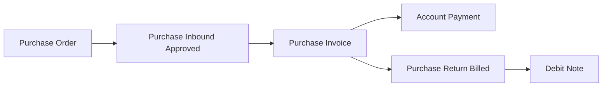
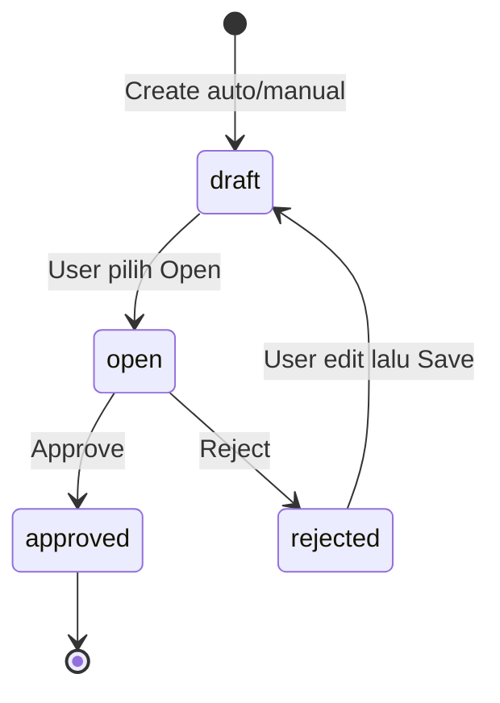
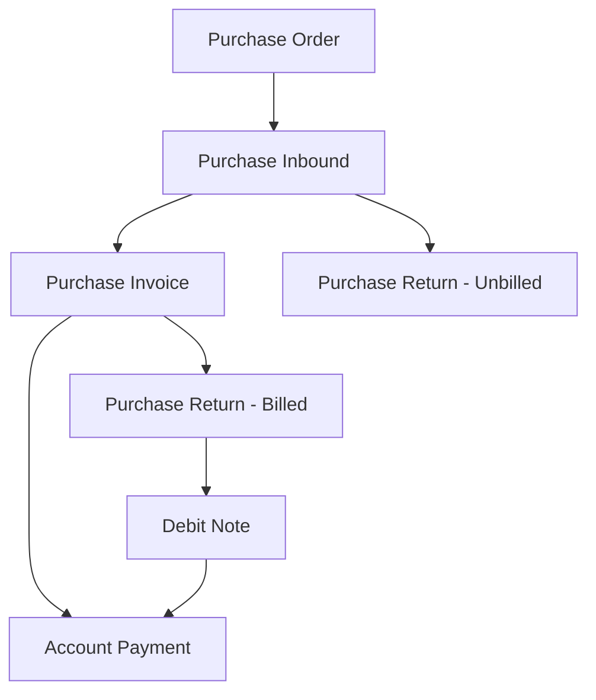

# Purchase Invoice — Requirement Documentation

**Modul:** Finance & Accounting / Account Payable  
**Prefix:** `PI-`  
**Audience:** PM, Finance, QA  
**UI route:** `/accounting/supplier-invoice`  
**SoT:** `purchase-invoice-source-of-truth.md` v3.0 (15 Jul 2026)

Downstream: [Account Payment](../accounting-supplier-payment/requirement.md)

---

## 0. Metadata & Changelog

| Version | Date | Author | Changes |
|---------|------|--------|---------|
| 2.2 | 2026-07-11 | QA - Yemima | Compliance qa-docs-standard (baseline; sebagian perilaku tidak akurat — lihat v3.0) |
| 3.0 | 2026-07-15 | QA - Yemima | Rewrite dari SoT v3.0: Void → Pending Items; gap registry PI-01/02/03; currency lock 1 rule; cost/disc auto-select + stuck risk; return Billed + Debit Note; print Resolved per SoT |

---

## 1. Ringkasan Eksekutif

Purchase Invoice (PI) adalah dokumen pengakuan **Account Payable** ke supplier atas barang yang sudah diterima (Purchase Inbound approved). Value transaksi bersumber utama dari Purchase Order; eligible to invoice hanya barang yang punya inbound approved. PI memicu pengakuan PPN Masukan dan biaya/diskon tambahan dari PO, lalu menjadi dasar pelunasan di Account Payment.

| Kebutuhan bisnis | Jawaban PI |
|------------------|------------|
| No double invoicing | Outstanding qty = inbound − prepared/processed invoice − prepared/processed return |
| Harga & tax dari PO | Line price/tax di-copy dari PO — tidak edit manual DPP |
| Partial invoicing | Bulk/single per SKU; Additional Cost/Disc bisa ditunda (remove baris) |
| Multi-currency | Max 1 foreign currency + local per PI (satu rule untuk SKU & cost/disc) |
| AP recognition | Approve → jurnal Dr Unbilled Goods + Tax + Cost / Cr AP + Disc |

### 1.1 Rantai proses



---

## 2. Prasyarat

| Prasyarat | Sumber | Catatan |
|-----------|--------|---------|
| Purchase Order approved | Menu Purchase Order | SKU, harga, tax, Additional Cost/Disc |
| Purchase Inbound approved | Menu Purchase Inbound | SKU eligible hanya dari inbound approved |
| Supplier | Master General Company | Dropdown filter: supplier yang punya referensi inbound **status apapun** (termasuk draft) — lihat GAP-PI-03 |
| Product COA (Unbilled Goods, Tax, AP) | Product COA Group / Company | Wajib sebelum approve |

---

## 3. Siklus Status



| Status | Kondisi | Editable? | Tombol |
|--------|---------|-----------|--------|
| **Draft** | Default create; juga hasil Rejected setelah edit+Save | Ya | Save & Next / Save All, Delete |
| **Open** | User pilih manual — syarat Approve | Ya | Save All, Approve, Reject, Delete |
| **Rejected** | Approver Reject saat Open | Ya — setelah edit+Save → Draft | Save All, Delete |
| **Approved** | Approve; jurnal terbit | Tidak | Print, Show only |

**Tidak ada** status Void, Processed, atau Closed pada implementasi yang dipakai user. Siklus berhenti di Approved. Lihat §9.1 Pending Items.

---

## 4. Datalist

| Kolom | Default visible | Sumber | Keterangan |
|-------|-----------------|--------|------------|
| Trx Code \| Trx Date | Ya | Header | Prefix `PI-` |
| Due Date | Ya | Header | Manual |
| Supplier | Ya | Header | — |
| Supplier's Ref | Ya | Header | Referensi faktur/dokumen supplier |
| Desc | Ya | Header | — |
| Trx Ref | Ya | Detail agregat | Nomor inbound; multi dipisah koma; clickable ke show inbound |
| Curr / Exchange | Ya | Header | — |
| Net Purchase Invoice | Ya | §6 Totals | — |
| Trx Status | Ya | Header | Draft / Open / Rejected / Approved |
| Created by \| at | Ya | Audit | — |
| Action | Ya | — | Edit/Show, Approve/Reject, Delete |

**Fitur:** Global Search, Advanced Filter, Show Deleted, Column Show/Hide, Export with/without detail (mengikuti filter aktif).

**Action rules:** Edit selama unapproved; Show saja jika Approved. Approve/Reject hanya Open. Delete hanya unapproved.

**Create UX (auto-save):** Transaction Date = now; Currency = primary; Exchange Rate = 1 (disabled jika primary). Supplier auto-fill dari PI terakhir user — jika user belum pernah punya PI, autosave gagal dan wajib isi field wajib manual dulu.

---

## 5. Form & Field

### 5.1 Basic Information

| Field | Wajib? | Default | Sumber | Validasi |
|-------|--------|---------|--------|----------|
| Transaction Code | Ya | Auto `PI-` | System | Unique per company |
| Transaction Date | Ya | Now | — | — |
| Due Date | Tidak | Null | — | Manual — belum auto dari TOP supplier (§9.1) |
| Currency | Ya | Primary | Master Currency | — |
| Exchange Rate | Ya | 1 | — | Disabled jika primary; editable jika foreign |
| Supplier | Ya | — | Supplier dengan referensi inbound (status apapun) | Quirk GAP-PI-03 |
| Supplier's Reference | Tidak | Null | — | Label UI = Supplier's Reference |
| Description | Tidak | Null | — | — |
| Term and Condition | Tidak | Null | — | — |
| Attachment | Tidak | — | — | Upload dokumen pendukung |

Header **locked** jika sudah ada detail item.

### 5.2 Detail — Inbound Transaction

Modal menampilkan SKU dari PO yang inbound-nya sudah approved.

**Aksi insert:**
- **Single Use** — modal qty (default = outstanding, editable, tidak boleh melebihi outstanding)
- **Bulk Use** — multi-select; qty default = seluruh outstanding per baris
- Outstanding 0 tapi masih ada Prepared → Action teks **"Already Prepared"**; baris hilang dari modal setelah full Processed

**Outstanding qty (base unit):**

```
Outstanding = Inbound Qty
  − (Invoice Prepared + Invoice Processed)
  − (Return Prepared + Return Processed)
```

Tampilan mengikuti primary unit; validasi selalu di base unit.

**Grid setelah insert:** Inbound Code, Name, PO Code|Date, SKU|Name, Qty, Unit, Unit Price, Discount, DPP, VAT, PO Total, Invoice Total, Exchange Gain, Action (delete).

### 5.3 Additional Cost & Discount

| Field | Wajib? | Default | Catatan |
|-------|--------|---------|---------|
| Select Cost/Disc | Ya | — | Master active ATAU Other Cost/Disc di PO (tampil nomor PO) |
| Nominal | Ya | Dari master/PO | **Disabled** jika sumber PO |
| Description | Tidak | — | — |
| COA | Ya | Master/PO | Editable selama unapproved; opsi active + bukan parent, tanpa batasan class |

**Auto-select dari PO:** begitu SKU dari suatu PO di-insert, **seluruh** Other Cost/Discount PO tersebut otomatis masuk. User remove baris yang tidak ditagih sekarang (partial per baris cost). Risiko stuck: GAP-PI-02.

**Exchange Diff** muncul jika cost/disc dari PO dan currency PO beda dari PI.

### 5.4 Totals

| Baris | Sumber |
|-------|--------|
| Total Products | Σ Invoice Total baris |
| Disc Products | Σ discount baris |
| Total VAT | Σ VAT baris |
| Total Additional Cost / Disc | Σ header cost / disc |
| **Net Purchase Invoice** | Products − Disc + VAT + Cost − Disc tambahan |
| Net (IDR) | Net × Exchange Rate header |

Jika baris pajak `coefficient = true`, DPP yang diakumulasi ke Total Products memakai DPP coefficient (lebih kecil) agar total akhir sesuai tarif efektif (mis. 12% dikenakan sebagai 11%).

### 5.5 Approval & Audit

Approval Log: siapa/kapan approve. Audit Log: seluruh perubahan data PI.

---

## 6. How It Works

### 6.1 Partial invoicing per SKU

Eligible qty = qty inbound approved, dikurangi yang sudah/sedang ditagih dan retur. Qty di PI draft = **Prepared**; setelah approve → **Processed**. Sisa outstanding untuk PI berikutnya turun sesuai qty yang sudah diproses.

### 6.2 Multi-unit

Validasi selalu di base unit. Contoh: 1 Box = 10 Pieces; invoice 2 Box → prepared 20 pieces.

### 6.3 Currency lock — satu rule, dua mode

Berlaku untuk SKU detail **dan** Additional Cost/Disc: **tidak boleh 2 foreign currency berbeda dalam 1 PI**; local selalu boleh.

| Header PI | Mekanisme |
|-----------|-----------|
| Local (IDR) | Boleh local bebas. Foreign pertama (mis. USD) masuk → foreign lain (EUR) ditolak; selanjutnya hanya IDR atau USD |
| Foreign (USD) | Lock dari awal: hanya local atau currency sama dengan header |

### 6.4 Additional Cost/Disc partial & auto-select

Insert SKU PO → semua baris cost/disc PO ikut ter-select. User remove yang ditunda. Trigger opsi lagi di PI berikutnya membutuhkan outstanding SKU dari PO/supplier yang sama — lihat GAP-PI-02.

### 6.5 Jurnal saat Approve

Dr Unbilled Goods (balik kredit inbound) + Dr Tax (jika ada, COA dari setting tax PO) + Dr Additional Cost (COA baris) — Cr Additional Discount (COA baris) + Cr Account Payable.

Contoh: Products 8.738,74 + VAT 961,26 + Cost 144,50 − Disc 86,00 = Net **9.758,50** (× kurs → local).

### 6.6 Exchange Gain/Loss

Selisih = PO Total (local) − Invoice Total (local). Minus = laba (Cr Exchange Gain); plus = rugi (Dr). Berlaku baris detail dan cost/disc dari PO currency beda.

### 6.7 Return setelah PI Approved

Pakai Purchase Return tipe **Billed** (bukan Unbilled). Tidak potong AP langsung; menerbitkan **Debit Note** untuk potong tagihan berikutnya di Account Payment.

---

## 7. Validasi

| # | Kondisi | Behavior |
|---|---------|----------|
| 1 | Edit Basic Info setelah ada detail | Ditolak — header locked |
| 2 | Insert SKU/cost/disc foreign currency kedua yang beda | Ditolak (§6.3) |
| 3 | Qty to Invoice melewati Outstanding | Ditolak |
| 4 | Qty inbound full processed di Invoice | Return Unbilled tidak bisa atas SKU inbound ini |
| 5 | Qty inbound full processed di Return Unbilled | SKU tidak bisa lagi di PI |
| 6 | Approve tanpa ≥1 detail, atau Product COA kosong | Approve gagal |
| 7 | Amount cost/disc sumber PO | Non-editable — tidak bisa over-bill secara struktural |

---

## 8. Relasi Menu Lain



| Menu | Peran |
|------|-------|
| [Purchase Order](../supplychain-purchase-order/requirement.md) | Sumber SKU, harga, tax, cost/disc |
| [Purchase Inbound](../supplychain-new-purchase-inbound/requirement.md) | Eligible SKU; bridge prepared/processed qty |
| [Account Payment](../accounting-supplier-payment/requirement.md) | Pelunasan; PI approved → outstanding |
| Purchase Return Billed | Retur setelah PI; hasilkan Debit Note |
| Purchase Return Unbilled | Mutually exclusive dengan qty full invoiced |
| [Master Other Cost](../omni-other-cost/requirement.md) / [Other Discount](../omni-other-discount/requirement.md) | Label + default COA |
| [Chart of Account](../accounting-chart-of-account/) | Opsi COA override |

---

## 9. Gap Registry

| ID | Deskripsi | Dampak | Status |
|----|-----------|--------|--------|
| GAP-PI-01 | Print PI dulu memuat template PO, bukan PI | Operator tidak bisa cetak dokumen resmi | **Resolved** (per SoT) — `[VERIFY: CODEBASE]` method print masih type-hint PurchaseOrder |
| GAP-PI-02 | Additional Cost/Disc dari PO bisa permanen tidak bisa ditagih jika SKU sumber sudah full invoiced/return sebelum semua baris cost dipilih — trigger opsi terikat outstanding SKU PO yang sama | Sebagian nilai Other Cost/Disc PO "hilang" operasional | **Open** — dikomunikasikan ke end user; verifikasi mekanisme detail `[VERIFY: CODEBASE]` |
| GAP-PI-03 | Filter Supplier header (inbound status apapun) ≠ filter SKU eligibility (harus approved) — modal kosong jika supplier hanya punya inbound draft | Membingungkan operator baru | **Resolved (Accepted)** — konfirmasi lead tech, tidak diperbaiki |

### 9.1 Pending Items — belum matang

Bukan gap teknis fitur existing; user **tidak** bisa memakai fitur ini.

| Item | Status |
|------|--------|
| **Void** | Belum matang (requirement + codebase). Siklus berhenti di Approved — tidak ada jalur void yang bisa dipakai user. Kode sisa (`can_void`, dialog) **deprecated** sebagai dokumentasi perilaku. |
| **Due Date otomatis dari TOP supplier** | Belum — Due Date murni manual |
| **Status Processed / Closed** | Ideal untuk konsistensi modul & relasi Payment; saat ini belum ada |

---

## 10. FAQ

**Q: Kenapa supplier tidak muncul di dropdown create?**  
A: Hanya muncul jika punya referensi Purchase Inbound (status apapun, termasuk draft).

**Q: Supplier terpilih tapi modal Inbound Transaction kosong?**  
A: Dropdown boleh draft; SKU baru muncul jika inbound **Approved**. Perilaku accepted (GAP-PI-03), bukan bug.

**Q: Kenapa tidak bisa 2 mata uang asing berbeda dalam 1 PI?**  
A: Aturan sistem — max 1 foreign + local, agar selisih kurs tidak kacau.

**Q: Sebagian Other Cost PO tidak muncul lagi di PI berikutnya?**  
A: Kemungkinan SKU PO sudah full invoice/return. Lihat GAP-PI-02.

**Q: Bisa void PI yang sudah approved?**  
A: Belum. Fitur belum tersedia. Approve keliru → koordinasi manual.

**Q: PPN dijurnal kapan?**  
A: Saat Approve PI, bukan saat inbound.

**Q: Retur setelah PI approved?**  
A: Purchase Return tipe **Billed** → Debit Note → potong tagihan berikutnya (bukan potong AP langsung).

**Q: Total Products lebih kecil dari hitungan manual?**  
A: Jika pajak coefficient true, DPP terakumulasi versi coefficient (lebih kecil) agar total sesuai aturan PPN.

---

## Related Documents

| Doc | Path |
|-----|------|
| Knowledge Base | [knowledge-base.md](./knowledge-base.md) |
| Technical | [technical.md](./technical.md) |
| Account Payment | [../accounting-supplier-payment/requirement.md](../accounting-supplier-payment/requirement.md) |
| Purchase Inbound | [../supplychain-new-purchase-inbound/requirement.md](../supplychain-new-purchase-inbound/requirement.md) |
