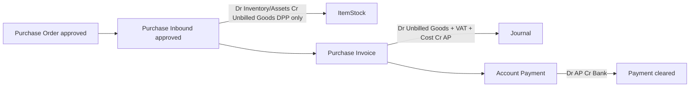
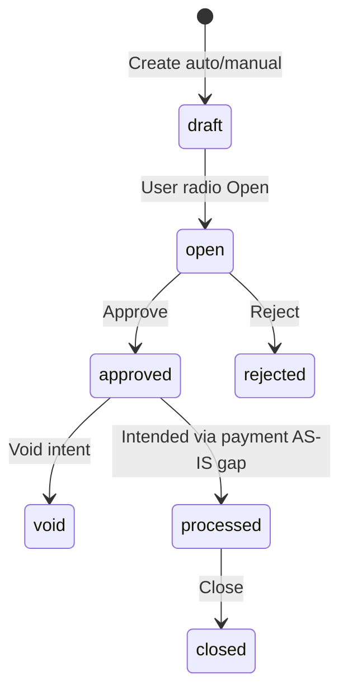

# Purchase Invoice — Requirement Documentation

**Modul:** Finance & Accounting / Account Payable  
**Prefix transaksi:** `PI-`  
**Audience:** PM, Finance, Operations, QA, Support, Developer  
**Status:** AS-IS verified against codebase per 2026-07-05

**UI route:** `/accounting/supplier-invoice`  
**API base:** `{VITE_API_URL}accounting/supplier-invoice`  
**Table:** `accounting_supplier_invoices` · `accounting_supplier_invoice_detail_items` · other cost/discount

**PM source:** `purchase-invoice-requirement-okt2025.md` v1.1 (29 Okt 2025)

**Payment downstream:** [Account Payment](../accounting-supplier-payment/requirement.md)

---

## 0. Metadata & Changelog

| Version | Date | Author | Changes |
|---------|------|--------|---------|
| 1.0 | 2026-06-19 | QA - Yemima | Initial draft AS-IS codebase |
| 2.0 | 2026-07-05 | QA - Yemima | Full PM merge v1.1, journal/VAT shift, dynamic cost, UI/calc detail, inbound & payment relasi, gaps §19–§21 |

---

## 1. Ringkasan Eksekutif

**Purchase Invoice (PI)** mencatat pengakuan **Account Payable** ke supplier atas barang yang sudah **Purchase Inbound approved**. PI adalah titik:

1. **Pengakuan PPN Masukan** (VAT In) — dipindah dari Inbound ke PI (revamp Okt 2025)
2. **Clearing Unbilled Goods** — membalik akun perantara dari GRN
3. **Dasar pelunasan** di menu **Account Payment**

| Kebutuhan Bisnis | Bagaimana PI Menjawab |
|------------------|----------------------|
| No double invoicing | `prepared_to_invoice_quantity` / `processed_to_invoice_quantity` per inbound detail |
| Harga dari PO | Line price/tax copied from PO — tidak edit manual DPP |
| Partial invoicing | Bulk/single/group inbound; dynamic Other Cost/Disc per invoice |
| Multi-currency | Currency + exchange rate; exchange diff journal |
| AP recognition | Approve → journal Dr Unbilled Goods + Tax + Cost / Cr AP |

### 1.1 Rantai procurement (hulu → hilir)



---

## 2. Prasyarat

| # | Prasyarat | Validasi AS-IS |
|---|-----------|----------------|
| 1 | **Inbound approved** | Outstanding query: inbound with approvals; status approved/processed |
| 2 | **Purchase Order** | Inbound detail linked `purchase_order_detail_id` — harga, tax, other cost/disc source |
| 3 | **Supplier** | Same supplier on PI header & inbound; select2 filtered suppliers with inbound |
| 4 | **Currency match** | PO `currency_id` = PI `currency_id` — error if different |
| 5 | **Inbound date < PI date** | `inbound.transaction_date < PI.transaction_date` |
| 6 | **Product COA** | Unbilled Goods, Tax COA, AP COA configured per product/supplier/company |

---

## 3. Siklus Status Transaksi



| Status | Definisi | Edit? | Approve? |
|--------|----------|-------|----------|
| **draft** | Default create | Yes | No — must switch to **open** |
| **open** | Ready for approval | Yes | Yes |
| **approved** | Journal posted; AP recognized | No | No |
| **rejected** | Approver reject | FE shows as draft radio | — |
| **void** | From approved (UI) | No | — |
| **processed** | PM: partial payment context | — | **Rarely set on PI header** (GAP-PI-03) |
| **closed** | Requires `processed` | — | GAP-PI-03 |

**Approval:** single level seeded (`approval => 1`).

---

## 4. Datalist

**Komponen:** `SupplierInvoice/DataList.vue`  
**API:** `GET accounting/supplier-invoice`

| Kolom | Field |
|-------|-------|
| Trx Code / Date | `code_formatted` |
| Due Date | `due_date_formatted` |
| Supplier | `supplier_name_formatted` |
| Supplier's REF. | `supplier_reference_document` |
| Description | `description` (truncate) |
| Trx Ref | `reference_formatted` — inbound codes (max 2 links FE) |
| Currency | `currency.code` |
| Exchange Rate | `exchange_rate_formatted` |
| **Net Purchase Invoice** | `grand_total_after_vat_formatted` |
| Trx Status | `transaction_status` |

**Toolbar:** bulk delete, bulk approve, export (with/without details), show deleted, advanced filter.

**Row actions:** Update; Delete (non-approved); Approve; Close (if `processed`); Void (if `can_void` — often hidden in list).

---

## 5. Header — Field & Validasi

| Field | PM | AS-IS |
|-------|-----|-------|
| **Transaction Code** | Auto PI | Auto `PI` prefix if blank; unique per company |
| **Transaction Date** | Tanggal pengakuan hutang/jurnal | Required; fiscal period; FE min **6 months** backdate |
| **Supplier** | Wajib; punya inbound belum ditagih | Required; select2 suppliers with approved/processed inbound |
| **Currency & Exchange Rate** | Wajib | Required; lock if details exist |
| **Due Date** | Auto from TOP, editable | Nullable — **no auto TOP calc from supplier master** (GAP-PI-06) |
| **Tax Invoice No** | Optional/required by setting | `supplier_reference_document` or separate field — verify FE label "Supplier's Reference" |
| **Description** | Optional | max 150 |
| **Term and Condition** | — | CKEditor max 2000 (codebase-only) |
| **Attachment** | — | File upload with extension validation |
| **Draft / Open** | — | Radio side panel before approve |

**Update lock** (if detail/other cost/discount exists): supplier, currency, exchange rate, transaction date cannot change.

**Create quirk (AS-IS):** `fetchDefaultValues()` may auto-submit create on first visit — draft PI created immediately (GAP-PI-08).

---

## 6. Detail Items — Outstanding Inbound

### 6.1 Sumber data

**API outstanding:** `GET accounting/supplier-invoice/{id}/outstanding-inbound` (and group variant)

| Filter | Rule |
|--------|------|
| Inbound | **Approved** (has approvals) |
| Supplier | = PI supplier |
| Currency | PO currency = PI currency |
| Date | Inbound date **<** PI transaction date |
| Qty sisa | `processed_to_invoice_quantity < quantity_in_base_unit` |
| Type | Not inventory adjustment / return inbound |

### 6.2 Kolom outstanding panel

SKU, Product, Inbound ref, PO ref, Qty inbound, **Max invoice qty** (`invoiceBalance()`), Prepared/Processed invoice status, Return qty status.

### 6.3 UI actions — Inbound Transaction panel

| Action | Behavior |
|--------|----------|
| **Bulk Use** | Checkbox multi-select → `POST …/details/bulk` with `inbound_detail_ids` |
| **Single Use** | Modal "Use this to Invoice" — edit qty → `POST …/details` |
| **Group inbound** | Select whole inbound header → `store_group` API |
| **Toggle group view** | `DatalistOutstandingGroup` vs flat outstanding |

### 6.4 Qty validation

```
invoiceBalance() = quantity_in_base_unit
                 - prepared_to_invoice_quantity
                 - processed_to_invoice_quantity
                 - (return quantities)
```

| Event | Field update |
|-------|--------------|
| Add line | `prepared_to_invoice_quantity` ↑ on inbound detail |
| Delete line / delete PI | `prepared_to_invoice_quantity` ↓ |
| Approve PI | prepared ↓, `processed_to_invoice_quantity` ↑ |

**Messages:**
- `Invoice Qty must not exceed Inbound Qty after deducting Returned Qty.`
- `The data you selected is already included in this purchase invoice detail.`
- `Can't use Purchase Order with different currency.`

### 6.5 Detail grid columns (after add)

PO ref, SKU/Name, Invoice Qty, Unit, Unit Price, Discount %, **DPP**, VAT %, PO Total, **Invoice Total**, Exchange Gain (if foreign).

**PM:** DPP tidak editable manual — **AS-IS:** prices copied from PO via `getDetailPriceAndTax()` — user cannot override unit price on line.

---

## 7. Perhitungan Harga & Totals

### 7.1 Line-level (from PO)

Copied/stored per `SupplierInvoiceDetailItem`:

| Field | Meaning |
|-------|---------|
| `invoice_each_price_before_discount_before_vat` | Unit before discount, before VAT |
| `invoice_each_price_after_discount_before_vat` | Unit after discount, before VAT (DPP unit) |
| `invoice_each_price_after_discount_after_vat` | Unit after discount, after VAT |
| `invoice_discount` | Discount % from PO |
| `vat` / `fake_vat` / `vat_included` | Tax from PO pivot |

**Formulas (`SupplierInvoiceDetailItem`):**

```
invoice_total (before VAT) = invoice_quantity × invoice_each_price_after_discount_before_vat
invoice_vat_total          = invoice_total × vat / 100
invoice_total_after_vat    = invoice_quantity × invoice_each_price_after_discount_after_vat
DPP column display         = invoice_quantity × each_dpp
```

### 7.2 Exchange difference (foreign currency)

When PO exchange rate ≠ PI exchange rate:

```
exchangeDifference = (PO.exchange_rate - PI.exchange_rate) × qty × price
```

Posted to company **Exchange Diff. COA** on journal (`SupplierInvoicePrice::exchangeDifference`).

### 7.3 Header grand total (`SupplierInvoicePrice::grandTotal`)

```
subTotal.before_vat = Σ line (qty × each_price_after_discount_before_vat)
subTotal.after_vat  = Σ line (qty × each_price_after_discount_after_vat)

grandTotal.before_vat = subTotal.before_vat + totalOtherCost - totalOtherDiscount
grandTotal.after_vat  = subTotal.after_vat  + totalOtherCost - totalOtherDiscount
```

**Persisted:** `grand_total_before_vat`, `grand_total_after_vat`

### 7.4 FE Totals panel (`Form.vue`)

| Row | Source |
|-----|--------|
| Total Products (+ DPP tooltip) | `totalProduct` breakdown |
| Disc Products | Sum line discounts |
| Total VAT | Sum line VAT |
| Total Additional Cost / Disc | Header other cost − other discount |
| **Net Purchase Invoice** | `grand_total_after_vat` (+ primary currency conversion if foreign) |

**PM validation:** Invoice total cannot be negative — enforce on approve/grandTotal calc.

---

## 8. Additional Cost & Discount (Dynamic — PM v1.1)

### 8.1 PM concept

User **memilih** Other Cost / Other Discount dari PO untuk invoice **ini** atau menunda ke PI berikutnya (partial invoicing):

- Barang saja
- Barang + Cost
- Cost saja (barang sudah ditagih di PI sebelumnya)

### 8.2 AS-IS implementation

| Mechanism | Detail |
|-----------|--------|
| **Auto on first line add** | `firstOrCreate` `SupplierInvoiceOtherCost/OtherDiscount` from PO line's PO header costs — sets PO `prepared_to_invoice=true` |
| **Manual select from PO** | `OtherCostSelectFromPO.vue` / `OtherDiscountSelectFromPO.vue` — multiselect `supplychain/purchase-order/outstanding-other-costs/select2` filtered by supplier, currency, PO ids |
| **Manual entry** | `OtherCostForm` — amount, description, other_cost_id |
| **On approve** | PO flags → `processed_to_invoice=true`, `prepared_to_invoice=false` |
| **On PI delete** | PO flags reset |

**GAP-PI-14:** PM describes explicit tick-box per cost line; AS-IS uses multiselect add + auto-first-line — functionally similar but UI differs.

**Over-bill guard:** Amount cannot exceed PO other cost/disc remaining (validate on store).

---

## 9. Penjurnalan saat Approve (PM v1.1 + AS-IS)

### 9.1 Konsep (revamp Okt 2025)

| Tahap | PPN | Jurnal inti |
|-------|-----|-------------|
| **Purchase Inbound** | **Tidak** | Dr Inventory/Assets/Op.Expense · Cr **Unbilled Goods** (DPP/net only) |
| **Purchase Invoice** | **Ya — trigger VAT In** | Dr **Unbilled Goods** + **Tax** + **Other Cost** · Cr **AP** + **Other Discount** + Exchange diff |

### 9.2 Matriks jurnal PI (`JournalProcess::supplierInvoiceAutoJournal`)

| Posisi | COA | Nilai |
|--------|-----|-------|
| **Debit** | Product **Unbilled Goods** | `qty_in_base × each_price_after_discount_before_vat × PO.exchange_rate` |
| **Debit** | **Tax COA** (per PO tax line) | Pro-rata `vat_amount` on invoiced qty |
| **Debit** | Other cost **expense COA** | `amount_primary_currency` |
| **Credit** | Other discount **expense COA** | `amount_primary_currency` |
| **Credit/Debit** | Company **Exchange Diff. COA** | Net exchange gain/loss |
| **Credit** | **Account Payable** (supplier) | Balancing: total debit − credits − exchange |

**Journal header:** type `"Purchase Invoice"`, auto-approved, primary currency, date = PI transaction date.

**Not:** PI does **not** debit Inventory again — clears Unbilled Goods accrual from inbound.

### 9.3 Contoh angka (PM)

Barang DPP 90,090.09 + PPN 9,909.91; Other Cost 10,000; Other Disc 5,000 → **AP Credit 105,000**

### 9.4 Approve sequence

1. Cache lock 30s `approval_supplier_invoice`
2. Fiscal period; min 1 detail
3. Set `account_payable_coa_id`
4. `approve()` — status + approval log
5. Inbound: prepared↓ processed↑
6. PO other cost/disc: processed flags
7. `supplierInvoiceAutoJournal()`

---

## 10. Relasi Purchase Inbound (detail)

| Aspek | Rule |
|-------|------|
| **Eligible inbound** | Approved/processed GRN; same supplier & currency |
| **Double invoicing** | Blocked via prepared + processed qty caps |
| **Reference link** | Datalist TRX REF → `/supplychain/mutation-inbound/edit/{id}` (legacy route; BETA inbound same backend) |
| **Return after invoice** | Purchase Return cuts **AP**, not Unbilled Goods (PM downstream — cross-ref return docs) |
| **Qty fields** | See [Purchase Inbound v2.0](../supplychain-new-purchase-inbound/requirement.md) — `prepared_to_grn` vs `processed_to_invoice` independent chains |

**Inbound journal (reminder):** DPP only — see PI §9.1 and [GRN §11](../supplychain-new-purchase-inbound/requirement.md#11-accounting--journal-as-is).

---

## 11. Relasi Account Payment (detail)

Full doc: [accounting-supplier-payment/requirement.md](../accounting-supplier-payment/requirement.md)

### 11.1 PI → Payment outstanding

Approved PI appears in **Account Payment** outstanding when:

```
grand_total_after_vat > processed_to_payment_amount
status ∈ {approved, processed}
supplier = payment supplier
payment.transaction_date ≥ invoice.transaction_date
```

**API:** `PaymentController@queryOutstandingSupplierInvoice`

### 11.2 Payment allocation fields on PI

| Field | Meaning |
|-------|---------|
| `prepared_to_payment_amount` | Reserved by draft/open payment lines |
| `processed_to_payment_amount` | Finalized on payment **approve** |
| `invoice_remaining_after_vat` | `grand_total_after_vat - prepared - processed` |

### 11.3 Lifecycle coupling

| PI state | Payment state | Effect on PI outstanding |
|----------|---------------|--------------------------|
| Approved, no payment | — | Full `grand_total_after_vat` outstanding |
| Payment draft/open | `prepared_to_payment_amount` ↑ | Outstanding reduced by prepared |
| Payment approved | `processed_to_payment_amount` ↑ | Outstanding reduced permanently |
| Partial payment | — | PI stays approved; remaining outstanding |
| Full payment | processed = grand total | Fully paid |

### 11.4 Void / edit guards (PM vs AS-IS)

| PM rule | AS-IS |
|---------|-------|
| Approved PI immutable | ✓ update blocked |
| Cannot void if payment exists | **Partial** — void UI exists but **no payment check** + void doesn't reverse journal (GAP-PI-02) |
| Cancel payment first to void PI | **Not enforced in code** |

### 11.5 Payment journal (downstream)

On payment approve: `JournalProcess::supplierPaymentAutoJournal`:
- **Dr** Account Payable (per PI allocation)
- **Cr** Cash/Bank and/or **Debit Note** (multi-source)
- Exchange diff + Cash diff + Adjustment lines

Full AP spec: [accounting-supplier-payment/requirement.md §10–§12](../accounting-supplier-payment/requirement.md#10-penjurnalan-saat-approve)

**Show PI from payment form:** `GET accounting/supplier-payment/supplier-invoice/{id}` → delegates PI show.

---

## 12. UI/UX — Halaman Form

### 12.1 Layout & navigasi

**Sidenav sections:** Basic Information → Product to Invoiced → Additional Cost → Additional Discount → Approval Log → Audit

**Side panel (sticky):** Draft/Open radio · Save All · Approve · Void · Close

### 12.2 Tombol utama

| Tombol | Kondisi | Aksi |
|--------|---------|------|
| **Save & Next** | Create | Save header → redirect edit |
| **Save All** | Edit + `can_update` | PATCH header |
| **Approve** | Open + `can_approve` + ≥1 detail | POST approve |
| **Void** | Approved + `can_void` | VoidDialog → approve void |
| **Print** | Edit | GET print — **broken** (GAP-PI-01) |
| **Inbound Transaction** | Edit | Overlay outstanding panel |

### 12.3 Auto UX behaviors

- First load draft/open → auto-scroll to `#ProducttoInvoiced`
- Totals panel visible after save (dashed border summary)
- Rejected API status → FE radio shows **draft**
- Foreign currency → show converted primary amount in totals

---

## 13. Import / Export / Print

| Feature | AS-IS |
|---------|-------|
| **Export Excel** | ✓ async `SupplierInvoiceExportJob`; with/without details; chunk 100 |
| **Import** | ❌ No PI import (GAP-PI-05) |
| **Print PDF** | ❌ Route calls **PurchaseOrder** PDF template (GAP-PI-01) |

---

## 14. Void / Delete / Close

| Action | When | Reversal |
|--------|------|----------|
| **Delete** | Not approved | Revert inbound prepared; delete lines; reset PO cost flags |
| **Void** | Approved (UI) | Status only via `approve(AS_VOID)` — **no** inbound/journal reversal (GAP-PI-02) |
| **Close** | `processed` status | `approve(AS_CLOSED)` — rarely reachable (GAP-PI-03) |

---

## 15. Do's & Don'ts

| ✅ Do | ❌ Don't |
|-------|----------|
| Match PI currency to PO/inbound | Invoice inbound from different currency PO |
| Approve only from **open** | Approve while draft |
| Configure Unbilled Goods + Tax + AP COA before approve | Expect VAT journal at inbound |
| Select only uninvoiced inbound qty | Double-invoice same inbound line |
| Complete payment before expecting void cleanup | Rely on void to auto-reverse payment |

---

## 16. Acceptance Criteria (QA smoke)

1. Create PI → add inbound line → prepared_to_invoice on GRN detail  
2. Approve → processed_to_invoice; journal Dr Unbilled Goods + Tax; Cr AP  
3. Grand total = lines + cost − discount  
4. Foreign PO/PI rate diff → exchange diff journal line  
5. Other cost from PO → appears on approve journal debit  
6. Partial other cost on PI 1, remainder on PI 2  
7. Approved PI in Account Payment outstanding  
8. Payment approve → processed_to_payment on PI  
9. Block duplicate inbound line on same PI  
10. Export with details succeeds  

---

## 17. Relasi Menu

| Menu | Relasi |
|------|--------|
| [Purchase Order](../supplychain-purchase-order/requirement.md) | Price, tax, other cost/disc source |
| [Purchase Inbound](../supplychain-new-purchase-inbound/requirement.md) | Outstanding source; Unbilled Goods accrual |
| [Account Payment](../accounting-supplier-payment/requirement.md) | Pelunasan AP |
| [Product COA Group](../accounting-product-coa-group/) | Unbilled Goods, Tax COA |
| [General Company](../generalsetting-general-company/) | AP COA, Exchange Diff COA |

---

## 19. Gaps — PM vs AS-IS

| ID | Topik | PM / Expected | AS-IS | Status |
|----|-------|---------------|-------|--------|
| GAP-PI-01 | Print PI PDF | Working print | Controller loads **PO** PDF | **Broken** |
| GAP-PI-02 | Void reverses AP/inbound | Full reversal | Void status only; no qty/journal rollback | **Not implemented** |
| GAP-PI-03 | PI `processed` on partial pay | Outstanding status | Header rarely set `processed` | **Partial** |
| GAP-PI-04 | Void blocked if payment | Must cancel payment first | No payment guard on void | **Not implemented** |
| GAP-PI-05 | Import PI | — | No import routes | **N/A** |
| GAP-PI-06 | Due date from supplier TOP | Auto calculate | Manual due_date only | **Not implemented** |
| GAP-PI-07 | Tax Invoice No field | Dedicated FP field | May map to supplier reference | **Verify UI** |
| GAP-PI-08 | Create page behavior | Explicit save | Auto-submit on default values | **UX quirk** |
| GAP-PI-09 | Supplier tooltip | Accurate | Says "draft inbound"; API needs **approved** | **UI drift** |
| GAP-PI-10 | `rejected` vs `declined` | Consistent | Approve sets rejected; canApprove checks declined | **Code inconsistency** |
| GAP-PI-11 | Negative invoice total | Block | Verify grandTotal validation | **Verify QA** |
| GAP-PI-12 | Return after invoice | Cut AP not Unbilled | Purchase Return module — cross-test | **Separate menu** |
| GAP-PI-13 | Account Payment docs | Complete | Payment QA docs pending until v2.0 | **Addressed this commit** |
| GAP-PI-14 | Dynamic cost tick UI | Checkbox per cost | Multiselect from PO | **UI differs — OK functionally** |

### 19.1 GAP-PI-01 — Print (detail)

`GET accounting/supplier-invoice/{id}/print` → `SupplierInvoiceController@print` loads PurchaseOrder view — FE expects PI PDF. Operator cannot print official PI from system.

### 19.2 GAP-PI-02 — Void (detail)

Void from approved does not:
- Decrement `processed_to_invoice_quantity` on inbound
- Reset PO `processed_to_invoice` on other costs
- Reverse/auto-void journal entry

Finance must manual adjust or use unapprove (dev/local only).

---

## 20. Dev Follow-ups

| ID | Item |
|----|------|
| DEV-PI-01 | Fix print to use SupplierInvoice template |
| DEV-PI-02 | Void: reverse inbound qty + journal + block if payment |
| DEV-PI-03 | Set PI `processed` when partial payment approved |
| DEV-PI-04 | Auto due_date from supplier payment terms |
| DEV-PI-05 | Remove create-page auto-submit |
| DEV-PI-06 | Align rejected/declined status constants |

---

## 21. Pending Items — Major

| ID | Severity | Stakeholder | Pertanyaan | AS-IS |
|----|----------|-------------|------------|-------|
| **P-PI-01** | 🔴 **Highest** | **Finance + Dev** | **Void PI harus reverse inbound + journal?** (GAP-PI-02) | Void cosmetic only |
| **P-PI-02** | 🔴 **Major** | **Ops** | **Fix Print PI?** (GAP-PI-01) | 404/wrong document |
| **P-PI-03** | 🔴 **Major** | **Finance** | **Block void if payment exists?** (GAP-PI-04) | Not enforced |
| **P-PI-04** | 🟡 Medium | **PM** | Auto due date from TOP? (GAP-PI-06) | Manual only |
| **P-PI-05** | 🟡 Medium | **QA** | PI `processed` status semantics vs payment (GAP-PI-03) | Unclear lifecycle |

**Confirmed OK (PM v1.1):**

- VAT at PI not inbound ✓  
- Dynamic other cost/disc partial invoicing ✓ (multiselect)  
- Dr Unbilled Goods clears inbound accrual ✓  
- Double invoicing blocked ✓  

---

## Related Documents

| Doc | Path |
|-----|------|
| Knowledge Base | [knowledge-base.md](./knowledge-base.md) |
| Technical | [technical.md](./technical.md) |
| Account Payment | [../accounting-supplier-payment/requirement.md](../accounting-supplier-payment/requirement.md) |
| Purchase Inbound | [../supplychain-new-purchase-inbound/requirement.md](../supplychain-new-purchase-inbound/requirement.md) |
