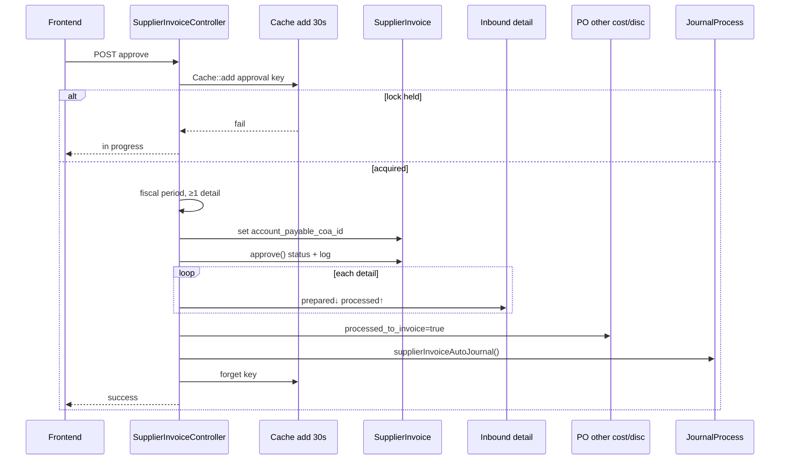

# Purchase Invoice — Technical Documentation

**API prefix:** `accounting/supplier-invoice`  
**Module:** `Modules/Accounting`  
**Behavior SoT:** [requirement.md](./requirement.md) v3.0

---

## 1. File Map

### Backend

| Layer | Path |
|-------|------|
| Routes | `Modules/Accounting/Routes/api.php` (prefix `supplier-invoice`) |
| Controller | `Modules/Accounting/Http/Controllers/SupplierInvoiceController.php` |
| Detail items | `Modules/Accounting/Http/Controllers/SupplierInvoiceDetailItemController.php` |
| Other cost | `Modules/Accounting/Http/Controllers/SupplierInvoiceOtherCostController.php` |
| Other discount | `Modules/Accounting/Http/Controllers/SupplierInvoiceOtherDiscountController.php` |
| Model header | `Modules/Accounting/Entities/SupplierInvoice.php` |
| Model detail | `Modules/Accounting/Entities/SupplierInvoiceDetailItem.php` |
| Model OC/OD | `SupplierInvoiceOtherCost`, `SupplierInvoiceOtherDiscount` |
| Tax lines | `Modules/Accounting/Entities/SupplierInvoiceTax.php` (`coefficient`) |
| Pricing | `Modules/Accounting/Services/SupplierInvoicePrice.php` |
| Journal | `app/Helpers/Accounting/JournalProcess.php` → `supplierInvoiceAutoJournal()` |
| COA select2 | `ChartOfAccountController@select2Child` |
| Export | `SupplierInvoiceExportJob` |

### Frontend

| Layer | Path |
|-------|------|
| Route | `olshoperp-frontend/src/router/accounting.ts` → `/accounting/supplier-invoice` |
| List | `src/pages/Accounting/AccountPayable/SupplierInvoice/DataList.vue` |
| Form | `Form.vue` |
| Outstanding | `DatalistOutstanding.vue`, `DatalistOutstandingGroup.vue` |
| Other cost/disc | `OtherCost.vue`, `OtherDiscount.vue` + `CoaSelect.vue` |
| PO select | `OtherCostSelectFromPO.vue`, `OtherDiscountSelectFromPO.vue` |
| Detail grid | `DetailItemDataList.vue` |

### Cross-module

| Area | Path |
|------|------|
| Payment outstanding | Payment / SupplierPayment controllers |
| Debit Note (post Billed return) | `DebitNoteController` — bridging return → payment |

---

## 2. API Routes (utama)

| Method | Path | Action |
|--------|------|--------|
| GET/POST | `accounting/supplier-invoice` | Index / Store |
| GET/PATCH/DELETE | `accounting/supplier-invoice/{id}` | Show / Update / Destroy |
| POST | `accounting/supplier-invoice/{id}/approve` | Approve / Reject (`AS_APPROVED`, `AS_REJECTED`; `AS_VOID` still in Rule::in — **immature**, see §9) |
| GET | `…/{id}/outstanding-invoice` | Outstanding flat |
| GET | `…/{id}/outstanding-invoice-group` | Outstanding grouped |
| POST | `…/supplier-invoice-detail-item` | Add line |
| POST | `…/supplier-invoice-detail-item-bulk` | Bulk add |
| POST | `…/supplier-invoice-detail-item/create/group` | Group add |
| GET | `…/{id}/print` | Print — `[VERIFY: CODEBASE]` vs SoT GAP-PI-01 Resolved (method still typed `PurchaseOrder` + PO PDF view) |
| GET | `select2/supplier` | Supplier dropdown (inbound ref any status) |

---

## 3. Database — Key Tables

### `accounting_supplier_invoices`

| Column | Notes |
|--------|-------|
| `code`, `transaction_date`, `due_date` | `due_date` nullable, no TOP auto-calc |
| `supplier_id`, `currency_id`, `exchange_rate` | Lock after details |
| `grand_total_before_vat`, `grand_total_after_vat` | From pricing service |
| `prepared_to_payment_amount`, `processed_to_payment_amount` | Payment bridge |
| `account_payable_coa_id` | Set on approve |
| `transaction_status` | draft / open / approved / rejected (no user-facing void/processed/closed) |
| `supplier_reference_document` | Supplier's Reference |

### `accounting_supplier_invoice_detail_items`

| Column | Notes |
|--------|-------|
| `mutation_inbound_detail_item_id` / inbound detail FK | Qty bridge |
| `purchase_order_detail_id` | Price source |
| `invoice_quantity`, `invoice_quantity_in_base_unit` | Validation in base unit |
| Price + `vat` / `fake_vat` | Copied from PO |
| Tax child rows | `coefficient` on tax entity |

### Inbound qty bridge

| Column / accessor | Usage |
|-------------------|-------|
| `prepared_to_invoice_quantity` | Reserved on add line |
| `processed_to_invoice_quantity` | Finalized on PI approve |
| Return prepared/processed | Subtracted in `invoiceBalance()` — see INV-PI-01 |

### PO other cost flags

| Column | Usage |
|--------|-------|
| `prepared_to_invoice` / `processed_to_invoice` | Linked ↔ billed on PI |

### PI OC/OD

| Column | Notes |
|--------|-------|
| `expense_coa_id` | Editable until approved; journal reads row value |
| `purchase_order_other_*_id` | Set = from PO (amount locked) |

---

## 4. Pricing Service

**Class:** `SupplierInvoicePrice`

```
subTotal.before_vat = Σ (qty × each_after_discount_before_vat)
subTotal.after_vat  = Σ (qty × each_after_discount_after_vat)
grandTotal = subTotal + totalOtherCost − totalOtherDiscount
```

**Coefficient tax:** if tax `coefficient` true, DPP accumulated into FE Total Products uses coefficient DPP (smaller) so effective VAT rate matches policy.

**Exchange diff:** PO local total − Invoice local total → Exchange Gain (Cr) / Loss (Dr); also on PO-sourced OC/OD with currency mismatch.

**Line pricing:** `PurchaseOrderDetail::getDetailPriceAndTax()`.

---

## 5. Approve Flow



**Transaction:** `approveSupplierInvoice()` in single `DB::beginTransaction` — status, inbound qty, PO flags, journal rollback together.

**Journal:** Dr Unbilled Goods + Tax + OC (`expense_coa_id`) · Cr AP + OD + exchange. Validates `expense_coa.owned_by == PI.owned_by`.

---

## 6. Invariants

| ID | Invariant |
|----|-----------|
| INV-PI-01 | `prepared_to_invoice + processed_to_invoice + prepared_to_return + processed_to_return ≤ inbound qty_base` per inbound detail |
| INV-PI-02 | `Σ Dr = Σ Cr` on `supplierInvoiceAutoJournal` |
| INV-PI-03 | Max one distinct foreign currency across detail SKU **and** OC/OD in a PI; local always allowed |
| INV-PI-04 | PO-sourced OC/OD: amount & label immutable; `expense_coa_id` + description mutable until approved |
| INV-PI-05 | At approve: `expense_coa` is leaf (no children), active, `owned_by == PI.owned_by` |
| INV-PI-06 | `prepared_to_payment + processed_to_payment ≤ grand_total_after_vat` |

---

## 7. Failure Modes & Transaction Boundary

| Failure | Scope | Behavior |
|---------|-------|----------|
| Concurrent approve | Pre-TX | `Cache::add` fail → error; no DB change |
| Fiscal closed / empty detail / missing Product COA | Pre-TX or mid journal | Error; approve TX rolled back if inside transaction |
| Exception mid-`approveSupplierInvoice` | Single TX | Full rollback |
| OC/OD PO stuck (GAP-PI-02) | Product | If SKU fully processed in invoice/return before all PO costs billed, options may not reappear — `[VERIFY: CODEBASE]` for exact filter |
| Void path | Immature | `can_void` / VoidDialog / `AS_VOID` still in code; datalist often `render_void: false`. **Not** a supported user flow (Pending Items SoT) |
| Print | Route exists | `[VERIFY: CODEBASE]` vs SoT Resolved — `@print` still loads PO DomPDF view |

---

## 8. Data Lifecycle (PO → GRN → PI → Payment / Return)

| Stage | Document | Flag / field | Meaning |
|-------|----------|--------------|---------|
| PO | Other cost/disc | `prepared_to_invoice` | Linked to draft PI |
| PO | Other cost/disc | `processed_to_invoice` | Billed on approved PI |
| GRN | Inbound detail | `prepared_to_invoice_quantity` | Reserved by draft PI line |
| GRN | Inbound detail | `processed_to_invoice_quantity` | Finalized on PI approve |
| GRN | Inbound detail | return prepared/processed | Cuts invoice outstanding |
| PI | Header | `prepared` / `processed_to_payment_amount` | AP allocation |
| PI → Return Billed | Purchase Return | — | Issues Debit Note (not direct AP cut) |
| DN → Payment | Debit Note | — | Source on Account Payment |

Business rules: [requirement §6–§8](./requirement.md).

---

## 9. Outstanding Inbound Query

Filters (controller / balance):

- Inbound approved (has approvals)
- Same `supplier_id`; currency rules per INV-PI-03
- Inbound date before PI date
- `invoiceBalance()` less than equal remaining (invoice + return prepared/processed)
- Exclude adjustment / return inbound types

Supplier select2: inbound reference **any** status — intentional quirk (GAP-PI-03 Accepted).

---

## 10. Validation Highlights

| Rule | Location |
|------|----------|
| Unique code / fiscal | Store-update / approve |
| Qty ≤ invoiceBalance (base) | Detail store/update |
| Currency lock one foreign | Detail + OC/OD store `[VERIFY: CODEBASE]` exact message path |
| Header lock if details exist | Update request |
| PO OC/OD amount locked | `checkInvalidModified` |
| `expense_coa_id` FormRequest | Often nullable until approve (OI-style debt) |
| COA owned_by | Journal approve |

---

## 11. Frontend Behaviors

| Behavior | File / note |
|----------|-------------|
| Auto-submit create + supplier last-PI fill | `Form.vue` `fetchDefaultValues()` |
| Void UI remnant | `VoidDialog` + `can_void` — not productized |
| Inline COA edit | `OtherCost.vue` / `OtherDiscount.vue` → `CoaSelect` |
| Auto OC/OD on first SKU from PO | Detail store → firstOrCreate / bulk from PO |
| Outstanding overlay | `DatalistOutstanding*.vue` |
| Print call | Hits print API |

### COA select2

Active + leaf only; **no** class filter; company scope.

---

## 12. Tests & QA Notes

| Area | Suggestion |
|------|------------|
| Approve journal | Assert Dr Unbilled + Tax, Cr AP; Σ=0 |
| Qty + return | Assert balance after invoice AND return qty |
| Currency lock | Second foreign SKU or OC rejected |
| Auto OC/OD + GAP-PI-02 | Invoice all SKU without selecting remaining PO cost → options gone |
| Coefficient | Total Products uses coefficient DPP |
| Payment bridge | Approve payment updates `processed_to_payment` |
| Print | Assert correct PI view name (SoT says fixed; verify against current `@print`) |

---

## 13. Known Issues (code)

| ID | Issue |
|----|-------|
| GAP-PI-01 | SoT **Resolved**; code `@print` still PO-shaped — `[VERIFY: CODEBASE]` |
| GAP-PI-02 | PO OC/OD may stick if SKU fully processed first — Open |
| GAP-PI-03 | Supplier any-status vs eligible approved — Accepted |
| Pending Void | FE/BE remnants; not user-supported lifecycle |
| Pending Due Date TOP | Manual only |
| Pending Processed/Closed | Not set from payment on PI header |

Full registry: [requirement §9](./requirement.md#9-gap-registry).

---

## Related Documents

| Doc | Path |
|-----|------|
| Requirement | [requirement.md](./requirement.md) |
| Knowledge Base | [knowledge-base.md](./knowledge-base.md) |
| Account Payment Technical | [../accounting-supplier-payment/technical.md](../accounting-supplier-payment/technical.md) |
| Purchase Inbound Technical | [../supplychain-new-purchase-inbound/technical.md](../supplychain-new-purchase-inbound/technical.md) |
