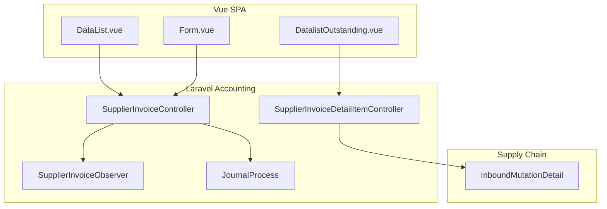
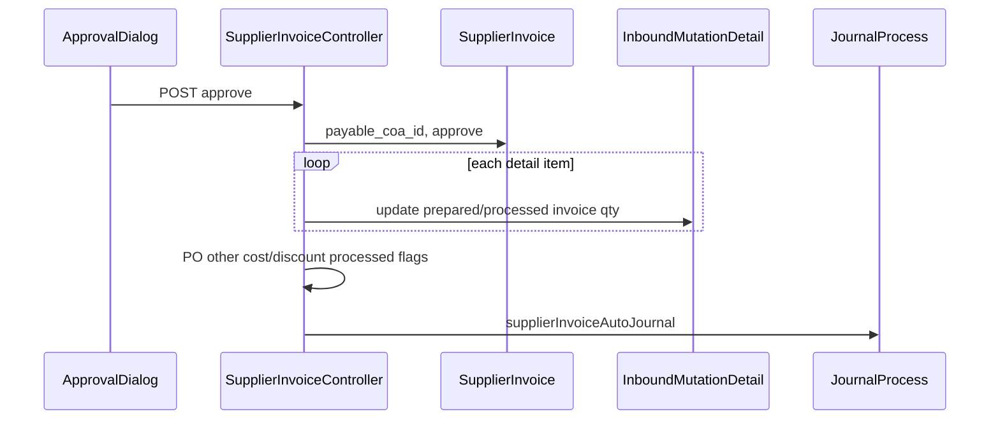

# Purchase Invoice — Technical Documentation

> **DRAFT** — Dokumentasi AS-IS dari codebase (19 Juni 2026). Belum final review QA/PM.

## 1. Architecture Overview

CRUD AP invoice dengan approval dan auto-journal. Lines dari `InboundMutationDetail` (purchase inbound). Model observed by `SupplierInvoiceObserver`.

## 2. Frontend File Map

**Root:** `olshoperp-frontend/src/pages/Accounting/AccountPayable/SupplierInvoice/`

| File | Role | Key API |
|------|------|---------|
| `DataList.vue` | Index, export | `accounting/supplier-invoice` |
| `Form.vue` | Create/edit | POST/PUT supplier-invoice |
| `HeaderBasicInformation.vue` | Header | show, select2 supplier |
| `DatalistDetail.vue` | Invoice lines | supplier-invoice-detail-item |
| `DatalistOutstanding.vue` | Pick inbound lines | `outstanding-invoice` |
| `DatalistOutstandingGroup.vue` | Group inbound | `outstanding-invoice-group` |
| `OtherCost.vue` / `OtherCostForm.vue` | Other cost | supplier-invoice-other-cost |
| `OtherCostSelectFromPO.vue` | PO other cost | select from PO |
| `OtherDiscount.vue` / `OtherDiscountForm.vue` | Other discount | supplier-invoice-other-discount |
| `OtherDiscountSelectFromPO.vue` | PO discount | select from PO |
| `ApprovalDialog.vue` | Approve flow | POST approve |
| `ApprovalEligibility.vue` | Eligibility | approval-eligibility |
| `DatalistLogApproval.vue` | Log | log/approve |

**Routes:**

| Path | Name |
|------|------|
| `/accounting/supplier-invoice` | `accounting_supplier-invoice_index` |
| `/accounting/supplier-invoice/create` | create |
| `/accounting/supplier-invoice/edit/:id` | edit |

## 3. Backend File Map

| File | Role |
|------|------|
| `Modules/Accounting/Http/Controllers/SupplierInvoiceController.php` | CRUD, approve, export, print |
| `Modules/Accounting/Http/Controllers/SupplierInvoiceDetailItemController.php` | Lines, bulk, group |
| `Modules/Accounting/Http/Controllers/SupplierInvoiceDetailOtherController.php` | Other lines |
| `Modules/Accounting/Http/Controllers/SupplierInvoiceOtherCostController.php` | Other cost |
| `Modules/Accounting/Http/Controllers/SupplierInvoiceOtherDiscountController.php` | Other discount |
| `Modules/Accounting/Entities/SupplierInvoice.php` | Model, `code_identifier = PI` |
| `Modules/Accounting/Entities/SupplierInvoiceDetailItem.php` | Line, `inbound_mutation_detail_id` |
| `Modules/Accounting/Observers/SupplierInvoiceObserver.php` | Model observer |
| `Modules/Accounting/Policies/SupplierInvoicePolicy.php` | Permission |
| `app/Helpers/Accounting/JournalProcess.php` | `supplierInvoiceAutoJournal` |
| `app/Helpers/Accounting/SupplierInvoicePrice.php` | Totals |
| `Modules/Accounting/Jobs/SupplierInvoiceExportJob.php` | Export |

## 4. API Routes (utama)

| Method | Path | Action |
|--------|------|--------|
| GET | `/api/accounting/supplier-invoice` | index |
| POST | `/api/accounting/supplier-invoice` | store |
| GET/PUT/DELETE | `/api/accounting/supplier-invoice/{id}` | show/update/destroy |
| POST | `/api/accounting/supplier-invoice/{id}/approve` | approve |
| GET | `.../approval-eligibility/{id}` | eligibility |
| GET | `.../{id}/outstanding-invoice` | inbound lines available |
| POST | `/api/accounting/supplier-invoice/{si}/supplier-invoice-detail-item-bulk` | bulkStore |
| GET | `/api/accounting/supplier-invoice/export-excel` | export |
| GET | `/api/accounting/supplier-invoice/{id}/print` | print |

## 5. Database Schema

| Table | Purpose |
|-------|---------|
| `accounting_supplier_invoices` | Header PI |
| `accounting_supplier_invoice_detail_items` | Lines, FK inbound + PO refs |
| `accounting_supplier_invoice_approvals` | Approval log |
| `accounting_supplier_invoice_approval_eligibilities` | Multi-level |
| `accounting_supplier_invoice_other_costs` | Other cost |
| `accounting_supplier_invoice_other_discounts` | Other discount |
| `accounting_supplier_invoice_taxes` | Tax rows |

## 6. Approve side effects

## 7. Related db-schema docs

- `docs/db-schema/accounting/accounting_supplier_invoice_detail_items.md`
- `docs/db-schema/accounting/accounting_supplier_invoice_other_costs.md`
- `docs/db-schema/accounting/accounting_supplier_invoice_other_discounts.md`
