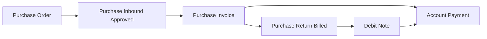
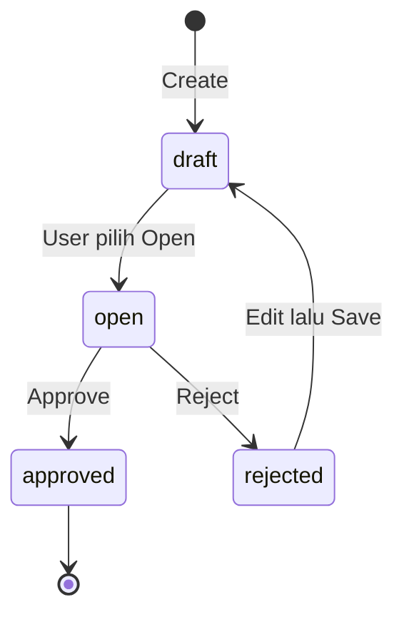

# Purchase Invoice — Panduan Pengguna

**Siapa yang baca panduan ini:** finance, AP clerk, operations support  
**Menu di sistem:** Accounting → Purchase Invoice  
**Kode transaksi:** dimulai dengan `PI-`

---

## 1. Apa Itu & Kenapa Penting

Purchase Invoice adalah dokumen untuk **mencatat hutang resmi** ke supplier setelah barang sudah diterima di gudang. Lewat menu ini kamu menagihkan barang yang masuk, mencatat PPN pembelian, dan membuka jalan untuk pembayaran di Account Payment.

Tanpa Purchase Invoice yang di-approve, hutang ke supplier belum resmi di sistem — dan pembayaran tidak punya dasar yang jelas.

---

## 2. Overview Flow & Proses Bisnis

### Rantai proses (dari PO sampai bayar / retur)

**Versi teks (tanpa diagram):**

1. **Purchase Order** dibuat dan disetujui (harga, pajak, biaya/diskon tambahan).
2. Barang diterima lewat **Purchase Inbound** dan inbound-nya **disetujui**.
3. Tagihan dibuat di sini (**Purchase Invoice**) — termasuk PPN.
4. Pelunasan dilakukan di **Account Payment**.
5. Kalau ada retur **setelah** invoice di-approve, pakai Purchase Return tipe **Billed** → hasilnya **Debit Note** → dipakai saat bayar berikutnya.

🎬 [Interactive demo akan ditambahkan di sini]

### Siklus status transaksi

**Versi teks — arti tiap status:**

| Status | Artinya | Bisa diubah? |
|--------|---------|--------------|
| **Draft** | Baru dibuat, atau hasil setelah reject lalu disimpan lagi | Ya |
| **Open** | Siap dicek dan di-approve | Ya |
| **Rejected** | Ditolak; setelah kamu edit dan Save, kembali ke Draft | Ya |
| **Approved** | Sudah final; jurnal hutang sudah terbit | Tidak |

> Setelah Approved, transaksi **tidak bisa diubah**. Fitur void / status closed belum tersedia untuk dipakai sehari-hari.

---

## 3. Sebelum Mulai (Flow Sebelum)

Pastikan ini sudah siap sebelum membuat Purchase Invoice:

- [ ] **Purchase Order** sudah disetujui (sumber harga, pajak, biaya/diskon tambahan).
- [ ] **Purchase Inbound** sudah **disetujui** dan masih ada sisa qty yang belum ditagih.
- [ ] **Akun produk** sudah lengkap (utang sementara, pajak, hutang supplier) — kalau belum, Approve nanti gagal.
- [ ] **Supplier** yang kamu pilih punya riwayat inbound (kalau belum pernah ada inbound sama sekali, supplier tidak muncul di daftar).
- [ ] Mata uang sudah jelas: dalam satu invoice, maksimal **satu mata uang asing** plus mata uang lokal.
- [ ] **(TO-BE)** Kalau mau bandingkan ke invoice fisik: siapkan total nominal supplier; pastikan **Cash Diff. COA** sudah di-set di Internal Company.

**Catatan penting:**

- Supplier bisa muncul di dropdown meski inbound-nya masih draft — tapi **barang baru bisa dipilih** kalau inbound sudah disetujui.
- Sisa qty yang bisa ditagih = qty barang masuk dikurangi yang sudah/sedang ditagih dan yang sudah/sedang diretur.

🎬 [Interactive demo akan ditambahkan di sini]

---

## 4. Setelah Selesai (Flow Sesudah)

Setelah Purchase Invoice **di-approve**:

1. **Bayar hutang** di menu **Account Payment** — PI yang sudah approved muncul di daftar yang belum lunas. Bisa bayar cash/bank dan/atau pakai Debit Note.
2. **Kalau ada retur barang** setelah invoice approved → buat **Purchase Return** tipe **Billed**. Hasilnya **Debit Note** (saldo ke supplier), bukan potongan langsung ke hutang PI. Debit Note dipakai di payment berikutnya.
3. **Cetak dokumen** lewat tombol Print bila perlu.

Yang belum tersedia:

- Void invoice yang sudah approved — belum bisa; kalau salah approve, koordinasikan manual.
- Due date otomatis dari termin supplier — masih diisi manual.
- Status “sudah lunas / closed” di header PI — belum ada.

🎬 [Interactive demo akan ditambahkan di sini]

---

## 5. Yang Perlu Diperhatikan

Ditulis dari sudut pandang yang kamu alami di layar:

- **Kalau kamu ubah data header** (supplier, mata uang, dll.) **setelah barang sudah ditambahkan**, sistem menolak — header terkunci. Hapus detail dulu kalau memang harus ganti.
- **Kalau kamu isi qty tagihan lebih dari sisa barang yang belum ditagih**, sistem menolak dan kamu harus turunkan qty-nya.
- **Kalau kamu coba campur dua mata uang asing berbeda** dalam satu invoice (baik di barang maupun biaya/diskon), sistem menolak. Satu invoice = maksimal satu asing + lokal.
- **Kalau inbound supplier masih draft**, daftar supplier bisa terisi tapi panel barang kosong — approve inbound dulu, itu bukan bug.
- **Kalau kamu approve tanpa ada baris barang**, atau akun produk belum lengkap, Approve gagal.
- **Kalau biaya/diskon berasal dari PO**, nominalnya terkunci — tidak bisa dinaikkan. Nama juga ikut dari PO. Yang masih bisa diganti sebelum approve: akun (COA) dan keterangan.
- **Kalau status belum Open**, tombol Approve tidak untuk dipakai — pilih Open dulu.
- **Kalau semua barang PO sudah habis ditagih/diretur** sebelum semua biaya/diskon dipilih, sebagian biaya bisa tidak muncul lagi di invoice berikutnya. Tagih biaya penting lebih dulu, atau koordinasikan sebelum “menutup” PO.
- **Kalau periode fiskal sudah tutup**, Approve gagal.
- **Kalau dua orang approve di waktu yang sama**, salah satu dapat pesan proses sedang berjalan.
- **(TO-BE) Kalau net sistem beda sen dengan invoice fisik supplier**, isi **Supplier's Invoice Amount** di Basic Information. Selisih (Invoice Diff) akan masuk jurnal Cash Diff + tambahan hutang saat approve. Kalau dikosongkan, tidak ada pembanding.
- **Kalau bayar di Account Payment dan ada sisa sen**, pakai **Allocate Full Amount** (sistem payment tidak menerima input desimal).

---

## 6. Langkah-Langkah (Step by Step)

### Cek dulu (prasyarat)

1. PO sudah approved.
2. Inbound sudah approved dan masih ada sisa qty.
3. Akun produk sudah lengkap.
4. Supplier punya riwayat inbound.

### Langkah 1 — Buat invoice baru

1. Buka **Accounting → Purchase Invoice → Create**.
2. Sistem bisa otomatis menyimpan draft (tanggal hari ini, mata uang utama).
3. Supplier sering terisi otomatis dari invoice terakhir kamu. Kalau belum pernah buat PI, isi field wajib manual (termasuk Supplier).
4. Isi / cek header:
   - Supplier (wajib)
   - Tanggal transaksi (wajib)
   - Mata uang & kurs (wajib)
   - Due date (opsional — isi manual)
   - Supplier's Reference (opsional — nomor faktur/dokumen dari supplier)
   - **Supplier's Invoice Amount** (opsional, **TO-BE**) — total nominal di invoice fisik supplier; bedakan dari Supplier's Reference (nomor dokumen)
   - Deskripsi (opsional)

### Langkah 2 — Pilih status Open

1. Di side panel, pilih status **Open**.
2. Tanpa Open, kamu belum siap Approve.

### Langkah 3 — Tambah barang dari inbound

**Cara cepat — banyak baris sekaligus (Bulk Use):**

1. Buka panel **Inbound Transaction**.
2. Centang baris yang mau ditagih.
3. Klik **Bulk Use** — qty default = seluruh sisa.
4. Simpan.

**Cara teliti — per baris (Single Use):**

1. Klik satu baris inbound.
2. Di modal, isi qty yang mau ditagih (tidak boleh melebihi sisa).
3. Simpan.

> Setelah ada baris barang, header terkunci.

### Langkah 4 — Cek biaya & diskon tambahan

1. Buka panel **Additional Cost / Discount**.
2. Saat kamu menambah barang dari suatu PO, **semua** biaya/diskon PO itu biasanya ikut masuk otomatis.
3. Hapus baris yang belum mau ditagih sekarang (bisa di PI berikutnya, selama masih ada barang outstanding dari PO yang sama).
4. Ganti akun (COA) bila perlu — hanya sebelum Approve.
5. Ingat: nominal dari PO tidak bisa diubah.

🎬 [Interactive demo akan ditambahkan di sini]

### Langkah 5 — Cek panel Total

Pastikan angka masuk akal sebelum approve:

| Baris di layar | Artinya |
|----------------|---------|
| Total Products | Total harga barang |
| Disc Products | Diskon di baris barang |
| Total VAT | Total PPN |
| Additional Cost / Disc | Biaya & diskon tambahan |
| **Net Purchase Invoice** | Total hutang akhir (termasuk PPN) |
| **Invoice Diff** (TO-BE) | Selisih Supplier's Invoice Amount − Net (jika diisi) |
| Net (dalam mata uang lokal) | Konversi ke mata uang perusahaan |

### Langkah 6 — Simpan

1. Klik **Save All**.
2. Pastikan tidak ada pesan error.

### Langkah 7 — Approve

1. Klik **Approve**.
2. Sistem menerbitkan jurnal hutang (termasuk PPN), mengunci transaksi, dan menandai qty yang sudah ditagih. **(TO-BE)** Jika Supplier's Invoice Amount diisi dan ada selisih, jurnal juga memuat Cash Diff. COA + tambahan hutang.
3. Setelah sukses, PI tidak bisa diedit lagi.

### Langkah 8 — Lanjutan

| Kebutuhan | Lakukan |
|-----------|---------|
| Bayar hutang | Buka **Account Payment** → pilih PI yang outstanding → bayar |
| Retur setelah approve | **Purchase Return** tipe **Billed** → dapat Debit Note |
| Cetak | Tombol **Print** |

---

## 7. Tips & Hal yang Sering Bikin Bingung

- **Harga & PPN tidak bisa diubah di PI** — ikut dari PO. Kalau salah harga, betulkan di hulu (atau koordinasi dengan tim terkait).
- **Partial invoice boleh** — tagih sebagian qty dulu; sisanya di PI berikutnya.
- **PPN dicatat saat Approve PI**, bukan saat barang masuk (inbound).
- **Due date belum otomatis** dari termin supplier — isi manual.
- **Supplier's Reference** = nomor faktur/dokumen dari supplier (opsional); muncul di daftar sebagai referensi.
- **Supplier dipilih tapi modal barang kosong?** Inbound-nya kemungkinan masih draft — approve inbound dulu.
- **Outstanding kosong / qty 0?** Barang itu sudah full ditagih atau diretur di transaksi lain.
- **Cost dari PO “hilang” di PI berikutnya?** Sering karena semua SKU sudah habis ditagih/diretur sebelum cost dipilih. Tagih cost penting lebih awal.
- **Mau void PI yang sudah approved?** Belum bisa. Koordinasi manual.
- **Retur setelah PI approved?** Pakai Return **Billed** → Debit Note → potong di payment berikutnya, bukan potong hutang PI secara langsung.
- **Total Products terlihat lebih kecil dari hitungan manual?** Bisa karena aturan PPN coefficient — total akhir yang penting tetap mengikuti aturan pajak yang berlaku.
- **Jumlah kolom DPP di detail beda dari Total DPP di tippy Totals?** Tidak boleh — laporkan ke support/QA (bug precision). Sama untuk kolom VAT vs Total VAT.
- **Total satu baris beda 1 sen dari harga × qty?** Bisa dari pembulatan DPP & PPN terpisah (ikut dari PO). Laporkan jika total dokumen banyak yang miring. **(TO-BE)** Cocokkan ke invoice fisik lewat **Supplier's Invoice Amount**.
- **Setelah approve PI**, jurnal otomatis: tutup Unbilled Goods (dari Inbound) + catat PPN + hutang supplier. PPN **belum** ada di jurnal terima barang.

---

## 8. Referensi

Untuk detail lebih lanjut (QA, developer, atau operator yang mau ngulik):

| Dokumen | Isi |
|---------|-----|
| [knowledge-base.md](./knowledge-base.md) | SOP operator, troubleshooting, FAQ |
| [requirement.md](./requirement.md) | Aturan bisnis, validasi, acceptance criteria, gap |
| [technical.md](./technical.md) | API, database, alur approve teknis |

**Menu terkait:** Purchase Order · Purchase Inbound · Account Payment · Purchase Return · Master Other Cost / Discount · Chart of Account

---

*Derivatif dari requirement / knowledge-base / technical v3.0 — tanpa menambah fakta baru di luar sumber.*
