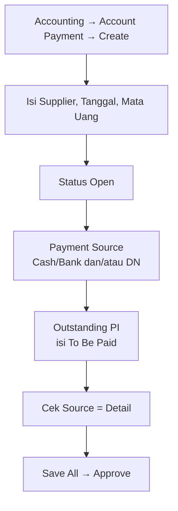

# Account Payment — Knowledge Base (Operator)

**Audience:** Finance, AP clerk  
**Route:** `/accounting/supplier-payment`  
**Kode transaksi:** `PY-XXXXX`

---

## 1. Apa itu Account Payment?

Account Payment adalah transaksi **pembayaran hutang** ke supplier. Hutang berasal dari **Purchase Invoice** yang sudah approved.

Pembayaran bisa memakai:
- **Cash/Bank** — uang keluar dari rekening
- **Debit Note** — potongan tagihan (dari retur atau kelebihan bayar sebelumnya)
- **Kombinasi keduanya**

---

## 2. Kapan dipakai?

| ✅ Buat payment jika | ❌ Jangan jika |
|---------------------|----------------|
| Ada PI approved dengan sisa hutang | PI masih draft / belum approved |
| Rekening kas/bank aktif (jika bayar tunai) | Saldo rekening tidak cukup |
| DN approved tersedia (jika potong DN) | Mau void payment approved — fitur belum tersedia |
| Setting company (AP COA, Exchange Diff, Cash Diff) lengkap | Periode fiskal tutup |

---

## 3. Alur kerja standar

Setelah PI approved, bayar hutang lewat Account Payment.

**Keterangan langkah:**

- **Create:** isi Supplier, Tanggal, Mata Uang, Kurs. Set status **Open**.
- **Payment Source:** tambah Cash/Bank dan/atau Debit Note.
- **Detail:** pilih PI outstanding → isi **To Be Paid** (sebagian atau penuh).
- **Adjustment (opsional):** biaya admin bank, rounding.
- **Balance wajib:** Total Source harus **sama persis** dengan Total Detail sebelum Approve.
- **Approve:** jurnal otomatis; hutang PI berkurang.

---

## 4. Section Payment Source

### Cash / Bank
- Pilih rekening dari master
- **Balance** menampilkan saldo tersedia
- Amount tidak boleh melebihi saldo
- **Bulk Use** — isi otomatis saldo penuh per akun terpilih

### Debit Note
- Pilih DN approved milik supplier yang sama
- **Remaining Balance** = sisa DN yang bisa dipakai
- DN sedang dipakai payment lain → status Prepared/Processed di modal

---

## 5. Section Outstanding Purchase Invoice

| Kolom | Arti |
|-------|------|
| TOTAL | Net Purchase Invoice |
| OUTSTANDING | Sisa hutang |
| STATUS | Prepared = sedang di payment lain; Paid = lunas |
| PURCHASE RETURN / DEBIT NOTE | Link terkait (jika ada) |

**Use (single):** Modal → isi To Be Paid → Save  
**Allocate Full Amount:** Lunasi penuh sisa outstanding  
**Bulk Use:** Tambah banyak PI sekaligus  

**Already Prepared:** PI sedang dipakai payment draft/open lain — tunggu approve atau batalkan payment tersebut.

---

## 6. Section Detail & Totals

| Kolom | Arti |
|-------|------|
| Paid Amount | Nominal bayar (mata uang payment) |
| Exchange Diff. | Selisih kurs PI vs payment |
| Cash Diff | Selisih pembulatan saat full clearing |

**Balancing error:**  
*"Approval Failed. Total Payment Source must be equal to Total Payment Detail."*  
→ Sesuaikan amount di Source atau Detail.

---

## 7. Hubungan dengan menu lain

| Menu | Peran |
|------|-------|
| **Purchase Invoice** | Sumber hutang; setelah approve, sisa hutang berkurang |
| **Debit Note** | Bisa jadi sumber dana (ganti kas keluar) |
| **Purchase Return** | Sering menghasilkan DN untuk potongan |
| **Cash / Bank** | Saldo rekening; approve → credit rekening di jurnal |

---

## 8. Import massal

Datalist → **Import Log** → upload Excel 3 sheet (Bank Mutation · Detail · Adjustment).

- Hasil import status **OPEN** — review dulu sebelum approve
- Hanya **IDR** untuk import
- Satu proses import per company pada satu waktu

---

## 9. Troubleshooting

| Gejala | Penyebab | Solusi |
|--------|----------|--------|
| Approve gagal balancing | Source ≠ Detail | Samakan total |
| Insufficient balance | Kas tidak cukup | Kurangi amount atau ganti rekening |
| PI tidak muncul | Sudah lunas / supplier beda / tanggal | Cek outstanding & filter |
| Header tidak bisa edit | Sudah ada detail | Hapus semua detail dulu |
| Void tidak jalan | Fitur belum tersedia | Jangan approve jika belum yakin |
| DN clearing bulk error | Bug URL FE | Pakai single DN add manual |

---

## 10. FAQ

**Q: Bisa bayar sebagian PI?**  
A: Ya — partial payment; sisa bisa dibayar di AP berikutnya.

**Q: Bisa gabung kas + debit note?**  
A: Ya — multiple rows di Payment Source.

**Q: Void payment approved?**  
A: Belum tersedia untuk dipakai. UI void ada tapi tidak berfungsi dengan benar — teliti sebelum approve.

**Q: Due date PI?**  
A: Informasi di outstanding; tidak memblok payment.

---

## Related Documents

| Doc | Path |
|-----|------|
| User Guide | [user-guide.md](./user-guide.md) |
| Requirement | [requirement.md](./requirement.md) |
| Technical | [technical.md](./technical.md) |
| Purchase Invoice | [../accounting-supplier-invoice/knowledge-base.md](../accounting-supplier-invoice/knowledge-base.md) |
| Debit Note | [../accounting-debit-note/knowledge-base.md](../accounting-debit-note/knowledge-base.md) |
