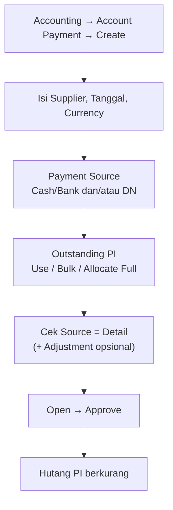

# Account Payment — Knowledge Base

**Audience:** Operator finance / AP clerk, Support  
**Path:** Accounting → Account Payable → **Account Payment** (`/accounting/supplier-payment`)  
**Prefix dokumen:** `PY-`

---

## 1. Apa itu Account Payment?

**Account Payment** mencatat **pembayaran hutang** ke supplier. Hutang muncul dari **Purchase Invoice** yang sudah di-approve. Sumber dana bisa **Cash/Bank**, **Debit Note**, atau kombinasi keduanya. Setelah Approve, jurnal terbit dan sisa hutang PI berkurang.

---

## 2. Kapan dipakai?

| ✅ Buat payment jika | ❌ Jangan jika |
|---------------------|----------------|
| Ada PI approved dengan sisa hutang > 0 | Tidak ada outstanding PI untuk supplier |
| Rekening kas/bank siap (atau DN approved) | Saldo kas / sisa DN tidak cukup |
| Setting COA company lengkap (AP, Exchange Diff, Cash Diff) | Mengandalkan Void setelah Approve (belum ada) |

---

## 3. Alur kerja standar

Setelah PI approved dan dana siap, buat payment lalu Approve saat Source = Detail.

```mermaid
flowchart TD
    A["Accounting → Account Payment → Create"] --> B["Isi Supplier, Tanggal, Currency"]
    B --> C["Payment Source\nCash/Bank dan/atau DN"]
    C --> D["Outstanding PI\nUse / Bulk / Allocate Full"]
    D --> E["Cek Source = Detail\n(+ Adjustment opsional)"]
    E --> F["Open → Approve"]
    F --> G["Hutang PI berkurang"]
```

**Keterangan langkah:**

- **Create:** Supplier, tanggal, mata uang, kurs; set **Open**.
- **Payment Source:** kas/bank (cek Balance) dan/atau Debit Note; amount ≤ sisa.
- **Outstanding PI:** Use (boleh sebagian), Allocate Full, atau Bulk Use.
- **Balance:** Total Source harus sama Total Detail sebelum Approve.
- **Approve:** jurnal AP berkurang; partial → sisa bisa dibayar di payment berikutnya.

---

## 4. Status

| Status | Arti | Bisa ubah? |
|--------|------|------------|
| **Draft** | Belum siap approve | Ya |
| **Open** | Siap approve jika balance | Ya |
| **Approved** | Jurnal terbit | Tidak |
| **Rejected** | Ditolak | — |

> **Void approved belum berfungsi.** Teliti sebelum Approve.

---

## 5. Tombol & section penting

| Area | Fungsi |
|------|--------|
| **Payment Source** | Tambah Cash/Bank dan/atau Debit Note |
| **Outstanding Purchase Invoice** | Alokasi hutang PI (Use / Bulk Use / Allocate Full) |
| **Detail Payment** | Baris alokasi + Exchange Diff / Cash Diff (tampil sistem) |
| **Adjustment** | Debit/Credit COA manual (opsional) |
| **Import Log** | Import massal Excel → hasil **Open** untuk review |
| **Already Prepared** | PI terkunci di payment draft/open lain |

Setelah ada source/detail/adjustment, **header terkunci** (supplier/currency/tanggal) sampai dikosongkan.

---

## 6. Troubleshooting

| Gejala | Penyebab | Solusi |
|--------|----------|--------|
| Approve: Source ≠ Detail | Belum balance | Samakan amount Source dan Detail (± Adjustment) |
| Saldo tidak cukup | Amount > available balance | Kurangi amount / pilih rekening lain |
| DN exceed | Amount > sisa DN | Kurangi amount DN |
| PI Already Prepared | Terkunci payment lain | Selesaikan/hapus payment tersebut |
| Header tidak bisa diubah | Sudah ada detail | Hapus source/detail/adjustment dulu |
| Bulk DN error | Bug FE URL | Tambah DN satu per satu |
| Void gagal | Fitur belum siap | Hubungi admin/dev; jangan andalkan Void |
| PI tidak muncul | Lunas / supplier beda / tanggal | Cek outstanding & filter tanggal |

---

## 7. FAQ

**Q: Boleh bayar sebagian?**  
A: Ya — partial payment; sisa di payment berikutnya.

**Q: Boleh kas + Debit Note sekaligus?**  
A: Ya — beberapa baris di Payment Source.

**Q: Due date PI memblok bayar?**  
A: Tidak — hanya info.

**Q: Hasil import langsung approved?**  
A: Tidak — status **Open**; review lalu Approve.

**Q: Mata uang sumber beda dari header?**  
A: Ditolak — samakan currency.

---

## Related Documents

| Doc | Path |
|-----|------|
| Feature Map | [feature-map.md](./feature-map.md) |
| User Guide | [user-guide.md](./user-guide.md) |
| Requirement | [requirement.md](./requirement.md) |
| Technical | [technical.md](./technical.md) |
| Purchase Invoice | [../accounting-supplier-invoice/knowledge-base.md](../accounting-supplier-invoice/knowledge-base.md) |
