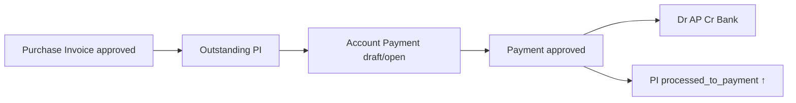

# Account Payment — Requirement Documentation

**Modul:** Finance & Accounting / Account Payable  
**Prefix transaksi:** `PAY-` (supplier payment)  
**Audience:** PM, Finance, QA, Developer

**UI route:** `/accounting/supplier-payment`  
**API base:** `{VITE_API_URL}accounting/supplier-payment`

**Upstream:** [Purchase Invoice](../accounting-supplier-invoice/requirement.md)

---

## 0. Metadata & Changelog

| Version | Date | Author | Changes |
|---------|------|--------|---------|
| 2.0 | 2026-07-05 | QA - Yemima | Initial requirement v2.0 — PI allocation relasi, journal, gaps |

---

## 1. Ringkasan Eksekutif

**Account Payment** mencatat **pelunasan hutang** ke supplier. Invoice yang sudah **Approved** (Purchase Invoice) muncul sebagai **outstanding** untuk dialokasi.



---

## 2. Prasyarat

| # | Prasyarat |
|---|-----------|
| 1 | PI status **approved** (or processed) |
| 2 | PI `grand_total_after_vat > processed_to_payment_amount` (outstanding > 0) |
| 3 | Payment supplier = PI supplier |
| 4 | Payment date ≥ PI transaction date |
| 5 | Bank COA, AP COA configured |

---

## 3. Siklus Status

| Status | Edit | Approve |
|--------|------|---------|
| draft | Yes | No |
| open | Yes | Yes |
| approved | No | — |
| rejected | — | — |
| void | No | — |

---

## 4. Header Fields

| Field | Rule |
|-------|------|
| Transaction Code | Auto PAY prefix |
| Transaction Date | Required; fiscal period |
| Supplier | Required; filters outstanding PI |
| Currency & Exchange Rate | Match PI currency for allocation |
| Bank / Cash COA | Credit side on journal |
| Description | Optional |

---

## 5. Outstanding Purchase Invoice Panel

**API:** `GET accounting/supplier-payment/{id}/outstanding-supplier-invoice`

| Filter | Rule |
|--------|------|
| PI status | approved, processed |
| Outstanding | `grand_total_after_vat - prepared_to_payment - processed_to_payment > 0` |
| Supplier | = payment supplier |
| Date | PI date ≤ payment date |

### Columns

PI code, PI date, due date, supplier ref, currency, exchange rate, **Net PI**, **Outstanding**, prepared/processed payment status.

### Actions

| Action | API | Effect on PI |
|--------|-----|--------------|
| Add allocation | POST payment detail | `prepared_to_payment_amount` ↑ |
| Update amount | PATCH detail | prepared adjusted |
| Delete detail | DELETE | prepared ↓ |
| Approve payment | POST approve | prepared ↓, `processed_to_payment_amount` ↑ |

### Validation messages

- `To be paid amount must be less than invoice outstanding amount`
- `The data you selected is already included in this payment detail`
- Amount must be > 0

---

## 6. Perhitungan Allocation

```
PI outstanding = grand_total_after_vat
               - prepared_to_payment_amount
               - processed_to_payment_amount

Payment line amount ≤ PI outstanding at save time
Payment header total = Σ allocation lines (+ forex if applicable)
```

**Partial payment:** Allowed — multiple payments against one PI until outstanding = 0.

**Overpayment:** Blocked by validation.

---

## 7. Relasi Purchase Invoice ↔ Account Payment (detail)

### 7.1 Field coupling on PI

| PI field | Set when |
|----------|----------|
| `prepared_to_payment_amount` | Payment detail saved (draft/open payment) |
| `processed_to_payment_amount` | Payment **approved** |

### 7.2 Lifecycle table

| Step | PI | Payment |
|------|-----|---------|
| PI 1 | Approved, outstanding = grand total | — |
| 2 | prepared ↑ | Draft payment + PI line |
| 3 | prepared ↓, processed ↑ | Payment approved |
| 4 | Outstanding = 0 | Full settlement |
| 5 | PI status stays **approved** | — |

**GAP-PAY-01:** PI header tidak otomatis jadi `processed` / `closed` saat partial/full pay (mirror GAP-PI-03).

### 7.3 Edit / void guards

| PM expectation | AS-IS |
|----------------|-------|
| Cannot edit approved payment | ✓ |
| Void payment reverses PI processed_to_payment | Verify on void flow |
| Void PI blocked if payment exists | **Not enforced on PI void** (GAP-PI-04) |

### 7.4 Journal on payment approve

`JournalProcess::supplierPaymentAutoJournal`:

| Dr | Cr |
|----|-----|
| Account Payable (per PI allocation) | Bank/Cash COA |
| Forex diff COA (if foreign) | balancing |

Journal date = payment transaction date; auto-approved.

### 7.5 End-to-end chain (Inbound → PI → Payment)

| Stage | Document | Accounting effect |
|-------|----------|-------------------|
| 1 | Purchase Inbound approve | Dr Inventory/Assets Cr **Unbilled Goods** (DPP) |
| 2 | Purchase Invoice approve | Dr **Unbilled Goods** + **VAT** Cr **AP** |
| 3 | Account Payment approve | Dr **AP** Cr **Bank** |

Qty chain: inbound `processed_to_invoice` ← PI approve; PI `processed_to_payment` ← payment approve.

---

## 8. UI/UX

**Route:** `/accounting/supplier-payment`  
**Sections:** Basic Info → Outstanding Invoice → Payment Details → Approval → Audit

| Button | Condition |
|--------|-----------|
| Save All | can_update |
| Approve | open + has details |
| Void | approved + can_void |

**Show PI from payment:** `GET accounting/supplier-payment/supplier-invoice/{id}` — read-only PI context.

**Outstanding panel:** Same pattern as PI inbound panel — bulk/single allocation with amount modal.

---

## 9. Acceptance Criteria

1. Approved PI appears in outstanding for same supplier  
2. Allocation increases PI prepared_to_payment  
3. Payment approve increases PI processed_to_payment; decreases outstanding  
4. Block allocation > outstanding  
5. Journal Dr AP Cr Bank on approve  
6. Partial pay leaves PI outstanding > 0  
7. Second payment can clear remainder  

---

## 19. Gaps

| ID | Topic | AS-IS | Status |
|----|-------|-------|--------|
| GAP-PAY-01 | PI status processed/closed on pay | PI stays approved | **Not implemented** |
| GAP-PAY-02 | Payment void reverses PI amounts | Verify — may need manual fix | **Verify QA** |
| GAP-PAY-03 | Block PI void when payment exists | Not on PI side | **Not implemented** |

---

## 21. Pending Items

| ID | Severity | Question |
|----|----------|----------|
| P-PAY-01 | Major | Auto-set PI processed when partially paid? |
| P-PAY-02 | Major | Payment void — reverse PI processed_to_payment? |

---

## Related Documents

| Doc | Path |
|-----|------|
| Purchase Invoice | [../accounting-supplier-invoice/requirement.md](../accounting-supplier-invoice/requirement.md) |
| Knowledge Base | [knowledge-base.md](./knowledge-base.md) |
| Technical | [technical.md](./technical.md) |
