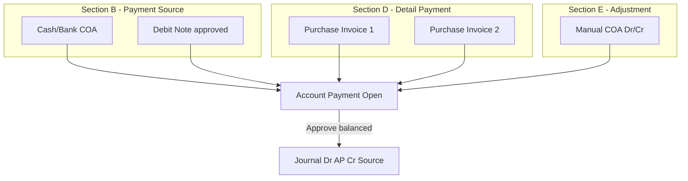
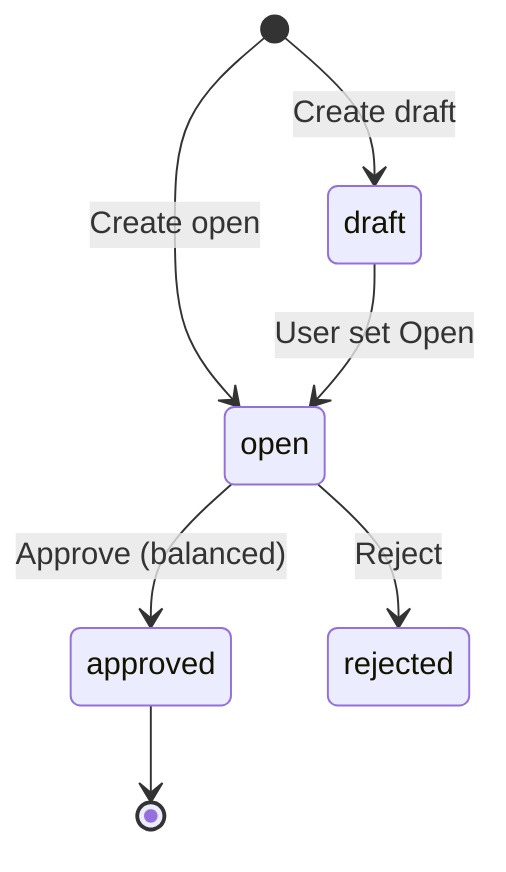
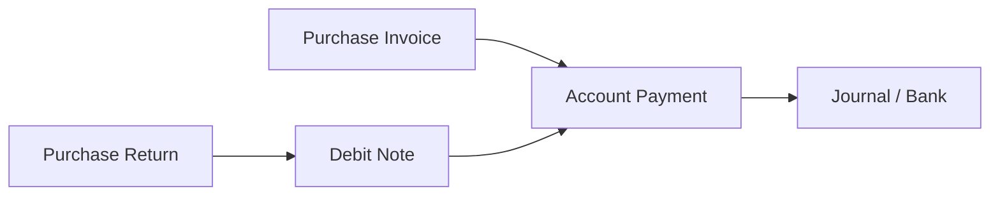

# Account Payment — Requirement Documentation

**Modul:** Finance & Accounting / Account Payable  
**Prefix transaksi:** `PY-`  
**Audience:** PM, Finance, QA  
**Status:** AS-IS verified (compliance pass 2026-07-17)

**UI route:** `/accounting/supplier-payment`  

**PM source:** `account-payment-requirement.md` (29 Okt 2025 MVP) + Import AP Relational (Apr 2026)

**Upstream:** [Purchase Invoice](../accounting-supplier-invoice/requirement.md)

---

## 0. Metadata & Changelog

| Version | Date | Author | Changes |
|---------|------|--------|---------|
| 2.0 | 2026-07-05 | QA - Yemima | Initial v2.0 — PI allocation, journal, gaps |
| 2.1 | 2026-07-06 | QA - Yemima | Full PM merge: multi-source (Cash/Bank + DN), sections A–E, balancing, formulas, import AP, relasi DN/Cash-Bank/PI/PR, gaps §19–§21 |
| 2.2 | 2026-07-17 | QA - Yemima | Compliance qa-docs-standard: stateDiagram, Validasi, FAQ; trim path/class; user-guide |

---

## 1. Ringkasan Eksekutif

**Account Payment (AP)** memproses **pelunasan hutang** (*Account Payable*) ke supplier. Fitur inti:

| Fitur | Deskripsi AS-IS |
|-------|-----------------|
| **Multi-Source** | Kombinasi **Cash/Bank** + **Debit Note** (potong tagihan retur/overpayment) |
| **Multi-Currency** | Header currency + exchange rate; konversi PI & forex gain/loss |
| **Strict Balancing** | Total **Payment Source (B)** = Total **Detail Payment (D)** saat approve |
| **Auto-Journal** | Dr AP + Exchange Diff + Cash Diff + Adjustment · Cr Cash/Bank + DN |
| **Import AP** | Multi-sheet Excel (Bank Mutation · Detail · Adjustment) — **implemented** |



### 1.1 Rantai procurement lengkap

| Tahap | Dokumen | Jurnal inti |
|-------|---------|-------------|
| 1 | Purchase Inbound | Dr Inventory/Assets Cr **Unbilled Goods** |
| 2 | Purchase Invoice | Dr Unbilled Goods + VAT Cr **AP** |
| 3 | **Account Payment** | Dr **AP** Cr **Cash/Bank / Debit Note** |
| Alt | Purchase Return → DN | DN sebagai **payment source** mengurangi kas keluar |

---

## 2. Prasyarat

| # | Prasyarat | Validasi AS-IS |
|---|-----------|----------------|
| 1 | **Supplier** terdaftar | Required header |
| 2 | **PI Approved** dengan outstanding > 0 | Outstanding query |
| 3 | **General Company Setting** — AP COA supplier | Journal on approve |
| 4 | **Exchange Diff. COA** & **Cash Diff. COA** company | Required on approve journal |
| 5 | **Cash/Bank account** aktif (jika pakai kas) | Master rekening company |
| 6 | **Debit Note Approved** (jika pakai DN) | Query DN available |
| 7 | **Fiscal period** aktif untuk transaction date | Validasi fiscal |

---

## 3. Siklus Status Transaksi



| Status | Edit header/detail? | Approve? |
|--------|---------------------|----------|
| **draft** | Yes | No — switch to **open** |
| **open** | Yes | Yes (if balanced) |
| **approved** | No | — |
| **rejected** | — | — |
| **void** | PM: MVP excluded | UI ada; **API broken** (GAP-PAY-VOID-01) |

**PM MVP:** Void Payment **tidak** tersedia — user harus teliti sebelum approve.

---

## 4. Datalist

Kolom standar: Trx Code, Date, Supplier, Currency, Exchange Rate, Grand Total, Status, actions.

**Toolbar:** bulk delete/approve, export, **Import Log** (header import AP), show deleted, advanced filter.

---

## 5. Section A — Basic Information (Header)

| Field | PM | AS-IS |
|-------|-----|-------|
| **Transaction Code** | Auto prefix PY; bisa manual unique | Auto generate PY |
| **Transaction Date** | Default now; no future; backdate max **6 bulan**; fiscal period | FE `min = now-6mo`, `max-now`; BE fiscal validate |
| **Supplier** | Wajib; filter supplier punya PI approved | Select2 suppliers with outstanding PI |
| **Transaction Currency** | Default IDR (primary) | `currency_id` required |
| **Exchange Rate** | Wajib; default 1 untuk IDR | Required |
| **Description** | Optional max 250 | Textarea — `[VERIFY: CODEBASE]` max length |
| **Attachment** | File upload bukti | `FormAttachment` |
| **Draft / Open** | Radio side panel | Same pattern as PI |

### 5.1 Header locking (PM + AS-IS)

Header **editable** hanya jika **tidak ada** data di Section B, D, atau E:

```
hasDetails() = payment_details OR adjustments OR deposits OR funds exist
```

Jika user ubah `supplier`, `currency_id`, `exchange_rate`, `transaction_date` saat ada detail:

**Error:** `Cannot edit Header when detail data exists. Please clear all details first.`

### 5.2 Auto-save on create (PM + AS-IS)

- Saat **edit**: watcher pada supplier, date, currency → auto `PATCH` header.
- Saat **create**: autofill supplier/currency/rate dari **last transaction** same company; auto-save jika required terpenuhi.
- Jika belum ada transaksi sama sekali: user harus isi required manual.

---

## 6. Section B — Payment Source (Sumber Dana)

User dapat multiple rows: **Cash/Bank** dan/atau **Debit Note**.

**Validasi umum:** Currency source = **Transaction Currency** header.

### 6.1 Cash / Bank

| Aspek | Rule |
|-------|------|
| Master | `CompanyDetailBank` → `chart_of_account_id` |
| Modal columns | Type (cash/bank), Label, Bank Name, Account Number, **Balance** |
| Amount input | Tidak boleh > **available balance** |
| Bulk use | Alokasi full available per akun terpilih |

**Balance calculation (AS-IS):**

```
in_period_balance = Σ approved journal debits − credits (COA, s/d payment date)
available_balance = in_period_balance − reserved (draft journals)
display_balance   = available − reserved_payment (draft/open AP funds on same COA)
```

**Note:** `JournalReport` memakai **debit − credit** uniformly; tidak mem-flip berdasarkan COA class Activa/Passiva di helper ini (cash/bank typically Activa).

**Errors:**
- `There is no available balance or insufficient funds...`
- `Insufficient balance on selected fund source`
- `Insufficient balance for cash/bank: {accounts}`

**Journal on approve:** **Credit** cash/bank COA (`payment_detail_funds.amount`).

### 6.2 Debit Note (Potong Tagihan)

| Aspek | Rule |
|-------|------|
| Storage | `payment_detail_deposits` — `deposit_id` → `DebitNote` |
| COA | Supplier **Deposit to Supplier COA** |
| Available | Approved DN; same supplier & currency; DN date < payment date; `processed_to_use_amount < grand_total` |
| On add | `debit_note.prepared_to_use_amount` ↑ |
| On approve | prepared ↓, `processed_to_use_amount` ↑ |

**Modal Clearing Debit Note columns (PM):** Trx Code/Date, Trx Ref (PR atau overpayment AP), Currency, Rate, Total Amount, Used Status (Prepared/Processed), Remaining Balance, Created by.

**API outstanding DN:** `GET accounting/supplier-payment/{id}/debit-note`  
**Select2:** `GET .../select2-available-debit-notes`

**Single full clear:** `POST .../supplier-payment-detail-fund/clearing` → `storeClearing`

**Errors:**
- `Entered amount exceeds the remaining Debit Note balance.`
- `Debit Note already added...`

**Exchange gain on DN source (PM):**

```
exchange_diff = (rate_payment − rate_debit_note) × amount
```

Minus → Cr Exchange Diff COA; Plus → Dr Exchange Diff COA (on journal).

**GAP-PAY-DN-CLEAR:** FE bulk DN clearing (`useClearingDebitNote`) memanggil URL **`customer-payment/.../bulk-clearing`** — salah untuk AP (GAP-PAY-DN-CLEAR).

### 6.3 Payment Source datatable columns

| Kolom | Cash/Bank | Debit Note |
|-------|-----------|------------|
| Debit Note Code | — | ✓ |
| GL Account | Cash/Bank COA | Deposit to Supplier COA |
| Bank Account / Bank Name | ✓ | — |
| Rate / Currency | — | ✓ (DN rate/currency) |
| Swift Code | ✓ | — |
| Amount | Input | Input |
| Exchange Gain | — | ✓ (forex diff DN vs payment rate) |

---

## 7. Section C — Outstanding Purchase Invoice

**Komponen:** `OutstandingSupplierInvoice.vue`  
**API:** `GET accounting/supplier-payment/{id}/outstanding-supplier-invoice`

### 7.1 Filter (PM + AS-IS)

| Filter | Rule |
|--------|------|
| Supplier | = header supplier |
| PI date | `<` payment transaction date |
| Status | `approved`, `processed` |
| Outstanding | `grand_total_after_vat > processed_to_payment` (SQL); UI also shows prepared state |

### 7.2 Kolom

Trx Code/Date, Trx Ref (inbound), Rate, **Total** (Net PI), **Outstanding**, **Status Invoice** (Prepared/Paid), **Purchase Return** (ref), **Debit Note** (ref if DN from PI), Created by/at.

**Status Invoice (PM):**
- **Prepared:** PI dialokasi di AP draft/open lain **atau** (PM) di Purchase Return — **AS-IS payment outstanding tidak kurangi `prepared_to_amount_return`** (GAP-PAY-PR-OUT)
- **Paid:** `processed_to_payment` = grand total (fully paid via AP)

**"Already Prepared" action:** Jika outstanding habis karena prepared di payment lain → tombol Use diganti label **Already Prepared**.

### 7.3 Modal Use (single PI)

| Field | Meaning |
|-------|---------|
| Total Invoice Amount | `grand_total_after_vat` |
| Outstanding Amount | `invoice_remaining_after_vat` (PI currency) |
| Prepared to Payment | `prepared_to_payment_amount` |
| Processed to Payment (Paid) | `processed_to_payment_amount` |
| Outstanding Amount (IDR) | Converted to payment primary currency |
| **To be Paid Amount** | Input — ≤ outstanding |
| Payment Exchange Rate | Header payment rate |
| To be Paid (PI currency) | Converted display |
| To be Paid (IDR) | Payment currency display |

**Allocate Full (Clearing):** `is_full_amount=1` → full outstanding; sets `cash_difference_local_currency` (§8.3).

**Bulk Use:** Insert multiple PI tanpa modal edit per row.

**Validations:**
- `To be paid amount must be less than invoice outstanding amount`
- `Invoice already added. Please select a different invoice.`
- `Outstanding amount has changed. Available: {n}. Please refresh data.`

---

## 8. Section D — Detail Payment (Alokasi)

**Komponen:** `DatalistDetail.vue`

| Kolom | Formula / source |
|-------|------------------|
| Trx Code | PI code + date |
| Rate Invoice | PI `exchange_rate` |
| Total Invoice | PI grand total in PI currency |
| **Total Invoice (IDR)** | Total × PI rate (primary) |
| **Paid Amount** | `payment_amount_in_invoice_currency` — inline edit |
| **Paid Amount (IDR)** | Paid × payment rate |
| **Exchange Diff.** | `(rate_payment − rate_invoice) × paid_amount` via `PaymentDetailHelper::calculateExchangeGain` |
| **Cash Diff** | See §8.3 |
| Delete | Only before approved |

### 8.1 Grand total detail (balancing numerator)

```
totalDetailAfterVat = Σ payment_detail.amount_before_discount_before_vat
totalAdjustment     = Σ(credit − debit) adjustments  [supplier: subtract]
grandTotal          = totalDetailAfterVat − totalAdjustment   (PaymentPrice::grandTotalPriceAfterVat)
```

### 8.2 Total source (balancing denominator)

```
totalSource = Σ payment_detail_funds.amount + Σ payment_detail_deposits.amount
            (foreign: sum amount_foreign columns)
```

### 8.3 Cash Diff (codebase-only detail)

**Purpose:** Selisih pembulatan/konversi saat **full clearing** (`is_full_amount=1`).

```
cash_difference = (invoice_remaining − paid_amount_in_invoice_currency) × rate_factor
```

- Stored: `payment_details.cash_difference_local_currency`
- Journal: aggregated → **Cash Diff. COA** (Cr if positive, Dr if negative)
- Displayed in detail grid column **CASH DIFF** — not user-editable header field

### 8.4 Approve balancing rule (critical)

```
bccomp(grandTotalPriceAfterVat, totalSource, 15) === 0
```

**Error:** `Approval Failed. Total Payment Source must be equal to Total Payment Detail.`

Requires: ≥1 payment_detail AND (funds OR deposits).

---

## 9. Section E — Adjustment

**Komponen:** `Adjustment.vue`  
**API:** CRUD `accounting/supplier-payment/{id}/supplier-payment-adjustment`

| Field | Rule |
|-------|------|
| Account (COA) | Select chart of account |
| Debit **OR** Credit | Mutually exclusive per row |
| Description | Optional |
| Actions | Save, Edit, Delete (before approved) |

**Effect on grand total (supplier payment):** Adjustments **reduce** detail total (`credit − debit` subtracted).

**Journal:** Dr/Cr per user input on approve.

---

## 10. Penjurnalan saat Approve

**Method:** `JournalProcess::supplierPaymentAutoJournal`

| Section | COA | Posisi |
|---------|-----|--------|
| **B — Funds** | Cash/Bank COA | **Credit** |
| **B — Deposits (DN)** | Deposit to Supplier COA | **Credit** (+ forex diff on DN) |
| **D — Details (PI)** | Account Payable (supplier setting) | **Debit** (`paid × PI.exchange_rate`) |
| **D — Forex** | Exchange Diff. COA | Dr/Cr per line gain/loss |
| **D — Cash diff** | Cash Diff. COA | Cr (+) / Dr (−) aggregated |
| **E — Adjustment** | User-selected COA | Dr or Cr per row |

**AP debit formula (local):**
```
debit_local = payment_amount_in_invoice_currency × supplier_invoice.exchange_rate
```

**Exchange gain per PI line:**
```
exchange_gain = (invoice.exchange_rate − payment.exchange_rate) × amount_in_invoice_currency
```
(when currencies warrant — see `PaymentDetailHelper`)

---

## 11. Relasi Purchase Invoice (detail)

| Aspek | Rule |
|-------|------|
| Outstanding | `grand_total_after_vat − prepared_to_payment − processed_to_payment` |
| On detail add | PI `prepared_to_payment_amount` ↑ |
| On detail delete / payment destroy | prepared ↓ |
| On payment approve | prepared ↓, `processed_to_payment_amount` ↑ |
| Partial pay | Multiple AP until outstanding = 0 |
| PI status header | Stays **approved** — tidak auto `processed` (GAP-PAY-01) |

Full PI doc: [accounting-supplier-invoice/requirement.md §11](../accounting-supplier-invoice/requirement.md#11-relasi-account-payment-detail)

---

## 12. Relasi Debit Note (detail)

### 12.1 DN sebagai Payment Source

| Event | DN field |
|-------|----------|
| Add to AP (draft) | `prepared_to_use_amount` ↑ |
| Approve AP | prepared ↓, `processed_to_use_amount` ↑ |
| Delete AP detail / destroy AP | prepared ↓ |

**Remaining DN balance:**
```
remaining = grand_total − prepared_to_use − processed_to_use
```

### 12.2 Asal Debit Note (referensi)

| Sumber | Trx Ref di modal |
|--------|------------------|
| **Purchase Return** | PR code — retur barang generate DN |
| **Account Payment overpayment** | AP code — adjustment Sheet 3 `DEBIT NOTE` (import) |
| **Manual DN** | User-created debit note |

Cross-ref: [accounting-debit-note/knowledge-base.md](../accounting-debit-note/knowledge-base.md)

### 12.3 DN pada kolom Outstanding PI

Display-only: PI → outbound → `purchase_return` → `debit_notes` links (informational).

---

## 13. Relasi Cash / Bank Account (detail)

| Aspek | Detail |
|-------|--------|
| Master | General Setting → Company Detail Bank |
| GL link | Each bank account → `chart_of_account_id` |
| Filter | Active (`status=1`), match payment `currency_id` |
| Reserved balance | Draft/open AP funds on same COA reduce available |
| Journal | Cr bank COA on AP approve |
| Insufficient funds | Blocked on fund store (supplier payment type) |

**Reconcile:** [accounting-cash-bank-reconcile/](../accounting-cash-bank-reconcile/) — separate menu for bank statement matching.

---

## 14. Relasi Purchase Return (detail)

### 14.1 PM expectation

Outstanding PI berkurang dari **Payment** dan **Purchase Return** (prepared/processed return amounts).

### 14.2 AS-IS

| Mechanism | AS-IS |
|-----------|-------|
| PI `prepared_to_amount_return` / `processed_to_amount_return` | **Fields exist** on `accounting_supplier_invoices` |
| PR writer to PI return fields | **Not found** in Accounting/PurchaseReturn controllers |
| Payment outstanding query | Uses **payment amounts only** — tidak subtract return fields |
| AP report | May use `grand_total − processed_to_payment − processed_to_amount_return` — **inconsistent** |
| PR → DN → AP | PR dapat generate **Debit Note**; DN dipakai sebagai **payment source** — mengurangi kas keluar, bukan langsung mutasi PI outstanding |

**Kesimpulan AS-IS:** Retur mempengaruhi hutang via **Debit Note path**, bukan langsung via PI `*_amount_return` pada payment allocation.

Cross-ref: [accounting-purchase-return/knowledge-base.md](../accounting-purchase-return/knowledge-base.md)

---

## 15. Import Account Payment (Apr 2026)

**PM status:** Draft — Pending Confirmation  
**AS-IS:** **Implemented** — `SupplierPaymentImportController`, routes `accounting/supplier-payment/import/*`

### 15.1 Template structure (3 sheets)

| Sheet | Purpose |
|-------|---------|
| **Bank Mutation** | 1 row = 1 AP document (parent) |
| **Detail Account Payment** | PI allocations (child via Identification Row) |
| **Adjustment** | Over/under payment COA or `DEBIT NOTE` auto-gen |

**Download:** `GET accounting/supplier-payment/import/template`

### 15.2 Key validation rules (PM + jobs)

| Rule | Message pattern |
|------|-----------------|
| All-or-nothing screening | Entire file rejected on any error |
| Amount match Sheet1 = Σ Sheet2 per Identification Row | `Amount Mismatch...` |
| PI outstanding check | `Paid amount exceeds...` |
| IDR only import | Foreign currency → reject |
| DN approved + balance | Per PM §5.2 |
| Sequential queue | `Import Transaction... being processed by another session` |

### 15.3 Post-import

- Generated AP status **OPEN** (review before approve)
- Approve triggers same journal as manual AP
- Sheet 3 `DEBIT NOTE` → auto-generate DN on approve (per PM — **verify QA**)

**Separate legacy paths:**
- Detail Excel per payment: `supplier-payment-detail/upload`
- Legacy header upload: `supplier-payment/upload`

---

## 16. UI/UX — Halaman Form

### 16.1 Layout (sidenav sections)

1. **Basic Information** — header + draft/open + attachment  
2. **Account Payment Source** — Cash/Bank + DN modals  
3. **Detail Account Payment** — grid + embedded Outstanding PI panel  
4. **Adjustment** — manual journal lines  
5. **Approval Log** · **Audit**

### 16.2 Tombol utama

| Tombol | Kondisi | Aksi |
|--------|---------|------|
| **Save & Next** | Create | POST → redirect edit |
| **Save All** | Edit + can_update | PATCH header |
| **Approve** | Open + balanced + has source + has detail | POST approve |
| **Void** | Approved + can_void | ⚠️ Broken — approve requires open (GAP-PAY-VOID-01) |
| **Print** | Edit | PDF export |
| **Import** (list) | Datalist | Import Log modal |

### 16.3 Auto UX

- Header fields disable when `hasDetails`
- Date picker: 6-month backdate tooltip
- Foreign currency: dual display IDR + transaction currency on modals
- Rejected → FE shows draft radio

---

## 17. Acceptance Criteria (QA smoke)

Create+cash+PI → approve balanced · unbalanced reject · cash>balance reject · DN source · full clearing cash_diff · forex · header lock · import OPEN · partial then second pay.


## 17.5 Validasi (ringkas)

| # | Kondisi | Behavior |
|---|---------|----------|
| 1 | Header edit saat ada source/detail/adj | Ditolak — clear details dulu |
| 2 | Total Source ≠ Total Detail | Approve gagal balancing |
| 3 | Amount kas > saldo tersedia | Ditolak |
| 4 | Amount DN > sisa DN | Ditolak |
| 5 | Currency currency ≠ header currency | Ditolak |
| 6 | Approve tanpa source atau tanpa PI detail | Approve gagal |
| 7 | Status bukan Open | Tidak bisa Approve |
| 8 | Fiscal closed / tanggal future | Ditolak |
| 9 | Import non-IDR / import paralel | Ditolak / antri |

Detail pesan & formula: [technical §8–§11](./technical.md).

## 18. Relasi Menu



| Menu | Relasi |
|------|--------|
| [Purchase Invoice](../accounting-supplier-invoice/requirement.md) | Outstanding & allocation target |
| [Debit Note](../accounting-debit-note/) | Payment source; PR/overpayment origin |
| [Purchase Return](../accounting-purchase-return/) | Generates DN; PI ref column |
| [Cash Bank Reconcile](../accounting-cash-bank-reconcile/) | Bank balance source journals |
| [General Company](../generalsetting-general-company/) | AP COA, Exchange Diff, Cash Diff COA |

---

## 19. Gaps — PM vs AS-IS

| ID | Topik | PM / Expected | AS-IS | Status |
|----|-------|---------------|-------|--------|
| GAP-PAY-VOID-01 | Void approved payment | MVP excluded; if exists must reverse | `approve()` requires `can_approve` (status **open** only) — void from approved **fails** | **Broken UI** |
| GAP-PAY-VOID-02 | Void reverses PI/DN/journal | Full reversal on void | No void branch in `approvePayment` | **Not implemented** |
| GAP-PAY-DN-CLEAR | Bulk DN clearing | Works on AP | FE calls `customer-payment/.../bulk-clearing` | **Wrong URL** |
| GAP-PAY-01 | PI status processed on pay | Status reflects payment | PI stays approved | **Not implemented** |
| GAP-PAY-PR-OUT | PR reduces PI outstanding in payment | Prepared/Paid includes PR | Return fields unused; DN separate path | **Partial / inconsistent** |
| GAP-PAY-PREFIX | Prefix PAY- | PY or manual | Code generates **PY** | **Doc drift fixed** |
| GAP-PAY-OUT-FILTER | SQL outstanding filter | Excludes fully prepared | SQL uses `processed_to_payment` only; UI handles "Already Prepared" | **Partial** |
| GAP-PAY-MSG | Duplicate PI message | "already included..." | `Invoice already added. Please select a different invoice.` | **Wording differs** |
| GAP-PAY-IMPORT-01 | Import AP PM draft | Pending PO confirmation | Code implemented — **verify all 17 validation rules QA** | **Verify QA** |
| GAP-PAY-IMPORT-02 | Smart Settlement (AR parity) | PM open item #2 | Unknown on AP import | **Pending PM** |
| GAP-PAY-03 | Block PI void when payment | — | Not on PI side | **Not implemented** |

---

## 20. Dev Follow-ups

DEV-PAY-01…05 (void UI, DN bulk URL, PR wiring, PI processed status, outstanding SQL): [technical §14](./technical.md#14-known-issues).


## 21. Pending Items — Major

| ID | Severity | Stakeholder | Pertanyaan | AS-IS |
|----|----------|-------------|------------|-------|
| **P-PAY-01** | 🔴 **Highest** | **PM + Dev** | **Void AP — hide UI (MVP) atau implement reversal?** | UI shows; API broken |
| **P-PAY-02** | 🔴 **Major** | **Finance** | **PR mengurangi PI outstanding langsung atau hanya via DN?** | DN path only AS-IS |
| **P-PAY-03** | 🔴 **Major** | **QA** | **Import AP Apr 2026 — sign-off vs PM draft?** | Code exists |
| **P-PAY-04** | 🟡 Medium | **PM** | Smart Settlement Adjustment parity dengan Import AR? | Open |
| **P-PAY-05** | 🟡 Medium | **Ops** | DN deleted after AP open — invalidate AP? | Open |

**Confirmed OK:** multi-source, balancing, cash balance check, header lock, exchange diff, allocate full, adjustment. Void excluded MVP — **UI still present** ⚠️.

---


## 22. FAQ

**Q: Kenapa approve gagal balancing?**  
A: Total Payment Source harus sama persis dengan Total Detail.

**Q: Void payment approved?**  
A: MVP tidak tersedia; UI ada tapi API broken (GAP-PAY-VOID-01 / P-PAY-01).

**Q: Partial payment?**  
A: Ya — sisa PI bisa dibayar di payment berikutnya.

**Q: Bulk DN clearing error?**  
A: Bug FE URL (GAP-PAY-DN-CLEAR) — pakai single DN add.

## Related Documents

| Doc | Path |
|-----|------|
| Knowledge Base | [knowledge-base.md](./knowledge-base.md) |
| Technical | [technical.md](./technical.md) |
| User Guide | [user-guide.md](./user-guide.md) |
| Purchase Invoice | [../accounting-supplier-invoice/requirement.md](../accounting-supplier-invoice/requirement.md) |
