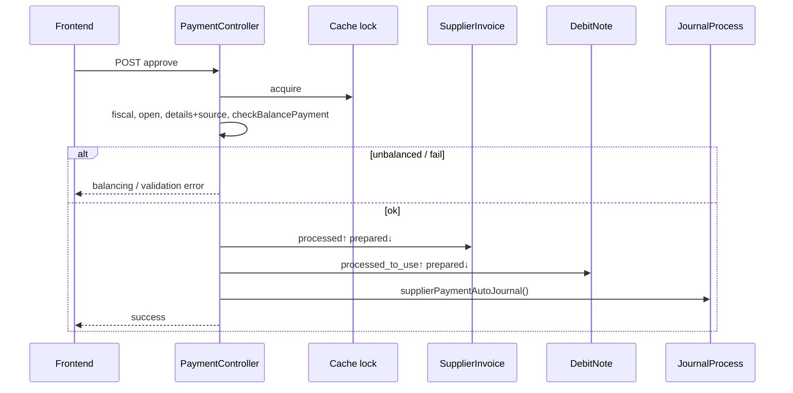

# Account Payment — Technical Documentation

**API prefix:** `accounting/supplier-payment`  
**Type:** `Payment to Supplier` · **Code prefix:** `PY`  
**Behavior SoT:** [requirement.md](./requirement.md) v2.2

---

## 1. File Map

### Backend

| Layer | Path |
|-------|------|
| Wrapper | `Modules/Accounting/Http/Controllers/SupplierPaymentController.php` → `PaymentController` |
| Core | `PaymentController.php` |
| PI allocation | `PaymentDetailController.php` / `SupplierPaymentDetailController.php` |
| Cash/Bank + DN | `PaymentDetailFundController.php` (`storeClearing`, deposits) |
| Adjustment | `PaymentDetailAdjustmentController.php` |
| Import | `SupplierPaymentImportController.php` + import jobs |
| Models | `Payment`, `SupplierPayment`, `PaymentDetail`, `PaymentDetailFund`, `PaymentDetailDeposit`, `PaymentDetailAdjustment` |
| Pricing | `PaymentPrice.php`, `PaymentDetailHelper.php` |
| Journal | `app/Helpers/Accounting/JournalProcess.php` → `supplierPaymentAutoJournal()` |
| Balance | `JournalReport::getInPeriodAvailableBalance()` |
| Routes | `Modules/Accounting/Routes/api.php` (prefix `supplier-payment`) |

### Frontend

| File | Section |
|------|---------|
| `olshoperp-frontend/src/pages/Accounting/AccountPayable/Payment/DataList.vue` | List + Import Log |
| `Form.vue` | Basic Information |
| `PaymentSource.vue` | Cash/Bank + DN |
| `OutstandingSupplierInvoice.vue` | Outstanding PI |
| `DatalistDetail.vue` | Detail grid |
| `Adjustment.vue` | Adjustment |
| `ImportLog.vue` | Header import UI |

**Route:** `/accounting/supplier-payment`

---

## 2. API Routes (utama)

| Method | Path | Action |
|--------|------|--------|
| GET/POST | `accounting/supplier-payment` | index / store |
| GET/PATCH/DELETE | `accounting/supplier-payment/{id}` | show / update / destroy |
| POST | `…/{id}/approve` | approve (void via `approval_status=void` — broken) |
| GET | `…/outstanding-supplier-invoice` | outstanding PI |
| GET | `…/cash-bank-account` | cash/bank balances |
| POST | `…/cash-bank-account/bulk-use` | bulk cash allocation |
| GET | `…/debit-note` / select2 | available DN |
| POST | `…/supplier-payment-detail-fund/clearing` | single DN full clear |
| CRUD | `…/supplier-payment-detail` (+ bulk) | PI lines |
| CRUD | `…/supplier-payment-adjustment` | adjustments |
| Import | `accounting/supplier-payment/import/*` | template, import, progress |

---

## 3. Database — Key Tables

| Table | Notes |
|-------|-------|
| `accounting_payments` | Header; type `Payment to Supplier`; `PY` code |
| `accounting_payment_details` | PI allocation; forex + cash_difference |
| `accounting_payment_detail_funds` | Cash/bank source |
| `accounting_payment_detail_deposits` | DN source |
| `accounting_payment_detail_adjustments` | Manual Dr/Cr |
| PI | `prepared_to_payment_amount` / `processed_to_payment_amount` |
| DN | `prepared_to_use_amount` / `processed_to_use_amount` |

---

## 4. Approve Flow

---

## 5. Invariants

| ID | Invariant |
|----|-----------|
| INV-PAY-01 | On approve: `grandTotalPriceAfterVat` = `totalSource` (`bccomp` scale 15) |
| INV-PAY-02 | Cash fund amount ≤ available balance (journal − reserved) |
| INV-PAY-03 | DN deposit amount ≤ DN remaining usable |
| INV-PAY-04 | Source currency = payment header currency |
| INV-PAY-05 | PI: `prepared + processed_to_payment ≤ grand_total_after_vat` |
| INV-PAY-06 | Company COAs required: AP, Exchange Diff, Cash Diff |

---

## 6. Failure Modes & Transaction Boundary

| Failure | Scope | Behavior |
|---------|-------|----------|
| Unbalanced source vs detail | Pre-TX | Approve error balancing message |
| Insufficient cash | Fund store / approve | Insufficient funds error |
| Concurrent import | Cache lock company | Block second import |
| Concurrent approve | Cache lock | Wait / fail |
| Fiscal closed / not open | Pre-TX | Error |
| Void from approved | Approve API | Fails — `can_approve` requires open (GAP-PAY-VOID-01) |
| Bulk DN clearing FE | FE URL | Wrong `customer-payment` path (GAP-PAY-DN-CLEAR) |

---

## 7. Data Lifecycle (PI / DN → Payment)

| Stage | Document | Flag | Meaning |
|-------|----------|------|---------|
| PI | Header | `prepared_to_payment_amount` | Reserved by draft/open payment |
| PI | Header | `processed_to_payment_amount` | Finalized on payment approve |
| DN | Header | `prepared_to_use_amount` | Reserved as payment source |
| DN | Header | `processed_to_use_amount` | Consumed on payment approve |
| Payment | Funds/deposits | amounts | Source side of balance |
| Payment | Details | paid + forex + cash diff | Allocation side |

---

## 8. Pricing & Journal

**Grand total:** `totalDetailAfterVat − totalAdjustment`  
**Total source:** `totalFund + totalDeposit`  
**Exchange gain:** `(PI.rate − payment.rate) × amount_in_invoice_currency`  
**Cash difference:** full-clearing remainder × rate factor  

**Journal:** Dr AP (+ forex/cash diff/adjustment) · Cr cash/bank + DN deposit COA. Requires Exchange Diff + Cash Diff + AP COAs.

---

## 9. Outstanding PI & Cash Balance

Outstanding: same supplier; PI approved/processed; remaining after processed payment; PI date ≤ payment date.  
Cash available: period journal balance − reserved payment funds on same COA.

---

## 10. Import AP

3-sheet template (Bank Mutation · Detail · Adjustment). Queue lock per company. Results as **OPEN** payments for review. Detail: import jobs in File Map.

---

## 11. Validation Highlights

| Rule | Location |
|------|----------|
| Header lock if details/funds/deposits/adj exist | Update header |
| Balance source = detail | Approve |
| Cash ≤ available | Fund store |
| DN ≤ remaining | Deposit store |
| Fiscal / date ≤ today / backdate FE ~6 mo | Header |
| Currency source = header | Source store |

---

## 12. Frontend Behaviors

| Behavior | Note |
|----------|------|
| Auto-save create | Last supplier/currency fill |
| Header disable when hasDetails | Form |
| Void button on approved | Present but API broken |
| Bulk DN clear | Wrong customer-payment URL |
| Import Log | Datalist entry |

---

## 13. Tests & QA Notes

1. Cash + PI → approve balanced → journal + PI processed↑  
2. Unbalanced → error  
3. Cash > balance → reject  
4. DN source → DN processed_to_use↑  
5. Full clearing → cash_difference  
6. Forex when rates differ  
7. Import → OPEN then approve  
8. Void UI → expect fail  

---

## 14. Known Issues

| ID | Issue |
|----|-------|
| GAP-PAY-VOID-01 | Void from approved broken |
| GAP-PAY-DN-CLEAR | FE bulk DN wrong URL |
| GAP-PAY-PR-OUT | PR return fields unused on PI outstanding |
| GAP-PAY-01 | PI status not set processed on pay |
| DEV-PAY-01…05 | Void UI, DN URL, PR wiring, PI processed, outstanding SQL |

Full: [requirement §19–§21](./requirement.md).

---

## Related Documents

| Doc | Path |
|-----|------|
| Requirement | [requirement.md](./requirement.md) |
| Knowledge Base | [knowledge-base.md](./knowledge-base.md) |
| User Guide | [user-guide.md](./user-guide.md) |
| Purchase Invoice | [../accounting-supplier-invoice/technical.md](../accounting-supplier-invoice/technical.md) |
