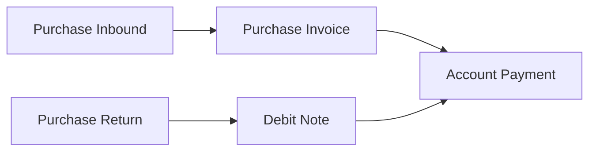
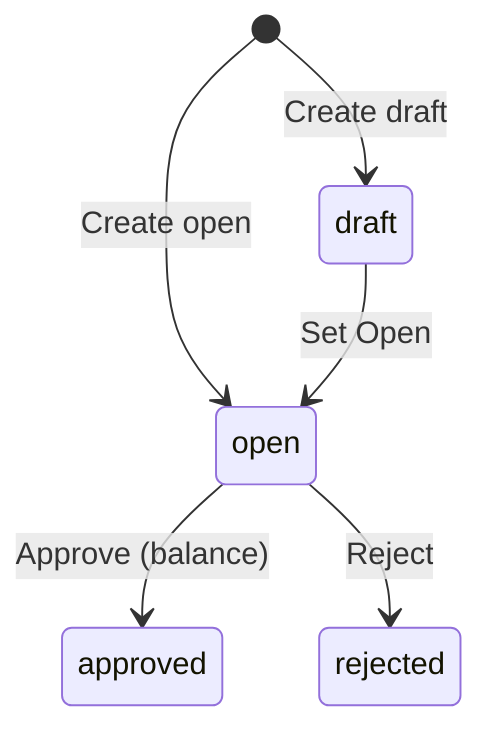

# Account Payment — Panduan Pengguna

**Siapa yang baca panduan ini:** finance, AP clerk  
**Menu di sistem:** Accounting → Account Payment  
**Kode transaksi:** dimulai dengan `PY-`

---

## 1. Apa Itu & Kenapa Penting

Account Payment adalah transaksi untuk **membayar hutang** ke supplier. Hutang muncul dari **Purchase Invoice** yang sudah di-approve.

Kamu bisa bayar dengan **Cash/Bank**, **Debit Note** (potongan dari retur/kelebihan bayar), atau **kombinasi keduanya**. Tanpa payment yang di-approve, hutang PI tetap outstanding.

---

## 2. Overview Flow & Proses Bisnis

### Rantai proses

**Versi teks (tanpa diagram):**

1. Barang diterima (Inbound) lalu ditagih di **Purchase Invoice**.
2. Bayar hutang di **Account Payment** (kas/bank dan/atau Debit Note).
3. Retur bisa menghasilkan **Debit Note** yang dipakai sebagai potongan di payment.

🎬 [Interactive demo akan ditambahkan di sini]

### Siklus status

**Versi teks:**

| Status | Artinya | Bisa diubah? |
|--------|---------|--------------|
| **Draft** | Belum siap approve | Ya |
| **Open** | Siap approve jika sudah balance | Ya |
| **Approved** | Jurnal terbit, hutang berkurang | Tidak |
| **Rejected** | Ditolak | — |

> **Void payment approved belum tersedia.** Teliti sebelum Approve.

---

## 3. Sebelum Mulai (Flow Sebelum)

Pastikan:

- [ ] **Supplier** terdaftar.
- [ ] Ada **PI approved** dengan sisa hutang > 0.
- [ ] Setting company lengkap: **AP COA**, **Exchange Diff COA**, **Cash Diff COA**.
- [ ] Jika bayar kas: rekening **Cash/Bank** aktif & saldo cukup.
- [ ] Jika potong DN: **Debit Note approved** milik supplier yang sama.
- [ ] Periode fiskal terbuka untuk tanggal transaksi.

🎬 [Interactive demo akan ditambahkan di sini]

---

## 4. Setelah Selesai (Flow Sesudah)

Setelah payment **di-approve**:

1. Jurnal otomatis: hutang AP berkurang; kas/bank dan/atau DN terpakai.
2. Sisa hutang di **Purchase Invoice** berkurang (partial → bisa dibayar lagi nanti).
3. DN yang dipakai: sisa DN berkurang.
4. Import massal: hasilnya status **Open** — review dulu baru approve.

🎬 [Interactive demo akan ditambahkan di sini]

---

## 5. Yang Perlu Diperhatikan

- **Kalau total sumber dana tidak sama dengan total alokasi PI**, Approve gagal — samakan Source dan Detail.
- **Kalau amount kas melebihi saldo rekening**, sistem menolak.
- **Kalau amount DN melebihi sisa DN**, sistem menolak.
- **Kalau kamu ubah header** (supplier/mata uang/tanggal) **setelah ada detail**, ditolak — hapus detail dulu.
- **Kalau PI sedang dipakai payment lain** (Already Prepared), pilih PI lain atau selesaikan payment tersebut.
- **Kalau mata uang sumber beda dari header**, ditolak.
- **Kalau status masih Draft**, set **Open** dulu sebelum Approve.
- **Kalau import Excel**, hanya **IDR**; satu import per company sekaligus; hasil **Open** untuk direview.
- **Kalau kamu mengandalkan Void setelah approve**, jangan — fitur belum berfungsi.
- **Kalau bulk clearing Debit Note error**, pakai tambah DN satu per satu (bug FE).

---

## 6. Langkah-Langkah (Step by Step)

### Cek dulu

1. PI outstanding siap.
2. Rekening / DN siap dipakai.
3. Setting COA company lengkap.

### Langkah 1 — Buat payment

1. Buka **Accounting → Account Payment → Create**.
2. Isi Supplier, Tanggal, Mata Uang, Kurs.
3. Set status **Open**.

### Langkah 2 — Tambah sumber dana

1. Buka **Payment Source**.
2. Tambah **Cash/Bank** (cek Balance) dan/atau **Debit Note**.
3. Amount tidak boleh melebihi saldo / sisa DN.

### Langkah 3 — Alokasi ke PI

1. Buka **Outstanding Purchase Invoice**.
2. **Use** / **Allocate Full Amount** / **Bulk Use**.
3. Isi **To Be Paid** (boleh sebagian).

### Langkah 4 — Adjustment (opsional)

Tambah baris adjustment bila perlu (biaya admin, rounding).

### Langkah 5 — Balance & Approve

1. Pastikan **Total Source = Total Detail**.
2. **Save All** → **Approve**.
3. Cek hutang PI sudah berkurang.

🎬 [Interactive demo akan ditambahkan di sini]

### Alternatif — Import massal

1. Datalist → **Import Log**.
2. Download template (3 sheet) → isi → upload.
3. Review payment **Open** → Approve satu per satu.

---

## 7. Tips & Hal yang Sering Bikin Bingung

- **Partial payment boleh** — sisa PI di payment berikutnya.
- **Gabung kas + DN boleh** — beberapa baris di Payment Source.
- **Balancing error?** Samakan angka Source dan Detail (termasuk adjustment).
- **PI tidak muncul?** Cek sudah lunas, supplier beda, atau tanggal filter.
- **Header terkunci?** Hapus semua detail/source dulu.
- **Due date PI** hanya info — tidak memblok bayar.
- **Void belum ada** — jangan approve kalau belum yakin.
- **Bulk DN error?** Tambah DN manual satu per satu.

---

## 8. Referensi

| Dokumen | Isi |
|---------|-----|
| [knowledge-base.md](./knowledge-base.md) | SOP operator, troubleshooting, FAQ |
| [requirement.md](./requirement.md) | Aturan bisnis, validasi, gap |
| [technical.md](./technical.md) | API, jurnal, import teknis |

**Menu terkait:** Purchase Invoice · Debit Note · Purchase Return · Cash Bank Reconcile

---

*Derivatif dari requirement / knowledge-base / technical v2.2 — tanpa menambah fakta baru di luar sumber.*
