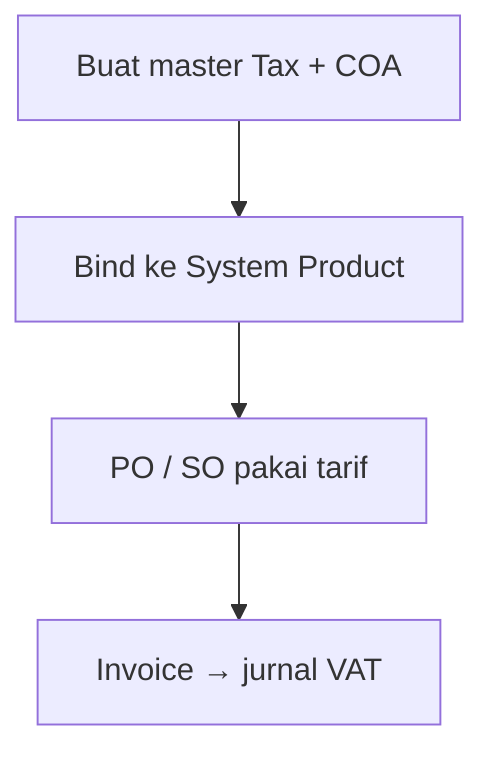

# Tax — Knowledge Base

> **Audience:** Finance / Accounting. **Route:** `/accounting/tax`

---

## 1. Apa itu?

**Tax** menyimpan **tarif PPN** perusahaan beserta:

- **Purchase COA** — akun pajak masukan (pembelian)  
- **Sales COA** — akun pajak keluaran (penjualan)  

Tanpa master ini (dan binding ke produk), Purchase/Sales Order sulit menambah baris pajak, dan approve invoice bisa gagal.

---

## 2. Glosarium

| Istilah | Arti awam |
|---------|-----------|
| **Purchase COA** | Akun pajak dari pembelian (VAT masukan) |
| **Sales COA** | Akun pajak dari penjualan (VAT keluaran) |
| **DPP** | Harga sebelum pajak |
| **Coefficient 11/12** | Tarif kertas 12%, pajak dipungut 11% |
| **Snapshot** | Pajak “terkunci” saat transaksi dibuat |
| **Live** | Diambil dari master saat approve (bisa berubah) |
| **Default Tax POS** | Flag untuk kasir (POS) — belum dipakai |

---

## 3. Cara pakai

1. **Create** → isi Code, Name, Tariff, Purchase COA (aset), Sales COA (kewajiban).  
2. Aktifkan **Coefficient** jika perlu mode 12/11 (Tariff terkunci 12).  
3. Simpan → bind Tax di **System Product** (purchase/sales).  
4. Pastikan supplier/customer auto-add VAT sesuai kebijakan di General Company.

**Hapus:** lepas dulu dari semua System Product; jangan hapus jika masih Default POS.

---

## 4. Yang perlu diingat

| Topik | Inti |
|-------|------|
| Ubah **Purchase COA** | Invoice pembelian yang sudah punya snapshot dari PO **tidak** ikut berubah |
| Ubah **Sales COA** | Bisa memengaruhi Sales Invoice **belum** di-approve |
| Coefficient ON | Angka VAT mengikuti 11%, bukan sekadar 12% kertas |
| Typo "Puchase" di list | Kosmetik — maksudnya Purchase COA |

---

## 5. Troubleshooting

| Gejala | Solusi |
|--------|--------|
| Approve PI/SI: Configure Tax COA | Isi Purchase/Sales COA di master Tax terkait |
| Tidak bisa Delete | Lepas binding Product / ganti Default POS dulu |
| VAT “aneh” vs tarif 12% | Cek Coefficient 11/12 |
| Tidak bisa pilih Tax di produk | Pastikan Tax **Active** |

---

## 6. FAQ

**Q: Transaksi lama setelah Tax dihapus?**  
A: Tetap aman — datanya sudah tersimpan di transaksi.

**Q: Default Tax POS buat apa?**  
A: Persiapan menu POS; belum ada efek operasional sekarang.

---

## Related Documents

| Doc | Path |
|-----|------|
| Requirement | [requirement.md](./requirement.md) |
| Technical | [technical.md](./technical.md) |
| User Guide | [user-guide.md](./user-guide.md) |
