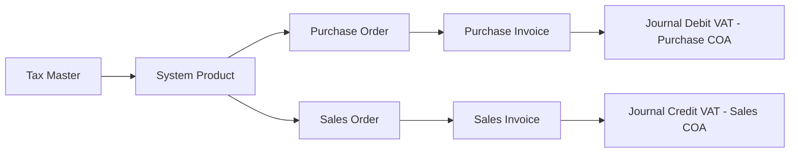
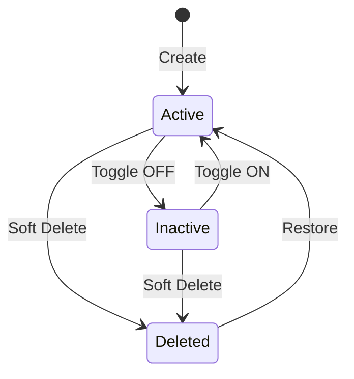

# Tax — Requirement Documentation

**Modul:** Finance Accounting → Master  
**UI route:** `/accounting/tax`  
**API prefix:** `accounting/tax`  
**Audience:** PM, Finance/Accounting, QA, Developer  
**PM source:** Tax Source of Truth **v1.0** (5 Agustus 2026)

> AS-IS diverifikasi codebase 5 Agu 2026 (`TaxController`, `Tax` entity, FE `Tax/DataList.vue` + `Form.vue`, helpers `calculateTax` / `calculateDpp`).

---

## 0. Metadata & Changelog

| Version | Date | Author | Changes |
|---------|------|--------|---------|
| 1.0 | 2026-08-05 | QA - Yemima | Full rewrite dari SoT v1.0; Gap `GAP-TAX-01..06`; PI snapshot vs SI live COA; Coefficient 11/12 |

---

## 1. Ringkasan Eksekutif

**Tax** adalah master tarif PPN per company. Menyimpan **Purchase COA** (VAT Masukan, class Activa) dan **Sales COA** (VAT Keluaran, class Passiva) sebagai acuan default penjurnalan VAT. Tax di-bind ke System Product (purchase/sales), lalu dipakai otomatis/manual di PO/SO. Tanpa Purchase/Sales COA valid, baris pajak PO/SO gagal dan approve PI/SI bisa gagal.

---

## 2. Prasyarat

| Prasyarat | Sumber | Catatan |
|-----------|--------|---------|
| COA class Activa | Chart of Account | Calon Purchase COA; bukan slot Current P/L |
| COA class Passiva | Chart of Account | Calon Sales COA; bukan slot Current P/L |
| System Product | System Product | Bind purchase/sales tax pivot |
| General Company VAT setting | General Company | Opsional — `auto_add_transaction_supplier` / `_customer` |

---

## 3. Siklus status

| Status | Editable? | Catatan |
|--------|-----------|---------|
| Active | Ya | Default create |
| Inactive | Ya | Tidak untuk relasi transaksi baru |
| Deleted | Read-only (`can_update=false`) | Delete ditolak jika masih bound System Product **atau** default POS |

Delete **tidak** diblok sekadar karena pernah dipakai di PO/PI — selama detach dari Product, delete OK. Transaksi lama memakai data **capture**.

---

## 4. Datalist

**URL:** `/accounting/tax`

| Fitur | Perilaku |
|-------|----------|
| Global Search | Standar datalist (code/name pattern) |
| Create | → `/accounting/tax/create` |
| Show Deleted | Checkbox — include soft-deleted |
| Column Show/Hide | Standar |
| Export | **Basic** — data yang tampil di datatable (bukan Advanced Export All) |
| Advanced Filter | Kolom searchable via filterColumn (Default POS, Coefficient, Active, dll.) |

| # | Kolom |
|---|-------|
| 1–3 | Code, Name, Description |
| 4 | Tariff (%) |
| 5–6 | Purchase COA Code / Name |
| 7–8 | Sales COA Code / Name |
| 9 | Default POS (Yes/No) — belum ada relasi fungsional (POS belum live) |
| 10 | Coefficient (Yes/No) |
| 11 | Active |
| 12 | Created By \| At |
| 13 | Action |

> UI typo header baris 1: **"Puchase"** COA Code — GAP-TAX-03.

---

## 5. Form & field

| Field | Wajib | Catatan |
|-------|-------|---------|
| Code | Ya | Unique non-deleted, max 50 |
| Name | Ya | Max 50 |
| Purchase COA | Ya | Select2 leaf Activa; exclude Current P/L |
| Tariff | Ya | Numeric min 1; FE max 100 step 0.1; **disabled** jika Coefficient ON → terkunci **12** |
| Sales COA | Ya | Select2 leaf Passiva; exclude Current P/L |
| Description | Tidak | |
| Default Tax POS | Tidak | Jika belum ada default company → create memaksa default=1 |
| Coefficient 11/12 | Tidak | OFF default; ON → tariff 12, effective VAT rate **11** |
| Active | Tidak | Default ON |
| Audit Log | — | `GET accounting/tax/{id}/audit` |

**Save & Next** (Create): create → redirect Edit.

**Update:** class Activa/Passiva **tidak** di-recheck (GAP-TAX-02). Current P/L tetap dicek. Aturan default POS (min 1; tidak boleh uncheck langsung tanpa ganti) berlaku.

---

## 6. How It Works

### 6.1 Coefficient 11/12

Tarif kertas 12%; VAT dipungut dihitung **11%**. Contoh harga 100.000 include, Coefficient ON:

- DPP (basis 12%) ≈ 82.582,58…  
- VAT (basis 11%) ≈ 9.909,91…  
- Total = 100.000  

Helper: `calculateTax($amount, $rate=11, …)` + `calculateDpp(..., $rate, $fake_rate=12, …)`. Di PO detail, paper rate tersimpan di field seperti **`fake_vat`**; DPP tampilan/pakai = basis fake rate; cadangan perhitungan 11% ikut pipeline rate efektif.

### 6.2 Snapshot PI vs Live SI (AS-IS valid — bukan gap)

| Dokumen | Sumber COA journal |
|---------|-------------------|
| **Purchase Invoice** approve | Snapshot `tax_coa_id` dari baris pajak **PO** |
| **Sales Invoice** approve | **Live** `tax.sales_coa_id` dari master saat approve |

Ubah Sales COA di master bisa memengaruhi SI belum approve; ubah Purchase COA **tidak** mengubah PI yang sudah snapshot dari PO.

### 6.3 Delete setelah dipakai transaksi

Detach dari Product → Delete OK; PO/Inbound/PI lama tetap memakai capture.

### 6.4 Auto-add ke PO/SO

(1) Product punya pivot tax aktif purchase/sales, dan (2) Company auto-add ≠ `no`.

---

## 7. Validasi

### 7.1 Create

| # | Rule | Pesan |
|---|------|-------|
| 1–3 | Code/Name/Tariff required | Laravel / unique |
| 4–5 | Purchase & Sales COA required | |
| 6 | Coefficient boolean required | |
| 7 | Purchase = Activa | `The Purchase COA input must use Activa.` |
| 8 | Sales = Passiva | `The Sales COA input must use Passiva.` |
| 9 | Bukan Current P/L | `The Purchase/Sales COA has been set as Default Current Profit/Loss` |
| 10 | First default POS | Paksa `is_default_tax_pos = 1` jika belum ada |

### 7.2 Update

| Rule | Behavior |
|------|----------|
| Activa/Passiva | **Tidak dicek** — GAP-TAX-02 |
| Current P/L | Tetap dicek |
| Matikan default terakhir | `At least one default Tax POS must remain active.` |
| Uncheck tanpa ganti | `Cannot directly disable the default option…` |
| Set default baru | Clear flag tax lain di company |

### 7.3 Delete

| Guard | Pesan |
|-------|-------|
| Default POS | `Cannot delete this data because it is set as the default Tax POS.` |
| Bound Product | `Failed to delete tax data because it is already related to a System Product.` |

### 7.4 Konsumen

| Menu | Cek |
|------|-----|
| System Product | Select2 tax active; delete tax diblok jika bound |
| PO | Wajib Purchase COA — `Configure 'Purchase COA' in master tax form.` Snapshot ke `tax_coa_id` |
| Purchase Inbound | Tidak validasi tax sendiri |
| PI approve | Debit snapshot; gagal jika kosong — `Please Configure 'Tax COA' for Tax Purchase Order…` |
| SO General | Wajib Sales COA — `Configure 'Sales COA' in master tax form.` |
| SO Platform | Dari `salesTaxes` / Default VAT |
| SI approve | Credit **live** Sales COA — `Please Configure 'Sales COA'…` / `Tax COA not registered…` |
| General Company | auto_add `yes` / `no` / `default_by_product` |

---

## 8. Relasi menu

| Menu | Peran |
|------|-------|
| [System Product](../system-product/README.md) | Pivot purchase/sales |
| [General Company](../generalsetting-general-company/README.md) | Auto-add VAT |
| [Purchase Order](../supplychain-purchase-order/README.md) | Tax lines + snapshot Purchase COA |
| [Purchase Invoice](../accounting-supplier-invoice/README.md) | Journal dari snapshot |
| Sales Order / Sales Invoice | Tax lines; SI live Sales COA |
| [Chart of Account](../accounting-chart-of-account/README.md) | Activa/Passiva; COA terpakai Tax tidak bisa dihapus |

---

## 9. Acceptance Criteria

| ID | Kriteria |
|----|----------|
| TAX-01 | Create wajib Code/Name/Tariff/Purchase COA Activa/Sales COA Passiva |
| TAX-02 | Coefficient ON → tariff 12 locked; effective calc 11 |
| TAX-03 | Delete diblok default POS / product pivot |
| TAX-04 | PI journal = PO snapshot; SI journal = live Sales COA |
| TAX-05 | Gap registry terdokumentasi |

---

## 10. FAQ

**Q: Ubah Sales COA setelah SO dibuat?**  
A: Bisa memengaruhi SI belum approve (live). PI memakai snapshot PO.

**Q: Tidak bisa hapus Tax?**  
A: Masih bound Product atau default POS.

**Q: Transaksi lama setelah Tax dihapus?**  
A: Tetap — data capture.

**Q: Tariff terkunci?**  
A: Coefficient ON.

**Q: Default Tax POS?**  
A: Flag persiapan POS — belum dipakai fungsional.

---

## 11. Gap Registry

| ID | Deskripsi | Status |
|----|-----------|--------|
| GAP-TAX-01 | Exclude COA Cash/Bank dari select2 Purchase/Sales belum ada | Open (TO-BE) |
| GAP-TAX-02 | Activa/Passiva tidak di-recheck di Update | Open |
| GAP-TAX-03 | Typo header **"Puchase"** di datalist | Open |
| GAP-TAX-04 | `TaxController::select2()` ada tapi **tidak ter-route** | Open |
| GAP-TAX-05 | Sync `gs_company_vat_settings` dari General Company partial/commented | Open |
| GAP-TAX-06 | Loop sync SO Platform berpotensi tulis `purchase_coa_id` ke `tax_coa_id` | Open |

---

## Related Documents

| Doc | Path |
|-----|------|
| Knowledge Base | [knowledge-base.md](./knowledge-base.md) |
| Technical | [technical.md](./technical.md) |
| User Guide | [user-guide.md](./user-guide.md) |
