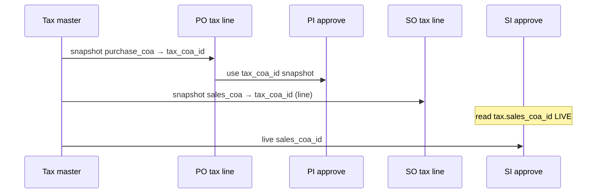

# Tax — Technical Documentation

> **Review** — AS-IS 2026-08-05. Behavior: [requirement v1.0](./requirement.md).

---

## 0. Metadata & Changelog

| Version | Date | Author | Changes |
|---------|------|--------|---------|
| 1.0 | 2026-08-05 | QA - Yemima | File map, CRUD validation, coefficient helpers, PI/SI COA lifecycle, gaps |

---

## 1. File Map

| Layer | Path |
|-------|------|
| Controller | `Modules/Accounting/Http/Controllers/TaxController.php` |
| Entity | `Modules/Accounting/Entities/Tax.php` (`accounting_taxes` / taxes table) |
| Policy | `Modules/Accounting/Policies/TaxPolicy.php` |
| Routes | `Modules/Accounting/Routes/api.php` — `resource /tax`, `tax/select2/child`, `tax/{tax}/audit` |
| Helpers | `app/Helpers/Accounting/AccontingHelper.php` — `calculateTax`, `calculateDpp` |
| Pricing | `app/Helpers/SupplyChain/PurchaseOrderDetailPrice.php` (+ SI/SO tax pipelines) |
| FE | `olshoperp-frontend/src/pages/Accounting/master/Tax/DataList.vue`, `Form.vue` |

**Note:** `TaxController::select2()` **exists** but **no route** — consumers use Product tax select2 / Default VAT (GAP-TAX-04). Routed: `select2Child` → COA picker for form.

---

## 2. Model fillable / flags

| Field | Notes |
|-------|-------|
| `code`, `name`, `description`, `tariff` | |
| `purchase_coa_id`, `sales_coa_id` | FK COA |
| `is_default_tax_pos` | Single-active per company (enforced in update) |
| `coefficient` | Boolean — paper 12 / effective 11 |
| `status`, `is_all_company` | store forces `is_all_company = 0` |

Relations: `productTaxPivots()`, purchase/sales COA belongsTo.

---

## 3. CRUD validation

### store

- Validate code unique, name, tariff min 1, both COA ids, coefficient boolean  
- **Enforce** Activa on purchase COA / Passiva on sales COA  
- Reject Current Profit/Loss on both  
- If no existing default POS → force `is_default_tax_pos = 1`

### update

- Code/name/tariff validated; **no** Activa/Passiva recheck (GAP-TAX-02)  
- Current P/L still checked  
- Default POS: cannot clear last; setting new clears others  

### destroy

- Block if `is_default_tax_pos`  
- Block if `productTaxPivots()->exists()`  
- Soft delete otherwise  

---

## 4. Coefficient & DPP/VAT

```text
effective_rate = coefficient ? 11 : tariff
fake_rate (paper) = coefficient ? 12 : tariff   // FE locks tariff field to 12 when ON
```

- `calculateTax($amount, $effective_rate, $included)`  
- `calculateDpp($amount, $effective_rate, $fake_rate, $included)` → DPP on **paper** basis  
- PO detail stores paper rate (e.g. `fake_vat`) and DPP fields (`each_dpp_*`); VAT amount from effective rate  

---

## 5. Journal COA lifecycle



| Path | Behavior |
|------|----------|
| PI | Debit VAT → PO line `tax_coa_id` |
| SI | Credit VAT → `Tax.sales_coa_id` at approve time |

---

## 6. FE notes

| Item | Detail |
|------|--------|
| Typo | DataList title `Puchase COA Code` (GAP-TAX-03) |
| Tariff | `:disabled="coefficient"`; watcher forces 12 when ON |
| Export | DataTablesV3 basic export of current view |
| COA picker | `accounting/tax/select2/child` → ChartOfAccount select2Child |

---

## 7. Invariants & failure modes

- Create: Purchase Activa + Sales Passiva  
- Update may persist wrong class (GAP-TAX-02)  
- Default POS ≥ 1 when any exists  
- COA referenced by Tax cannot be deleted (COA guard elsewhere)  
- Empty Purchase/Sales COA → PO/SO tax add fails; PI/SI approve fails  

---

## 8. Known Issues

[requirement §11](./requirement.md#11-gap-registry) `GAP-TAX-01` … `06`.

---

## Related Documents

| Doc | Path |
|-----|------|
| Requirement | [requirement.md](./requirement.md) |
| Knowledge Base | [knowledge-base.md](./knowledge-base.md) |
| User Guide | [user-guide.md](./user-guide.md) |
| PO (VAT import / tax lines) | [../supplychain-purchase-order/technical.md](../supplychain-purchase-order/technical.md) |
