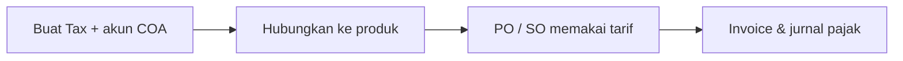

# Panduan Pengguna — Tax (Master Pajak)

**Siapa yang baca:** tim Finance / Accounting  
**Menu:** Finance Accounting → Master → Tax  
**Route:** `/accounting/tax`

---

## 1. Apa Itu & Kenapa Penting

**Tax** adalah daftar tarif PPN perusahaan beserta akun jurnalnya: akun pajak masukan (pembelian) dan akun pajak keluaran (penjualan).

Tanpa master ini — dan tanpa menghubungkannya ke produk — pesanan beli/jual sulit menambah pajak otomatis, dan proses approve invoice bisa gagal.

---

## 2. Overview Flow & Proses Bisnis

**Versi teks:**

1. Buat master Tax (kode, nama, tarif, akun beli & jual).  
2. Hubungkan Tax ke System Product (sisi beli dan/atau jual).  
3. Saat buat PO/SO, pajak bisa muncul otomatis sesuai setting supplier/customer.  
4. Saat invoice di-approve, sistem menjurnal ke akun pajak yang relevan.

### Status

| Status | Arti |
|--------|------|
| Active | Bisa dipakai di transaksi baru |
| Inactive | Tidak untuk transaksi baru |
| Deleted | Dihapus lunak — bisa di-restore |

---

## 3. Sebelum Mulai

- Chart of Account untuk pajak masukan (kelompok aset) dan keluaran (kelompok kewajiban) sudah siap.  
- Jangan pakai akun yang sudah jadi Current Profit/Loss.  
- Siapkan kebijakan auto-add pajak di master Customer/Supplier bila perlu.

🎬 [Interactive demo akan ditambahkan di sini]

---

## 4. Setelah Selesai

- Tax Active dan terhubung ke produk yang tepat.  
- Uji: buat baris PO/SO dengan produk tersebut — pajak muncul sesuai harapan.  
- Approve invoice uji tidak error “Configure Tax COA”.

---

## 5. Yang Perlu Diperhatikan

- **Coefficient 11/12:** tarif di kertas 12%, perhitungan pungutan 11%. Tariff terkunci ke 12 saat mode ini aktif.  
- **Ubah akun Sales COA** di master bisa memengaruhi Sales Invoice yang **belum** di-approve.  
- **Ubah akun Purchase COA** tidak mengubah Purchase Invoice yang sudah mengambil snapshot dari PO.  
- **Hapus Tax** hanya setelah dilepas dari semua produk; Default POS juga harus diganti dulu.  
- **Default Tax POS** baru untuk menu kasir nanti — belum dipakai sekarang.  
- Di daftar, tulisan “Puchase” adalah typo visual untuk Purchase COA.

---

## 6. Langkah-Langkah

1. Buka **Tax** → **Create**.  
2. Isi Code, Name, Tariff, Purchase COA, Sales COA.  
3. Nyalakan Coefficient bila diperlukan → Save (atau Save & Next).  
4. Di System Product, bind Tax ke konfigurasi purchase/sales.  
5. Uji di PO atau SO, lalu invoice.

🎬 [Interactive demo akan ditambahkan di sini]

---

## 7. Tips & Hal yang Sering Bikin Bingung

- **"Tidak bisa hapus."** Masih terhubung produk atau masih Default POS.  
- **"Configure Tax COA."** Isi Purchase/Sales COA di master Tax.  
- **"Tariff tidak bisa diubah."** Coefficient sedang ON.  
- **"Angka VAT beda dari 12%."** Mode Coefficient memakai 11% untuk pungutan.

---

## 8. Referensi

| Sumber | Untuk apa |
|--------|-----------|
| [Knowledge Base](./knowledge-base.md) | Troubleshooting |
| [Requirement](./requirement.md) | Validasi & Gap |
| [Technical](./technical.md) | API / developer |
| [Purchase Order](../supplychain-purchase-order/README.md) | Pemakaian tax di PO |
