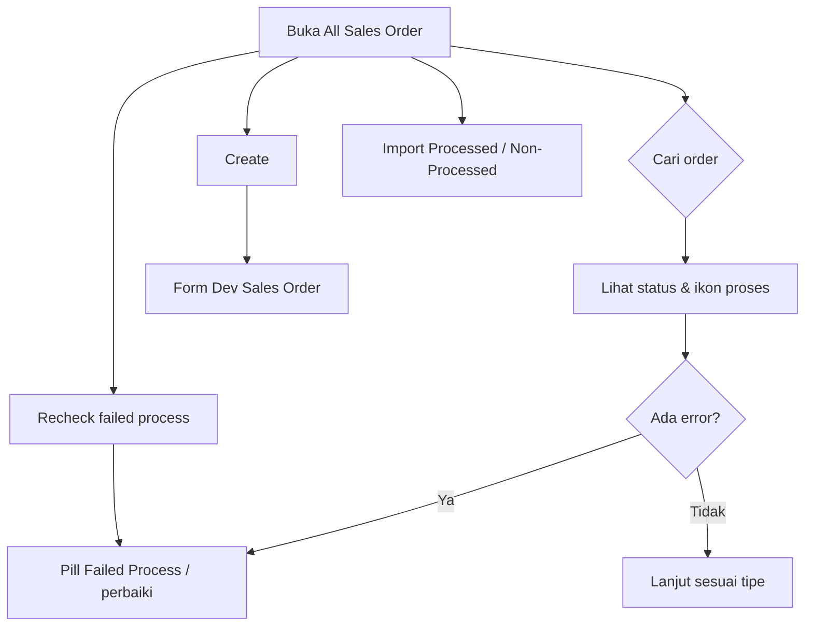

# All Sales Order — Knowledge Base

Satu daftar untuk **semua** sales order: marketplace (**Dev - Sales Platform**) dan internal (**Dev - Sales Order**).

---

## 1. Apa itu & kapan dipakai

Pakai All Sales Order bila Anda perlu:

- Melihat order marketplace **dan** internal dalam satu layar  
- Mengecek Failed Process lintas tipe  
- Menjalankan **Recheck failed process**  
- Export gabungan  
- Import order internal dengan **Import Processed** atau **Import Non-Processed** (sama seperti Dev - Sales Order)

| Untuk keperluan | Buka menu |
|-----------------|-----------|
| Sync toko / booking marketplace | **Dev - Sales Platform** |
| Atur Fulfillment Mode store | **Store** |
| Detail aturan import internal | **Dev - Sales Order** |
| Monitoring gabungan + Recheck + import dual | **All Sales Order** |

---

## 2. Alur kerja standar

**Keterangan:**

- Baris **platform** → aturan Sales Platform.  
- Baris **general** → aturan Dev Sales Order (termasuk Fulfillment Mode).  
- **Import Processed** / **Import Non-Processed**: template sama; store harus mode yang cocok. Detail: [Dev Sales Order KB](../sales-order-general/knowledge-base.md).

### Recheck failed process

Tombol ada di halaman ini (bukan di list Dev Sales Platform). Memeriksa ulang flag error order Approved yang belum/sedang antre Unassign Wave.

---

## 3. Troubleshooting

| Gejala | Solusi |
|--------|--------|
| Order marketplace tidak muncul | Cek sync di Sales Platform |
| Import gagal karena mode store | Samakan tombol dengan **Fulfillment Mode** di Store |
| Perlu buat order manual | Create di ASO atau Dev Sales Order |
| Tidak ada Recheck di Sales Platform | By design — pakai All Sales Order |

---

## Related

- [requirement.md](./requirement.md) · [technical.md](./technical.md) · [user-guide.md](./user-guide.md)  
- [Dev Sales Order](../sales-order-general/knowledge-base.md) · [Store](../omni-store-binding/knowledge-base.md)
