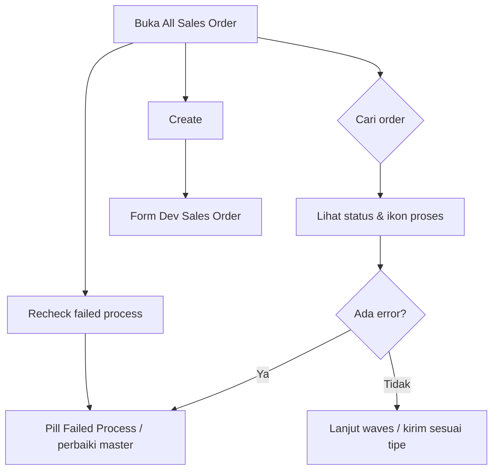

# All Sales Order — Knowledge Base

Satu daftar untuk **semua** sales order: order toko online (Sales Platform) dan order internal (Dev - Sales Order).

---

## 1. Apa itu & kapan dipakai

Pakai All Sales Order bila Anda perlu:

- Melihat order marketplace **dan** internal dalam satu layar
- Mengecek Failed Process lintas tipe order
- Menjalankan **Recheck failed process** (cek ulang icon error massal)
- Menyunting info booking Shopee yang belum punya nomor order (Other Information)
- Export gabungan / import order internal (pola sama Dev Sales Order)

**Bukan** pengganti dua menu sumber:

| Untuk keperluan | Buka menu |
|-----------------|-----------|
| Sync toko, Log Data, booking pipeline marketplace | **Dev - Sales Platform** |
| Buat/import order internal lengkap | **Dev - Sales Order** |
| Monitoring gabungan + Recheck failed process | **All Sales Order** (halaman ini) |

---

## 2. Alur kerja standar

**Keterangan:**

- Baris **platform** mengikuti aturan Sales Platform (sync, binding, auto-approve).
- Baris **general** mengikuti aturan Dev Sales Order (manual/import).
- Ikon error dan Processing Status artinya sama dengan di Sales Platform.

### Recheck failed process

Tombol **Recheck failed process** ada di halaman ini (bukan di daftar Dev Sales Platform).

- Memeriksa ulang flag error order yang **sudah Approved** dan belum/sedang antre Unassign Wave.
- Saat proses jalan, tombol disabled: *"Re-check is in progress…"*
- Setelah selesai, hover icon error bisa menampilkan **Last Checked** (waktu update error).
- Tidak terbatas filter tabel yang sedang aktif — sistem memproses kandidat sesuai aturan di atas.

---

## 3. Troubleshooting

| Gejala | Solusi |
|--------|--------|
| Order marketplace tidak muncul | Cek sync di Sales Platform / Failed Synchronize |
| Error flag muncul | Hover ikon → perbaiki binding/COA/stok/gudang seperti di Sales Platform |
| Perlu buat order manual | Create di ASO atau langsung Dev Sales Order |
| Edit booking | Gunakan form dari ASO (Other Information), bukan form list Sales Platform |
| Booking belum punya Platform Order ID | Boleh edit & pantau di sini; **jangan** harap Instant Settlement berhasil sampai Order ID terisi — detail: [Sales Platform KB § Booking](../omni-sales-platform/knowledge-base.md#4-booking-shopee) |
| Tombol Recheck disabled lama | Tunggu batch selesai; refresh halaman; hubungi admin jika lock macet |
| Tidak menemukan tombol Recheck di Sales Platform | By design — pakai **All Sales Order** |

---

## Related

- [Requirement](./requirement.md) · [Technical](./technical.md)
- [Sales Platform](../omni-sales-platform/knowledge-base.md) · [Dev Sales Order](../sales-order-general/knowledge-base.md)
