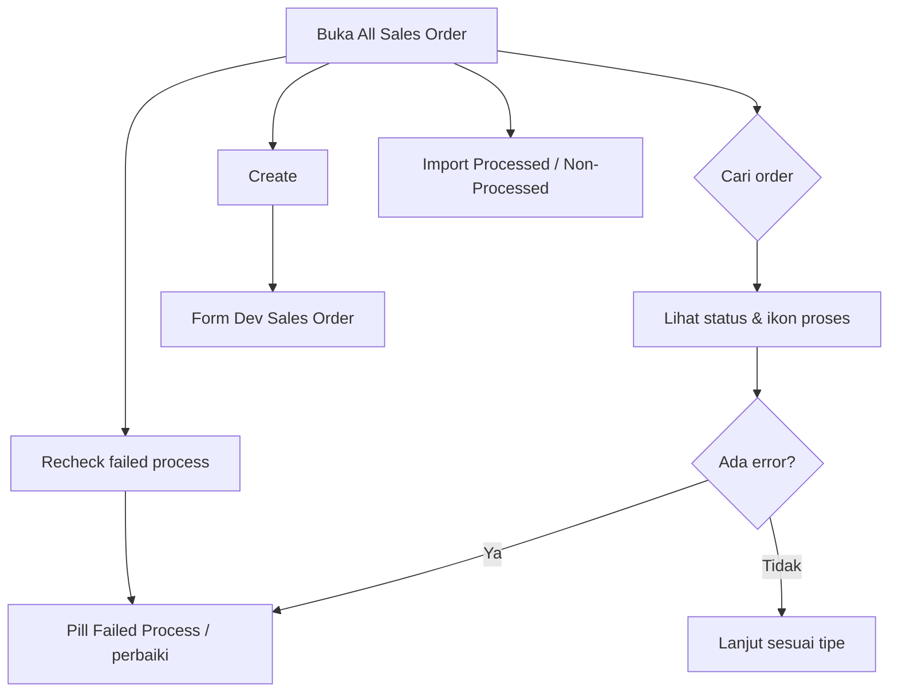

# All Sales Order — Knowledge Base

Satu daftar untuk **semua** sales order: marketplace (**Dev - Sales Platform**) dan internal (**Dev - Sales Order**).

---

## 1. Apa itu & kapan dipakai

Pakai All Sales Order bila Anda perlu:

- Melihat order marketplace **dan** internal dalam satu layar  
- Mengecek Failed Process lintas tipe  
- Menjalankan **Recheck failed process**  
- Export gabungan  
- Import order internal dengan **Import Processed** atau **Import Non-Processed** (sama seperti Dev - Sales Order)
- **(TO-BE)** Edit detail order **platform** sebelum Approve (tambah/ganti SKU, harga, VAT) — perilaku sama Sales Platform
- **(TO-BE)** Cek Order ID booking yang di-hold / booking tanpa Order ID lewat **Log Data** → tab **Pending Orders** (+ pill **Unmatched Bookings**)
- **(TO-BE)** **Void** order platform tanpa auto re-create dari sync; recreate manual lewat **Recreate** / **Void & Recreate** (ETM-15859)

| Untuk keperluan | Buka menu |
|-----------------|-----------|
| Sync toko / booking marketplace | **Dev - Sales Platform** |
| Atur Fulfillment Mode store | **Store** |
| Detail aturan import internal | **Dev - Sales Order** |
| Monitoring gabungan + Recheck + import dual | **All Sales Order** |
| Order ID Shopee “pending match” booking | **Log Data** → **Pending Orders** (TO-BE ETM-15798) |

---

## 2. Alur kerja standar

```mermaid
flowchart TD
    A[Buka All Sales Order] --> B{Cari order}
    B --> C[Lihat status & ikon proses]
    C --> D{Ada error?}
    D -->|Ya| E[Pill Failed Process / perbaiki]
    D -->|Tidak| F[Lanjut sesuai tipe]
    A --> G[Create] --> H[Form Dev Sales Order]
    A --> I[Import Processed / Non-Processed]
    A --> R[Recheck failed process] --> E
```

**Keterangan:**

- Baris **platform** → aturan Sales Platform.  
- Baris **general** → aturan Dev Sales Order (termasuk Fulfillment Mode).  
- **Import Processed** / **Import Non-Processed**: template sama; store harus mode yang cocok. Detail: [Dev Sales Order KB](../sales-order-general/knowledge-base.md).

### Recheck failed process

Tombol ada di halaman ini (bukan di list Dev Sales Platform). Memeriksa ulang flag error order Approved yang belum/sedang antre Unassign Wave.

### Unavailable Stock & Last Checked

Icon **Unavailable Stock** di Error Flag artinya stok FIFO di gudang proses **belum cukup pada tanggal Processing Order Date** di menu [Unassign Wave](../omni-unassign-wave/knowledge-base.md) — bukan otomatis “stok hari ini”.

- Processing Order Date **terisi** → cek stok memakai tanggal itu.
- Processing Order Date **kosong** → cek stok memakai waktu sekarang.
- **Last Checked** di tooltip seharusnya menampilkan tanggal evaluasi itu. Kalau yang tampil beda (mis. hari ini padahal Processing Order Date masih April), itu residual tampilan — percaya hasil FIFO ke tanggal processing.

Detail & contoh: [requirement §5.4a](./requirement.md).

### Log Data — Pending Orders (TO-BE)

Buka **Log Data** → tab **Pending Orders**: daftar Platform Order ID yang sengaja ditahan (belum jadi SO baru) karena menunggu Shopee **MATCHED** ke Booking Number yang sudah ada. Setelah match, baris hilang.

Pill **Unmatched Bookings**: tampilkan order yang sudah punya Booking Number tapi Platform Order ID masih kosong (ops bisa proses booking lebih dulu).

Detail: [requirement §5.7](./requirement.md) · [SP booking §3b](../omni-sales-platform/requirement.md).

### Void & recreate order platform (TO-BE)

| Aksi | Artinya untuk ops |
|------|-------------------|
| **Void** | Batalkan order. ID marketplace **tetap**. Sync **tidak** otomatis bikin SO baru. |
| **Void & Recreate** | Void + buat SO platform baru dari marketplace (ganti nama lama **Void & Clone**). |
| **Recreate** | Hanya di halaman **show** order yang **sudah void** — buat SO baru dari marketplace. |

Jangan harap schedule sync “menghidupkan” order void. Detail: [requirement §5.8](./requirement.md) · ETM-15859.

---

## 3. Troubleshooting

| Gejala | Solusi |
|--------|--------|
| Order marketplace tidak muncul | Cek sync di Sales Platform |
| Harga line Shopee terlalu kecil / aneh | Rule harga di **Sales Platform** (escrow + `shopee_discount`) — sync ulang; lihat [SP KB §5](../omni-sales-platform/knowledge-base.md) |
| Import gagal karena mode store | Samakan tombol dengan **Fulfillment Mode** di Store |
| Perlu buat order manual | Create di ASO atau Dev Sales Order |
| Unavailable Stock padahal stok fisik sudah ada | Cek **Processing Order Date** di Unassign Wave — mungkin masih sebelum tanggal inbound | Set POD ke tanggal stok ready → Recheck / Refresh |
| Last Checked di tooltip beda dari Processing Order Date | Residual tampilan (waktu job vs tanggal evaluasi) | Expected = POD / now — lihat §5.4a |
| Ingin filter order harga di bawah HPP | TO-BE: advanced filter Error Flag **Below Benchmark COGS** (paritas Platform / Dev Sales Order) — [Benchmark COGS](../accounting-product-benchmark-price/knowledge-base.md) |
| Cek PPN otomatis order marketplace | TO-BE: baris **platform** ikut **Auto Add VAT (Platform Orders)** di Store — [Store KB](../omni-store-binding/knowledge-base.md); baris general tetap setting customer GC |
| Nilai Benchmark COGS di line | TO-BE: snapshot **COGS efektif** (Manual COGS jika aktif) — paritas SP/SOG |
| Klik **Extract** pada bundle gagal / pesan price must be greater than zero | Price baris bundle masih **0** (sering pada **booking**). Tunggu harga terisi / order ID riil, lalu Extract lagi. Lihat [requirement §5.5](./requirement.md) |
| Order ID Shopee sudah ada di Seller Center tapi tidak kelihatan di list SO | Sering Order ID advance package tanpa booking — di-hold sampai MATCHED. Cek **Log Data → Pending Orders** (TO-BE). Booking tanpa Order ID: pill **Unmatched Bookings**. |
| Setelah Void, sync bikin SO baru (duplikat) | AS-IS residual. TO-BE (ETM-15859): Void tanpa prefix + gate sync; recreate hanya manual (**Recreate** / **Void & Recreate**) |

---

## Related

- [requirement.md](./requirement.md) · [technical.md](./technical.md) · [user-guide.md](./user-guide.md)  
- [Dev Sales Order](../sales-order-general/knowledge-base.md) · [Store](../omni-store-binding/knowledge-base.md)
