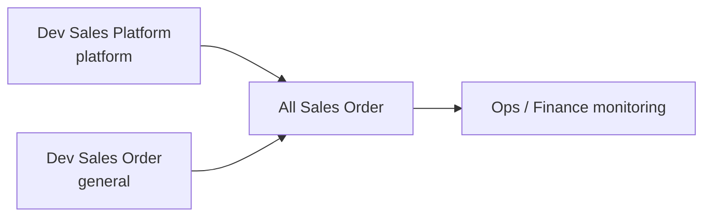
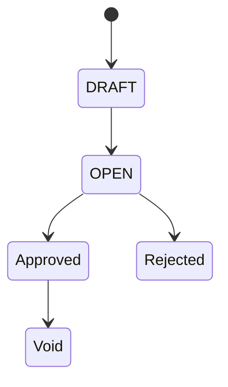
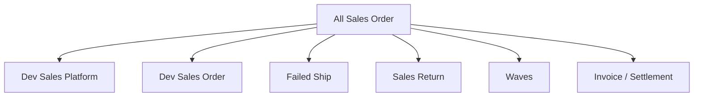

# All Sales Order — Requirement Documentation

**Modul:** BusinessDevelopment (+ OmniChannel shared engine)  
**UI route:** `/businessdevelopment/all-sales-order`  
**Audience:** PM, Ops, Finance, QA  

> **Bukan** menu create master. All Sales Order = **window gabungan** atas [Dev - Sales Platform](../omni-sales-platform/requirement.md) dan [Dev - Sales Order](../sales-order-general/requirement.md) **v3.1**. Perilaku per tipe SO **harus selaras** dengan doc sumber. Dual import general: **Import Processed** / **Import Non-Processed** (gate [Store Fulfillment Mode](../omni-store-binding/requirement.md)).

---

## 0. Metadata & Changelog

| Version | Date | Author | Changes |
|---------|------|--------|---------|
| 1.2 | 2026-07-22 | QA - Yemima | TO-BE: dual import Processed/Non-Processed (paritas SOG v3.1); cross-ref Store Fulfillment Mode |
| 1.1 | 2026-07-15 | QA - Yemima | GAP-ASO-01: tombol Recheck AS-IS verified; residual O-01…O-03 |
| 1.0 | 2026-07-15 | QA - Yemima | Split folder; sintesis platform + general; peran ASO |

---

## 1. Ringkasan Eksekutif

All Sales Order menampilkan **semua** sales order (general + platform) dalam satu datalist untuk monitoring lintas kanal, Failed Process, export, dan **Re-check Failed Process** (tombol di menu ini).

| Kebutuhan | Jawaban ASO |
|-----------|------------|
| Lihat general + platform sekali layar | Datalist `businessdevelopment/all-sales-order` |
| Failed Process lintas tipe | Pill + kolom error flag (shared engine Omni) |
| **Recheck failed process** | Tombol di ActionButtons ASO saja (bukan di Dev Sales Platform list) |
| Edit Other Info booking (platform) | Form ASO / link edit — aturan field → SP SoT booking |
| Create | Route create memakai pola SO General (store Others / defaults) |
| Import Excel (general) | **Import Processed** & **Import Non-Processed** — paritas [SOG §6.3](../sales-order-general/requirement.md); template sama; gate Fulfillment Mode store |

---

## 2. Prasyarat & pemetaan sumber

| Aspek | General | Platform | Di ASO |
|-------|---------|----------|--------|
| Sumber data | Manual / import / POS | Sync marketplace | Kedua tipe di satu list |
| Create | Full form SO General | Redirect dari SP ke SO General | Create → alur general |
| Sync marketplace | N/A | Ya | Sync one / Failed Sync (platform rows) |
| Editable after Approved | Tidak (dengan exception POS dll.) | Tidak | Sama per tipe |
| Error flags | Ya (shared) | Ya | Pill Failed Process `type=all` |
| Processing icons | Ya | Ya | Shared `formatAvailabilityAndProcessStatus` |

Canonical detail validasi/kalkulasi:

- Platform → [omni-sales-platform](../omni-sales-platform/requirement.md)
- General → [sales-order-general](../sales-order-general/requirement.md)

---

## 3. Siklus Status

Mengikuti status internal SO sumber (Draft / Open / Approved / Rejected / Void). ASO **tidak** memperkenalkan status baru.

Filter carousel process status memakai `filter-process-status?type=all`.

---

## 4. Form & Field (perilaku gabungan)

| Area | Perilaku ASO | Sumber kebenaran |
|------|--------------|------------------|
| Datalist columns | Gabungan kolom general+platform (code, store/customer, amounts, processing status, dll.) | FE `AllSalesOrder/DataList.vue` |
| Error flag column | Muncul saat pill Failed Process | [SP §5.2](../omni-sales-platform/requirement.md) + [SOG §8](../sales-order-general/requirement.md) |
| Edit form | `from-all-sales-order=true`; field bergantung tipe | General form vs platform read-mostly |
| Booking Other Info | Edit booking fields untuk unmatched booking | [SP booking](../omni-sales-platform/requirement.md) — manual edit di ASO, bukan form SP |
| Import Excel | **Import Processed** + **Import Non-Processed** (TO-BE paritas SOG) | [SOG §6.3](../sales-order-general/requirement.md) |
| Export | Export file ASO + opsi with/without details | Shared export engine |

---

## 5. How It Works

### 5.1 Peran operasional

1. **Monitoring** — satu tempat cek order marketplace + internal.
2. **Failed Process** — filter & ikon error (bind, COA, stock, shipping, warehouse, …) konsisten dengan SP.
3. **Tindak lanjut** — buka edit/show; untuk platform: sync / cek flag; untuk general: import/edit sesuai SOG.
4. **Recheck failed process (AS-IS)** — tombol hanya di ASO; batch `CheckOrderFlagsJob` via `revalidate-flags`.

### 5.2 Konsistensi perilaku (wajib)

| Skenario | Harus sama dengan |
|----------|-------------------|
| Tooltip / arti error flag | Sales Platform ErrorFlag |
| Processing Status 6 icon | Sales Platform / TransferSummary |
| Prevent auto-approve / Benchmark COGS | Platform + General rules masing-masing |
| Net Sales vs Additional Cost/Disc platform | SP: cost/disc tidak ke SI |
| Bundle proporsi Price Before VAT | SOG §10 / SP detail bundle |
| Timestamp async platform vs sync general | Masing-masing menu sumber |

### 5.3 Pill & tools (AS-IS)

| Kontrol | Perilaku |
|---------|----------|
| PillButtons `type=all` | Failed Process / Failed Sync / Ready / Sync Status (counter gabungan) |
| Failed Process | `all-sales-order?failed_process=true` + kolom error flag |
| **Recheck failed process** | Button ASO only → `POST omnichannel/sales-order/revalidate-flags` |
| Sync one SO | Endpoint Omni sync untuk baris platform |
| Import / progress | Endpoint Omni `type=general` (sama SOG) |

### 5.4 Re-check Failed Process — AS-IS vs TO-BE (SOG §9)

| Aspek | AS-IS (verified) | Residual / TO-BE |
|-------|------------------|------------------|
| Lokasi tombol | **All Sales Order** saja | RC-04 ✅ |
| Scope | Approved + unassign wave NOT_IN_QUEUE/IN_QUEUE | Lebih sempit dari “semua order” |
| Dispatch | Horizon batch `CheckOrderFlagsJob` (~50/batch) | Arah selaras |
| Lock / disable | Cache + echo `revalidate-flag`; tippy RC-07 | ✅ |
| Last Checked | `error_info.updated_at` (order-level) di tooltip | Belum per-icon (RC-01…03) |
| Log | `SalesOrderSynchronizeLog` type revalidate per store | Modal/log dedicated — **O-01** |
| Cooldown setelah selesai | Hanya selama batch | **O-02** |
| Retention log | Sync log existing | **O-03** |
| Dev Sales Platform list | Tidak ada tombol | By design |

**Bug note:** `checkRevalidateFlag()` masih hardcode `in_progress => false` — verifikasi disable button mengandalkan echo lock.

---

## 6. Validasi

ASO **tidak** menduplikasi matrix validasi penuh. Saat approve/edit:

| Tipe baris | Validasi yang berlaku |
|------------|----------------------|
| `platform` | [SP §6](../omni-sales-platform/requirement.md) |
| `general` | [SOG §3](../sales-order-general/requirement.md) |

Validasi UI ASO-specific: permission `AllSalesOrder` / viewAny gabungan; fiscal/company scope mengikuti backend `businessdevelopment/all-sales-order`.

---

## 7. Relasi Menu

| Menu | Fungsi terhadap ASO |
|------|---------------------|
| Dev - Sales Platform | Sumber baris platform; sync & booking rules |
| Dev - Sales Order | Sumber baris general; CRUD; dual import Processed/Non-Processed |
| Store | Fulfillment Mode gate untuk import general |
| Failed Ship / Sales Return | Cabang Return pada order platform di ASO |
| Waves / Processing | Pipeline setelah approve |
| Instant Settlement / SI | Downstream finance |

---

## 8. Gap Registry

| ID | Deskripsi | Status |
|----|-----------|--------|
| **GAP-ASO-01** | Re-check: tombol + batch AS-IS ada; residual = Last Checked per-icon, log UI (O-01), cooldown (O-02), retention (O-03), scope lebih sempit vs “all OPEN” | Partial — §5.4 |
| **GAP-ASO-02** | Dual import **Import Processed** / **Import Non-Processed** harus paritas UI+API dengan Dev - Sales Order (SOG GAP-SOG-07…) | Open (TO-BE) |
| **GAP-APR-01** | Auto-approve cron mengabaikan toggle/delay — berdampak baris platform di ASO | Open — [SP gaps](../omni-sales-platform/requirement.md) |

---

## 9. Acceptance Criteria

- [ ] Datalist menampilkan general **dan** platform
- [ ] Failed Process icons/tooltip selaras SP
- [ ] Create memakai alur SO General
- [ ] Edit booking unmatched tidak memaksa form SP
- [ ] Tidak mendefinisikan ulang formula harga — merujuk SOG/SP
- [ ] Tombol **Recheck failed process** hanya di ASO; lock saat batch jalan
- [ ] Doc folder terpisah dari SOG & SP

---

## 10. FAQ

**Q: Apa beda ASO vs Sales Platform?**  
A: SP khusus marketplace + sync ops. ASO = gabungan monitoring + tools lintas tipe.

**Q: Di mana tombol Recheck failed process?**  
A: Hanya di **All Sales Order** (bukan Dev Sales Platform list). Scope: order Approved yang belum / sedang antre Unassign Wave.
