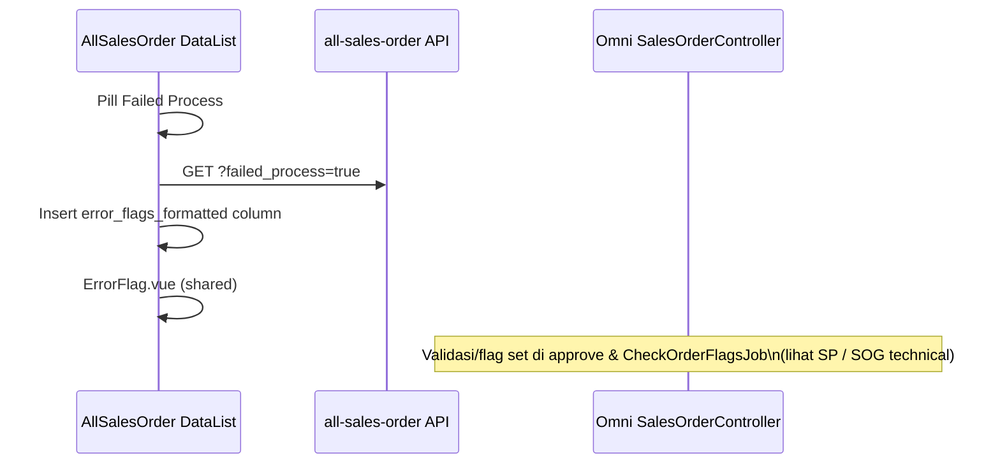

# All Sales Order — Technical Documentation

**UI:** `/businessdevelopment/all-sales-order`  
**API list:** `businessdevelopment/all-sales-order`  
**Shared Omni:** `omnichannel/sales-order/*` (`type=all` / general endpoints)

---

## 1. File Map

| Path | Role |
|------|------|
| `olshoperp-frontend/src/pages/BusinessDevelopment/Report/AllSalesOrder/DataList.vue` | Gabungan datalist + pills; `show-recheck-error` |
| `.../Omni/SalesOrder/components/ActionButtons.vue` | Slot create + optional Recheck |
| `.../Omni/SalesOrder/components/RevalidateFlagButton.vue` | Tombol Recheck + lock poll/echo |
| `.../Omni/SalesOrder/components/ErrorFlag.vue` | Tooltip + optional `Last Checked` dari `lastUpdated` |
| `.../AllSalesOrder/Form.vue` | Wrapper form `from-all-sales-order` |
| Shared BE | `SalesOrderController::revalidateFlag` / `checkRevalidateFlag` · `CheckOrderFlagsJob` |

FE pills: `PillButtons.vue` dengan `type="all"`.

---

## 2. API Routes

| Method | Path | Notes |
|--------|------|-------|
| GET | `businessdevelopment/all-sales-order` | Datalist gabungan |
| GET | `.../export-file` / `export-progress` | Export ASO |
| GET | `omnichannel/sales-order/get` | Dipakai partial (failed_process filters) |
| GET | `omnichannel/sales-order/filter-process-status?type=all` | Carousel buckets |
| GET | `omnichannel/sales-order/pill-count?type=all` | Pill counters |
| GET | `omnichannel/sales-order/sync-one-so` | Sync baris platform |
| POST | `omnichannel/sales-order/upload?type=general` | Import (general) |
| GET | `omnichannel/sales-order/revalidate-flags` | Progress/lock status Recheck |
| POST | `omnichannel/sales-order/revalidate-flags` | Dispatch batch Recheck |

### 2.1 Recheck pipeline (AS-IS)

```text
ASO button → POST revalidate-flags
  → query Approved + unassign_wave_status ∈ {NOT_IN_QUEUE, IN_QUEUE}
  → chunk 50 → Bus::batch(CheckOrderFlagsJob)
  → SalesOrderSynchronizeLog TYPE_REVALIDATE_ORDER per store
  → Cache lock UniqueJobKey::revalidate_flag + echo revalidate-flag
```

WebSocket channels: `BizdevWebSocketChannel::getAllSalesOrderChannel`.

**Caveat:** `checkRevalidateFlag()` response field `in_progress` currently hardcoded `false` (verify with FE echo path).

---
## 3. Database

Satu header table `omni_sales_orders` dengan `type_sales_order ∈ {general, platform}`. Tidak ada tabel khusus ASO.

---

## 4. Flow — Failed Process di ASO



---

## 5. Invariants

1. ASO menampilkan kedua tipe tanpa mengubah `type_sales_order`.
2. Semantic error flag & processing icons **identik** dengan Sales Platform renderer.
3. Create path tetap menghasilkan SO **general** (store Others / defaults).
4. Booking field edits allowed via ASO form; Sales Platform list tetap read-oriented.
5. Validasi approve tidak diimplementasikan ulang di ASO — delegate ke ApprovalController per tipe.

---

## 6. Frontend Behaviors

| Behavior | Notes |
|----------|-------|
| `type="all"` pills | Counters gabungan |
| Import history | Shared Omni SO General endpoints |
| `from-all-sales-order` | Form flag untuk breadcrumb/back |

---

## 7. Failure Modes

| Failure | Handling |
|---------|----------|
| Sync one fails | Pesan Omni; row tetap; Failed Synchronize di SP |
| Import fail | Import log (general) |
| Re-check batch fail / lock stuck | Error API / wait lock; GAP-ASO-01 residual UX |

---

## 8. Known Issues

- GAP-ASO-01 Partial — tombol ada; residual Last Checked per-icon + O-01…O-03 + `in_progress` hardcode
- GAP-APR-01 (dampak baris platform)
- Related: [omni-sales-platform technical §13](../omni-sales-platform/technical.md) · [sales-order-general](../sales-order-general/technical.md)
