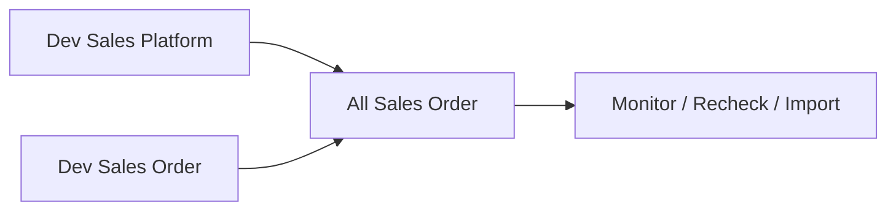

# All Sales Order — Panduan Pengguna

**Siapa yang baca:** ops, busdev, finance ops, support  
**Menu:** Business Development → **All Sales Order**  
**Untuk apa:** Melihat **semua** pesanan (internal + marketplace) dalam satu layar

Detail import internal & Fulfillment Mode → [Dev - Sales Order](../sales-order-general/user-guide.md) · [Store](../omni-store-binding/user-guide.md).

---

## 1. Apa Itu & Kenapa Penting

All Sales Order menampilkan pesanan **general** dan **platform** bersama-sama untuk monitoring, Failed Process, Recheck, export, dan import internal (**Import Processed** / **Import Non-Processed**).

ASO tidak membuat aturan status baru — tiap baris mengikuti tipe SO-nya.

---

## 2. Overview Flow & Proses Bisnis

**Versi teks:**

1. Order masuk dari Dev - Sales Order atau Dev - Sales Platform.  
2. Keduanya tampil di All Sales Order.  
3. Ops memantau, Recheck, atau import internal dengan dua tombol yang sama seperti Dev - Sales Order.  
4. Proses gudang / tagihan tetap di menu hilir (kecuali jalur Non-Processed yang auto dari import).

🎬 [Interactive demo akan ditambahkan di sini]

### Siklus status

Mengikuti sumber: Draft → Open → Approved / Rejected / Void. ASO tidak menambah status.

---

## 3. Sebelum Mulai (Flow Sebelum)

- [ ] Hak akses All Sales Order.  
- [ ] Import: atur **Fulfillment Mode** store (**Processed** / **Non Processed**).  
- [ ] Create manual: customer, store Others, produk siap.

🎬 [Interactive demo akan ditambahkan di sini]

---

## 4. Setelah Selesai (Flow Sesudah)

- Approved terkunci sesuai tipe.  
- Recheck sukses → error flag diperbarui.  
- Import Non-Processed sukses → outbound + tagihan otomatis (lihat panduan Dev - Sales Order).

🎬 [Interactive demo akan ditambahkan di sini]

---

## 5. Yang Perlu Diperhatikan

- Create dari ASO = alur Sales Order General.  
- **Import Processed** vs **Import Non-Processed** harus cocok dengan Fulfillment Mode store.  
- Recheck hanya di All Sales Order, bukan list Dev - Sales Platform.  
- Template Excel import **tidak berubah**.

---

## 6. Langkah-Langkah (Step by Step)

### A. Monitoring

1. Buka All Sales Order → filter / pill Failed Process bila perlu.  
2. Buka detail sesuai tipe baris.

### B. Import internal

1. Pastikan Fulfillment Mode store.  
2. Pilih **Import Processed** atau **Import Non-Processed**.  
3. Upload template yang sama → pantau history/progress/log.

### C. Create

1. **Create** → lengkapi seperti Dev - Sales Order → Open → Approve.

### D. Recheck

1. Jalankan **Recheck Failed Process** → cek ulang icon/error.

🎬 [Interactive demo akan ditambahkan di sini]

---

## 7. Tips & Hal yang Sering Bikin Bingung

- ASO = jendela; aturan bisnis di menu sumber + Store.  
- Tombol import di ASO **identik** dengan Dev - Sales Order.  
- Platform Order ID di baris general ≠ nomor order marketplace.

---

## 8. Referensi

| Untuk | Dokumen |
|-------|---------|
| Aturan QA ASO | [requirement.md](./requirement.md) |
| Troubleshooting | [knowledge-base.md](./knowledge-base.md) |
| Teknis | [technical.md](./technical.md) |
| Dev - Sales Order | [../sales-order-general/user-guide.md](../sales-order-general/user-guide.md) |
| Store | [../omni-store-binding/user-guide.md](../omni-store-binding/user-guide.md) |
