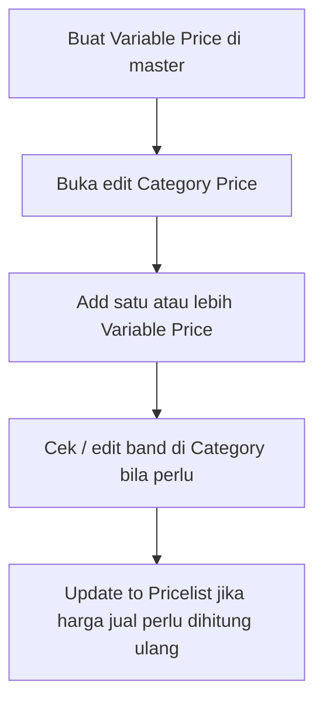

# Category Price — Knowledge Base

## Apa itu

**Category Price** adalah kategori harga yang dipakai channel/store. Di dalamnya ada aturan margin. Ke depan, aturan itu diambil dari master **Variable Price** (bisa lebih dari satu), supaya margin bisa bertingkat: berdasarkan harga dan/atau berat produk.

## Kapan dipakai

- Menyiapkan kategori harga sebelum bind ke store.
- Mengatur multi tier margin sebelum menghitung harga di **Pricelist Product**.

## Alur kerja standar (TO-BE)

**Keterangan langkah:**

- Ubah master Variable Price **tidak** langsung mengubah Category — tekan Update dari master dulu (konfirmasi).
- Edit angka di Category **tidak** mengubah master.
- Harga di Pricelist baru berubah setelah Update to Pricelist (konfirmasi — menimpa semua termasuk yang pernah diubah manual di Pricelist).

## Contoh

SKU harga default 16.000, berat primary 1.500 gram, Category pakai 3 aturan (harga + berat + harga lagi) → setelah Update ke Pricelist: harga jual 24.500, margin 8.500.

## Troubleshooting

| Gejala | Penyebab | Solusi |
|--------|----------|--------|
| Ubah master, Category masih angka lama | Belum Update dari master | Jalankan Update to Category / Update from Master |
| Category sudah di-update, harga jual belum berubah | Belum Update ke Pricelist | Jalankan Update to Pricelist |
| Ingin Amount + Weight | Satu master hanya satu type | Buat dua Variable Price, attach keduanya |

## FAQ

**Q: Apakah data margin lama otomatis pindah ke Variable Price?**  
A: Tidak. Data lama sedikit / belum aktif — biasanya dibersihkan lalu setup ulang lewat master.
