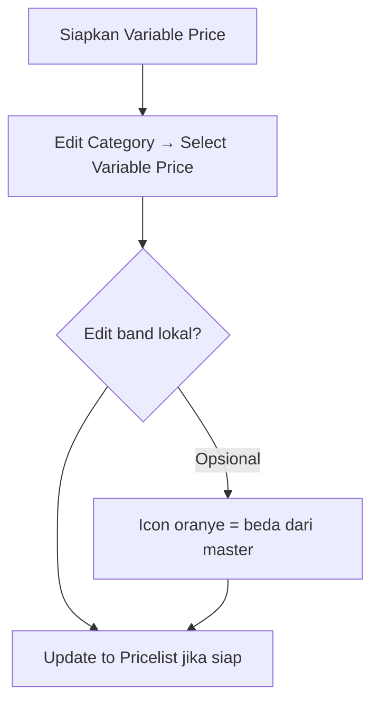

# Category Price — Knowledge Base

## Apa itu

Kategori harga untuk channel/store. **TO-BE:** aturan margin diambil dari satu atau lebih **Variable Price** (tier). Hasil semua tier dijumlahkan saat Update ke Pricelist.

## Alur standar

## Tombol penting

| Aksi | Efek |
|------|------|
| **Select Variable Price** | Pasang tier (snapshot). Hanya Active yang belum dipasang. |
| **Update from Master** | Timpa semua tier dari master terkini (edit lokal hilang). |
| **Update to Pricelist** (merah) | Hitung ulang margin semua produk category itu — termasuk yang pernah diedit manual di Pricelist. Wajib centang persetujuan. |

## Tips

- Edit band di Category **tidak** mengubah Variable Price master.
- Ubah master → Update to Category dari Variable Price, atau Update from Master di sini.
- Harga jual baru berubah setelah **Update to Pricelist**.
- Contoh: harga 16.000 + berat 1.500 g + 3 tier → margin 8.500 → final 24.500.

## Troubleshooting

| Gejala | Solusi |
|--------|--------|
| Select kosong | Semua Active sudah dipasang, atau belum ada Variable Price Active |
| Icon oranye di tier | Band sudah diedit lokal — Update from Master untuk samakan master |
| Pricelist belum berubah | Belum Update to Pricelist / belum centang konfirmasi |

Detail: [requirement.md](./requirement.md) · Wireframe: https://claude.ai/artifact/CSgXVMhzsztTJqwpeD7f89
