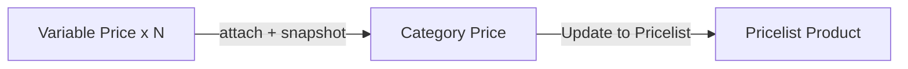

# Category Price — Requirement

## Metadata & Changelog

| Version | Date | Notes |
|---------|------|-------|
| 0.1 | 2026-10-07 | Draft AS-IS + TO-BE multi tier Variable Price (ETM-16313) |

## 1. Ringkasan Eksekutif

Category Price mengelompokkan aturan harga per channel/kategori. **AS-IS:** satu section Margin Price Configuration (band by default price). **TO-BE:** Category **attach multiple Variable Price** (masing-masing satu type: by Amount atau by Weight); band ditampilkan per tier sebagai **snapshot**; edit lokal tidak mengubah master; Update dari master dan Update ke Pricelist bersifat manual + konfirmasi.

## 2. Prasyarat

| Prasyarat | Catatan |
|-----------|---------|
| Variable Price (TO-BE) | ETM-16312 — master harus ada sebelum attach |
| Product default price / primary weight | Untuk kalkulasi di Pricelist |

## 3. Siklus Status

Active/Inactive master category — `[VERIFY: CODEBASE]` detail status existing.

## 4. Form & Field

### AS-IS — Margin Price Configuration

| Field | Wajib? | Catatan |
|-------|--------|---------|
| Start Price / End Price | Ya | Band Rp |
| Type | Ya | percentage \| amount |
| Value | Ya | Margin value |
| Unlimited row | Ya | `is_last` |

### TO-BE — Multi Variable Price tiers

| Field / aksi | Wajib? | Catatan |
|--------------|--------|---------|
| Attach Variable Price | Multi | Boleh beberapa by Amount dan/atau by Weight |
| Band per tier (snapshot) | Tampil | Start/End/Type/Value + Unlimited |
| Edit band lokal | Opsional | Tidak menulis balik ke master |
| Update from Master | Aksi | Overwrite snapshot + konfirmasi + log Category |
| Update to Pricelist | Aksi | Overwrite pricelist + konfirmasi (detail ETM-16314) |

## 5. How It Works

### AS-IS matching (saat product price berubah dari 0)

Sistem mematch default price ke band category (termasuk Unlimited). Lihat observer Product — scope kalkulasi AS-IS terbatas (trigger saat original price = 0).

### TO-BE stacking

Setiap Variable Price yang di-attach = satu tier. Saat Update to Pricelist, kontribusi tiap tier dijumlahkan (lihat Pricelist Product requirement).

### Contoh

Category A attach 3 master → SKU price 16.000 + weight 1.500 g → margin 8.500 / final 24.500 (setelah Update to Pricelist).

### Estafet satu arah

Master → Category → Pricelist. Edit Category tidak mengubah Variable Price. Edit Pricelist tidak mengubah Category.

## 6. Validasi

| ID | Kondisi | Behavior |
|----|---------|----------|
| V-CP-01 | Update from Master | Overwrite semua band snapshot tier terkait; konfirmasi wajib; log |
| V-CP-02 | Edit lokal band | Tidak update master |
| V-CP-03 | Band range | Samakan AS-IS (contiguous + Unlimited) |

## 7. Relasi Menu Lain

Variable Price · Pricelist Product · Store Binding

## 8. Gap Registry

| ID | Deskripsi | Type | Status |
|----|-----------|------|--------|
| GAP-CP-01 | Model DB pivot Category ↔ Variable Price belum ada | Missing Behavior | Open |
| GAP-CP-02 | Nasib UI section margin AS-IS vs diganti penuh attach UI | Pending Decision — Yemima | Prefer ganti ke attach (data lama dibersihkan) |
| GAP-CP-03 | Category tanpa tier: margin 0 saat Update Pricelist? | Unverified | Open |

## 9. FAQ

**Q: Satu Category bisa dua Variable Price by Amount?**  
A: Ya — keduanya additive saat hitung Pricelist.

**Jira:** ETM-16313 (Relates ETM-16312, ETM-16314)
