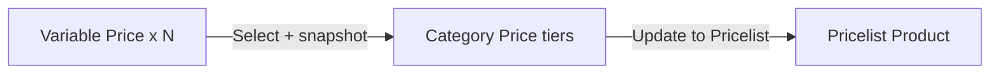

# Category Price — Requirement

**Modul:** Business Development · **Jira:** [ETM-16313](https://erpintegration.atlassian.net/browse/ETM-16313)  
**Wireframe:** https://claude.ai/artifact/CSgXVMhzsztTJqwpeD7f89 (layar D)  
**E2E final:** [`_meta/sot/variable-price-multi-tier-final-requirement.md`](../_meta/sot/variable-price-multi-tier-final-requirement.md) §2, §4, §6–9  
**Relates:** ETM-16312 · ETM-16314

---

## 0. Changelog

| Version | Date | Changes |
|---------|------|---------|
| 0.1 | 2026-10-07 | Draft AS-IS + TO-BE multi tier |
| 1.0 | 2026-10-09 | Full dari final: Variable Price Tiers, Select VP, Update from Master / to Pricelist |

---

## 1. Ringkasan

**AS-IS:** section *Margin Price Configuration* = satu set band by default price.  
**TO-BE:** diganti **Variable Price Tiers** — attach ≥1 Variable Price (snapshot band); boleh by Amount dan/atau by Weight; edit lokal OK; Update from Master / Update to Pricelist manual + konfirmasi.

Basic Information (Code, Category Name, Description, Applied Store, Show for all company) **tidak berubah**. DataList Category **tidak berubah**.

---

## 2. Acceptance Criteria

| ID | Kriteria | Status |
|----|----------|--------|
| A-01 | Section Variable Price Tiers menggantikan Margin Price Configuration; Basic Info tetap | **TO-BE** |
| A-02 | Tambah tier via **Select Variable Price** (searchable); opsi: Active + belum dipasang; tampil Code/Name/type badge | **TO-BE** |
| A-03 | Snapshot band editable lokal tanpa ubah master; tier edited → icon info oranye + tooltip | **TO-BE** |
| A-04 | Hapus tier → konfirmasi; master tidak berubah; opsi Select kembali | **TO-BE** |
| A-05 | Update from Master overwrite semua tier + konfirmasi sederhana + log | **TO-BE** |
| A-06 | Update to Pricelist: dialog keras + checkbox acknowledge; tombol merah disabled sampai dicentang | **TO-BE** |
| A-07 | Satu VP tidak bisa dipasang dua kali; hanya Active; by Weight pakai satuan `g` | **TO-BE** |

---

## 3. Form Edit — Variable Price Tiers

Sidebar: jump-section · **Update from Master** · **Update to Pricelist** (merah) · **Save All**.

### 3.1 Select Variable Price

Pola Select Product PO. Placeholder **Select Variable Price**. Opsi hilang setelah dipasang; kembali setelah hapus tier. Empty: **"No Variable Price available"**. Setelah pilih: toast `"{Code} added. Click Save All to apply."`

### 3.2 Accordion tier

| Elemen | Isi |
|--------|-----|
| Label | Tier N |
| Judul | `{Code} — {Name}` + badge type |
| Snapshot | Tanggal-jam last sync |
| Hapus | Icon → dialog Remove |
| Isi | Band Start/End/Type/Value + Unlimited (edit lokal) |

Edited lokal ≠ master → icon info oranye: *"This tier was edited in this Category Price, so it no longer matches the Variable Price master."*

Bantuan hitung di bawah daftar: contoh default 16.000 + weight 1.500 g → margin 8.500 / final 24.500.

### 3.3 Update from Master

Dialog: *"All tiers will be replaced with the current Variable Price master. Any changes made in this Category Price will be overridden."* Toast: "Tiers updated from master." Log Category.

### 3.4 Update to Pricelist

Dialog keras: N baris Pricelist category akan dihitung ulang; manual override tertimpa; **cannot be undone**. Checkbox *"I understand…"* wajib. Toast dengan N rows. Detail hitung: [Pricelist requirement](../businessdevelopment-pricelist-product/requirement.md).

---

## 4. Aturan & validasi

- Beberapa VP by Amount dan/atau by Weight OK.
- Category tanpa tier diperbolehkan; Update to Pricelist → margin 0 (**GAP-CP-01** — konfirmasi dialog "no tiers").
- Validasi band lokal = AS-IS (range + Unlimited).
- Tidak migrasi otomatis data margin lama.

---

## 5. Contoh E2E (ringkas)

Category `SH-GARME` attach VP-AMT-RETAIL + VP-WGT-STD + VP-AMT-MKTPLACE → SKU-001 (16.000 / 1.500 g) setelah Update to Pricelist → margin **8.500**, final **24.500**. Tabel penuh: final §7.

---

## 6. Gap

| ID | Topik | Usulan |
|----|-------|--------|
| GAP-CP-01 | Category tanpa tier → margin 0 | Boleh + dialog sebut "no tiers" |
| GAP-CP-02 | Mass Update from Master di datalist | Pola icon massal seperti VP (card ada, wireframe belum) |
| GAP-CP-03 | Data margin AS-IS | Bersihkan saat go-live; tidak auto-migrate |

---

## Related

[knowledge-base.md](./knowledge-base.md) · [Variable Price](../businessdevelopment-variable-price/) · [Pricelist Product](../businessdevelopment-pricelist-product/)
