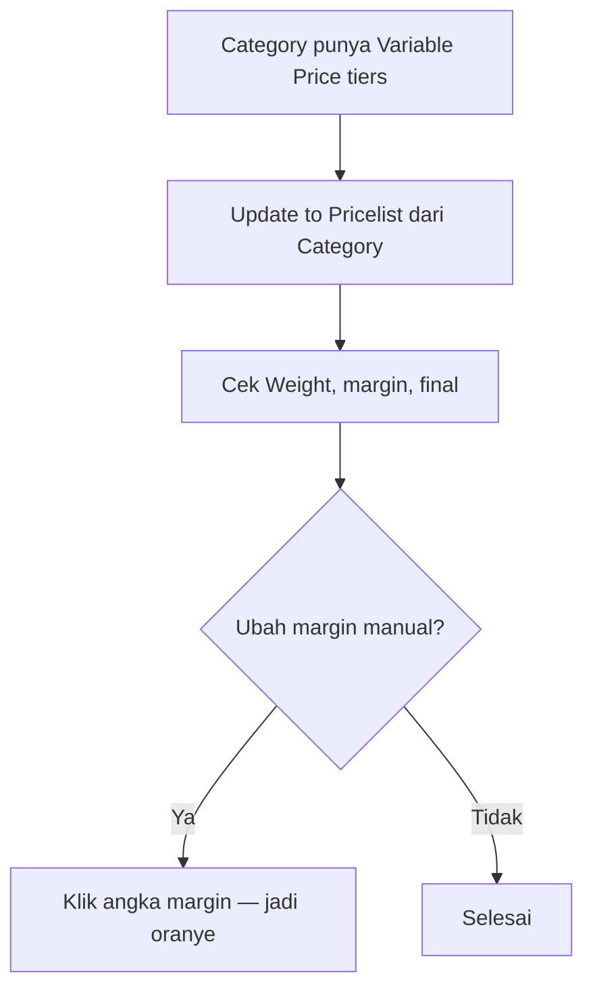

# Pricelist Product — Knowledge Base

## Apa itu

Daftar harga jual per produk per **Category Price**. Margin bisa dari **beberapa aturan** (harga + berat) yang dijumlahkan.

## Alur

## Kolom Weight

Setelah SKU. Ambil dari Dimension & Weight **primary** (gram). Kosong → **"No weight"** — aturan berdasarkan berat di-skip; aturan harga tetap jalan.

## Hover margin

Tampilkan pecahan per tier + **range band** yang dipakai + total. Kalau margin diedit manual: tetap tampil hasil hitung asli, siapa yang edit, dan nilai sekarang.

## Tips

- Contoh: harga 16.000 + berat 1.500 g → margin **8.500** → final **24.500**.
- Margin oranye = diubah user. Update to Pricelist dari Category menimpa lagi ke hasil hitung.
- Edit di Pricelist **tidak** mengubah Category / Variable Price.

## Troubleshooting

| Gejala | Solusi |
|--------|--------|
| Angka lama setelah ubah Variable Price | Belum Update to Category / Update to Pricelist |
| Margin Weight = 0 / skipped | Isi weight primary di System Product, lalu Update to Pricelist |
| Override hilang | Normal setelah Update to Pricelist |

Detail: [requirement.md](./requirement.md)
