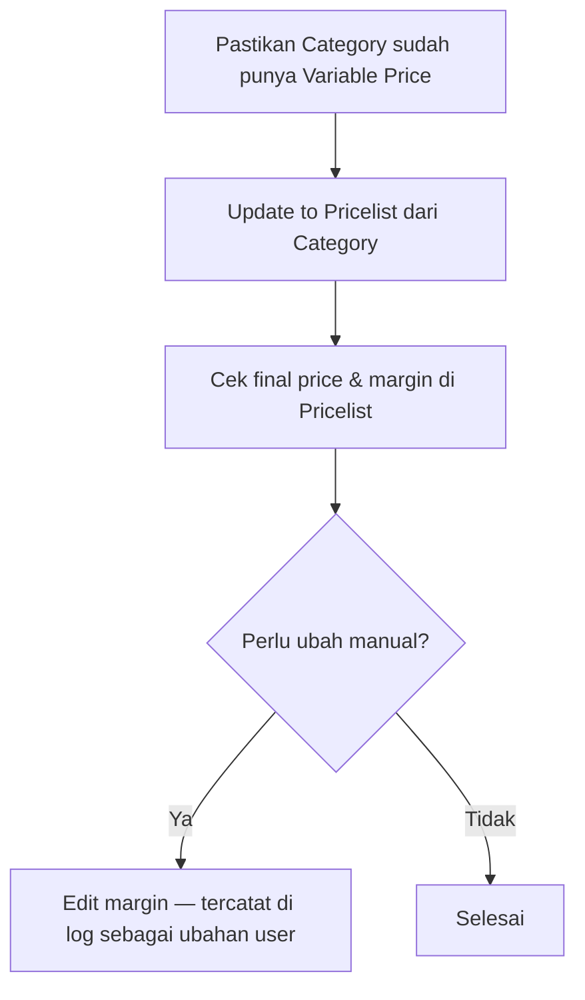

# Pricelist Product — Knowledge Base

## Apa itu

Daftar harga jual per produk untuk setiap **Category Price**. Angka margin bisa datang dari beberapa aturan (harga + berat) yang dijumlahkan.

## Alur kerja

## Contoh

Produk harga 16.000, berat primary 1.500 gram, tiga aturan margin → harga jual 24.500. Arahkan mouse ke angka margin 8.500 untuk melihat pecahan 3.000 + 2.000 + 3.500.

## Weight kosong

Jika produk belum punya berat primary, muncul peringatan. Aturan berdasarkan berat **tidak dihitung**; aturan berdasarkan harga tetap jalan.

## Troubleshooting

| Gejala | Solusi |
|--------|--------|
| Margin tidak pecah di hover | Baris sudah diubah manual — bukan hasil hitung multi tier |
| Setelah ubah Category, angka Pricelist lama | Jalankan lagi Update to Pricelist (akan menimpa termasuk ubahan manual) |
