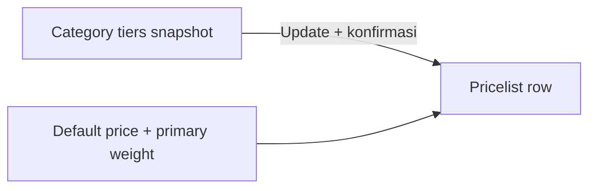

# Pricelist Product — Requirement

## 1. Ringkasan Eksekutif

Pricelist Product menyimpan `margin_price` dan `final_price` per product per Category Price. **TO-BE:** margin dihitung sebagai **SUM kontribusi multi tier** dari snapshot Category (Variable Price by Amount dan/atau by Weight); hover menampilkan breakdown; kolom Weight (primary); warning jika weight kosong; override manual + audit; Update from Category overwrite semua termasuk override.

## 2. Formula (TO-BE)

`final_price = default_price + SUM(tier_contributions)`  
`margin_price = final_price - default_price` (= SUM contributions)

Per tier:

- by Amount: match `default_price` ke band (+ Unlimited); percentage → % dari default price; amount → nilai absolut (boleh minus).
- by Weight: match primary weight (gram); weight null/0 → skip tier weight (kontribusi 0); amount tiers tetap jalan.

## 3. Contoh kasus (wajib)

SKU-001: default 16.000; weight primary 1.500 g.

| Tier | Match | Kontribusi |
|------|-------|------------|
| by Amount 10.001–20.000 | Ya | 3.000 |
| by Weight 1.001–2.000 g | Ya | 2.000 |
| by Amount 15.000–25.000 | Ya | 3.500 |
| **Total margin** | | **8.500** |
| **Final** | | **24.500** |

Hover angka 8.500 → tampil 3.000 + 2.000 + 3.500.

## 4. Form / Datalist (TO-BE)

| Kolom / fitur | Perilaku |
|---------------|----------|
| Weight (setelah SKU) | Primary DnW; satu nilai |
| Warning weight | Jika 0/null — hover: tier weight tidak ikut kalkulasi |
| Margin | Total; hover breakdown jika status calculated |
| Edit margin manual | Override; log old→new; flag bukan multi-tier calculated |
| Update from Category | Overwrite semua + konfirmasi + log Pricelist (user + category) |

## 5. Validasi / rules

- Edit Pricelist tidak mengubah Category / Variable Price.
- Update from Category menimpa override (flag kembali calculated).
- Matching band samakan AS-IS Category (termasuk Unlimited).

## 6. Gap Registry

| ID | Deskripsi | Type | Status |
|----|-----------|------|--------|
| GAP-PL-01 | Schema flag `is_manual_override` / breakdown JSON | Missing Behavior | Open |
| GAP-PL-02 | Floor final_price kurang dari 0 | Unverified | Open |
| GAP-PL-03 | Copy exact tooltip warning weight | Missing Behavior | Open |

## 7. Relasi

Category Price (ETM-16313) · Variable Price (ETM-16312) · System Product DnW

**Jira:** ETM-16314 · Request ID sama ETM-16313 (`reczz28JgQk1znq7`)
