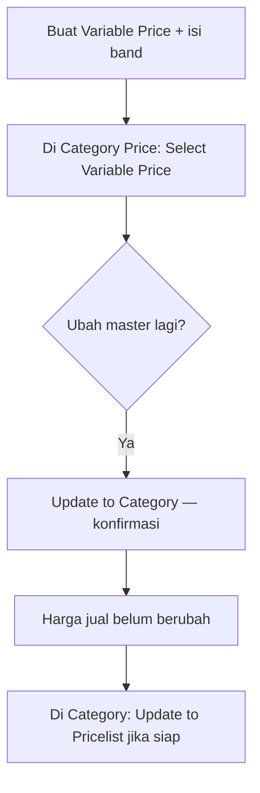

# Variable Price — Knowledge Base

## Apa itu

Master aturan margin (band) yang bisa dipakai banyak **Category Price**. Satu master hanya **berdasarkan harga** (by Amount) atau **berdasarkan berat** (by Weight). Butuh keduanya → buat dua master, pasang keduanya di Category.

## Kapan dipakai

- Mau aturan margin reusable (bukan isi ulang di tiap Category).
- Mau margin berdasarkan berat produk (gram) selain harga.

## Alur standar

## Glosarium singkat

| Istilah | Arti |
|---------|------|
| Band | Baris Start–End + Type + Value |
| Unlimited | Baris terakhir — berlaku dari Start ke atas |
| Snapshot | Salinan band di Category — tidak auto ikut ubah master |

## Tombol penting

| Aksi | Efek |
|------|------|
| **Update to Category** | Timpa band di semua Category yang memakai master ini (termasuk edit lokal). Pricelist **tidak** ikut. |
| Mass Update (datalist) | Sama, untuk beberapa master tercentang. Nonaktif jika ada master yang belum dipakai Category. |

## Tips

- Value boleh **minus** (mengurangi harga jual).
- Type bisa diganti selama belum dipakai Category; setelah dipakai terkunci.
- Hover **Used in Categories** untuk lihat Category mana yang memakai master.
- Setelah Update to Category, harga jual di Pricelist baru berubah kalau Category menjalankan **Update to Pricelist**.

## Troubleshooting

| Gejala | Solusi |
|--------|--------|
| Update to Category nonaktif | Master belum dipasang di Category mana pun |
| Type tidak bisa diganti | Sudah dipakai Category — buat master baru jika butuh type lain |
| Pricelist tidak berubah setelah Update to Category | Normal — lanjut Update to Pricelist di Category |

## Do / Don't

**Do:** satu type per master; cek Used in Categories sebelum mass Update.  
**Don't:** mengira ubah master langsung ubah harga jual; campur Amount+Weight dalam satu master.

Detail: [requirement.md](./requirement.md) · Wireframe: https://claude.ai/artifact/CSgXVMhzsztTJqwpeD7f89
