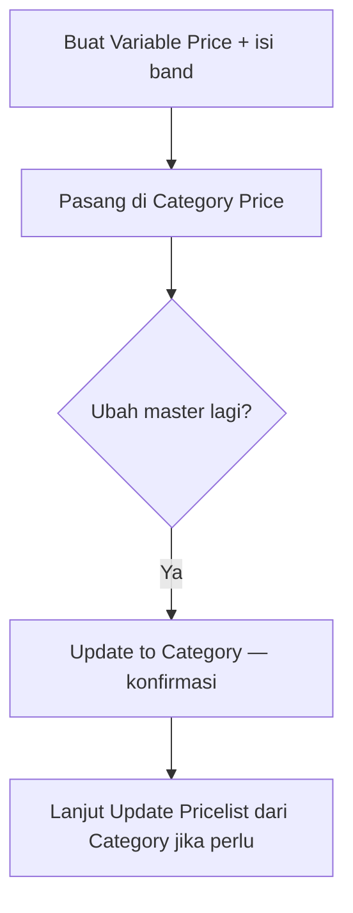

# Variable Price — Knowledge Base

## Apa itu

Master aturan margin. Pilih **berdasarkan harga** atau **berdasarkan berat** — satu master hanya salah satu. Kalau butuh keduanya, buat dua master lalu pasang di Category Price.

## Alur

## Tips

- Value boleh minus (mengurangi harga jual).
- Ubah master tidak langsung mengubah harga jual — ada dua pintu konfirmasi (Category, lalu Pricelist).
