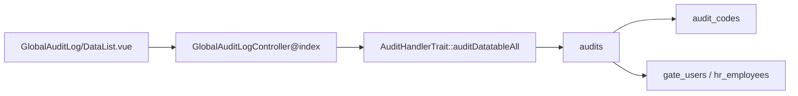

# Global Audit Log — Technical Documentation

> **Draft — 2026-06-19** — Dokumentasi AS-IS dari kode production. Belum review QA/PM; jangan jadikan referensi final.

## 1. Architecture Overview

## 2. Frontend File Map

**Root:** `olshoperp-frontend/src/pages/gate/GlobalAuditLog/`

| File | Role | Key API |
|------|------|---------|
| `DataList.vue` | Read-only datalist | `GET gate/global-audit-log` |

**Router:** `/gate/global-audit-log` (name: `gate_global_audit_log_index`)

## 3. Backend File Map

| File | Role |
|------|------|
| `Modules/Gate/Http/Controllers/GlobalAuditLogController.php` | index + SearchBuilder filters |
| `Modules/Gate/Entities/GlobalAuditLog.php` | Policy model |
| `Modules/Gate/Policies/GlobalAuditLogPolicy.php` | Authorization |
| `App\Traits\AuditHandlerTrait` | Shared audit datatable logic |

## 4. API Routes

| Method | Path | Action |
|--------|------|--------|
| GET | `/global-audit-log` | index (only used) |
| POST/PUT/DELETE | `/global-audit-log/*` | stub (no-op) |

Registered as `Route::resource('global-audit-log', GlobalAuditLogController::class)`.

## 5. Database Schema

| Table | Purpose |
|-------|---------|
| `audits` | id, user_id, event, auditable_type, auditable_id, old_values, new_values, created_at |
| `audit_codes` | audit_id, code (trx reference) |
| `gate_users` | User display name |

## 6. Jobs / Observers / Events

- Auditing triggered by model `$auditEvents` on entities across modules (not Gate-specific)

## 7. Related db-schema docs

- `audits`, `audit_codes`
