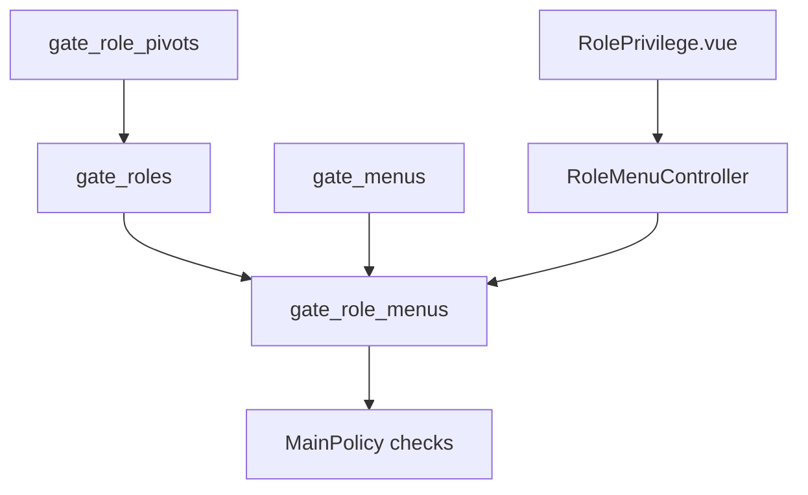

# Role (Gate) — Technical Documentation

> **Draft — 2026-06-19** — Dokumentasi AS-IS dari kode production. Belum review QA/PM; jangan jadikan referensi final.

## 1. Architecture Overview

Privilege disimpan per `(role_id, menu_id)` dengan flags add/update/delete/print/approval JSON.

## 2. Frontend File Map

**Root:** `olshoperp-frontend/src/pages/gate/role/`

| File | Role | Key API |
|------|------|---------|
| `DataLists.vue` | Role index | `GET gate/role` |
| `Form.vue` | Create/edit role | `POST/PUT gate/role`, audit |
| `RolePrivilege.vue` | Privilege matrix | `GET gate/role-menu/module`, `GET .../role/{id}/{group}`, `POST gate/role-menu` |

**Router:** `/gate/role`, `/gate/role/create`, `/gate/role/edit/:id`

## 3. Backend File Map

| File | Role |
|------|------|
| `Modules/Gate/Http/Controllers/RoleController.php` | Role CRUD, select2 |
| `Modules/Gate/Http/Controllers/RoleMenuController.php` | Privilege CRUD, module list, datatable |
| `Modules/Gate/Entities/Role.php` | Model |
| `Modules/Gate/Entities/RoleMenu.php` | Privilege pivot |
| `Modules/Gate/Entities/Menu.php` | Menu definitions |
| `Modules/Gate/Policies/RolePolicy.php` | Authorization |
| `Modules/Gate/Policies/RoleMenuPolicy.php` | Authorization |

## 4. API Routes

| Method | Path | Action |
|--------|------|--------|
| GET | `/role` | index |
| POST | `/role` | store |
| GET | `/role/{role}` | show |
| PUT | `/role/{role}` | update |
| DELETE | `/role/{role}` | destroy |
| GET | `/role/{role}/audit` | audit |
| GET | `/role-menu/module` | module groups |
| GET | `/role-menu/role/{role}/{group}` | index privilege datatable |
| GET | `/role-menu/datatable/{role}` | fetch |
| POST | `/role-menu` | store (bulk upsert module) |
| GET | `/role-menu/audit-datatable/{role}` | audit |

## 5. Database Schema

| Table | Key columns |
|-------|-------------|
| `gate_roles` | role_name, is_default, is_all_company, is_in_flight_role, owned_by, status |
| `gate_role_menus` | role_id, menu_id, add, update, delete, print, approval (JSON), status |
| `gate_menus` | menu_link, menu_text, group, add/update/delete/print/approval flags |

## 6. Jobs / Observers / Events

- Cache menu build invalidated on privilege change (via related user login / application settings pattern)

## 7. Related db-schema docs

- `gate_roles`, `gate_role_menus`, `gate_menus`
