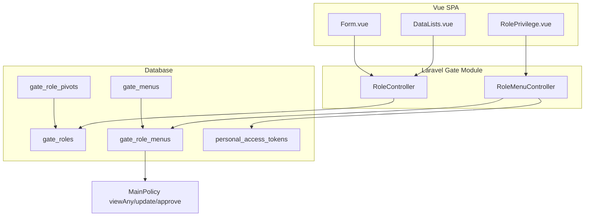
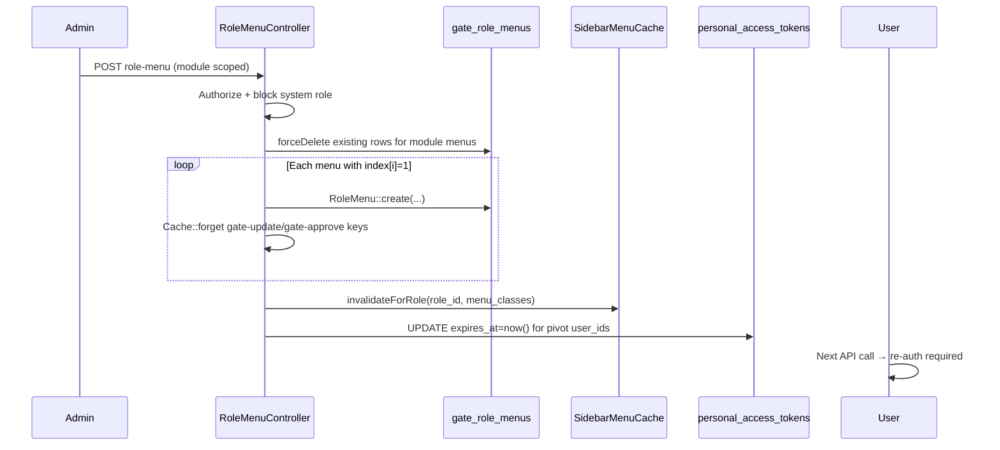

# Master Role — Technical Documentation

## 1. Architecture Overview



Privilege stored per `(role_id, menu_id)` with integer flags + JSON `approval` / `process`.

---

## 2. Frontend File Map

**Root:** `olshoperp-frontend/src/pages/gate/role/`

| File | Role | Key API |
|------|------|---------|
| `DataLists.vue` | Index | `GET gate/role` — columns: `role_name` only + DataTables defaults |
| `Form.vue` | Create/edit header + tabs | `POST/PUT gate/role`, audit URL |
| `RolePrivilege.vue` | Privilege matrix | module list, per-group fetch, `POST gate/role-menu` |

**Router:** `/gate/role`, `/gate/role/create`, `/gate/role/edit/:id`

**Form.vue tab index:** default tab Role; `?module=` → tab Role Privilege (`selectedTab=1`).

**RolePrivilege.vue payload shape:**
```json
{
  "role": 123,
  "module": "supply_chain_management",
  "index": { "1": 1, "2": 0 },
  "add": { "1": 1 },
  "update": { "1": 0 },
  "delete": { "1": 0 },
  "print": { "1": 0 },
  "approval": { "1": { "1": 1, "2": 0 } }
}
```

Keys are **1-based row index** matching hierarchical menu order from `buildMenuHierarchy()`.

---

## 3. Backend File Map

| File | Responsibility |
|------|----------------|
| `Modules/Gate/Http/Controllers/RoleController.php` | CRUD, audit, select2, flight-ops update |
| `Modules/Gate/Http/Controllers/RoleMenuController.php` | Module list, privilege datatable, store, session revoke |
| `Modules/Gate/Entities/Role.php` | Model `gate_roles` |
| `Modules/Gate/Entities/RoleMenu.php` | Model `gate_role_menus` — auditable |
| `Modules/Gate/Entities/Menu.php` | Menu defs + capability flags |
| `Modules/Gate/Support/SidebarMenuCache.php` | Cache invalidation after privilege save |
| `Modules/Gate/Policies/RolePolicy.php` | Gate authorization |
| `app/Policies/MainPolicy.php` | Runtime menu access checks |

**Menu seeders (catalog source):** `Modules/Gate/Database/Seeders/ModuleMenu/*.php`

---

## 4. API Routes

| Method | Path | Controller | Notes |
|--------|------|------------|-------|
| GET | `/gate/role` | `RoleController@index` | DataTables; extra cols `is_default`, `is_in_flight_role` |
| POST | `/gate/role` | `RoleController@store` | |
| GET | `/gate/role/{role}` | `RoleController@show` | Includes `can_update` |
| PUT | `/gate/role/{role}` | `RoleController@update` | No session revoke |
| DELETE | `/gate/role/{role}` | `RoleController@destroy` | Block if pivot exists |
| GET | `/gate/role/{role}/audit` | `RoleController@audit` | Loads `roleMenu` relation |
| GET | `/gate/role-menu/module` | `RoleMenuController@module` | Snake_case groups |
| GET | `/gate/role-menu/role/{role}/{group}` | `RoleMenuController@index` | JSON columns for Vue matrix |
| POST | `/gate/role-menu` | `RoleMenuController@store` | Replace module privileges + logout |
| GET | `/gate/role-menu/select2-role` | `RoleMenuController@select2Role` | Duplicate select2 (legacy) |

---

## 5. Database Schema

### `gate_roles`

| Column | Type / note |
|--------|-------------|
| `role_name` | string, required |
| `description` | nullable, max 150 |
| `status` | boolean |
| `is_all_company` | public visibility flag |
| `is_default` | global default role (unique enforced in controller) |
| `is_in_flight_role` | Flight ops |
| `owned_by` | FK company; null = system role |
| audit cols | created_by, updated_by, deleted_by, soft deletes |

### `gate_role_menus`

| Column | Type / note |
|--------|-------------|
| `role_id`, `menu_id` | FK pair |
| `add`, `update`, `delete`, `print` | 0/1 |
| `approval` | JSON — checked levels `{ "1": 1, "2": 0 }` |
| `process` | JSON — BE only; FE tidak kirim |
| `status` | active row |

### `gate_menus` (capability template)

| Column | Meaning |
|--------|---------|
| `group` | Module label (Title Case in DB) |
| `add`, `update`, `delete`, `print` | If 1 → column shown in privilege UI |
| `approval` | Integer N → render N approval checkboxes |
| `process` | Stored in role_menus; no FE UI |
| `menu_class` | PHP class for MainPolicy |
| `render_to_sidebar` | Sidebar visibility (separate from privilege rows) |

---

## 6. Privilege Save Flow



### `delete_session($role_id)`

```php
$users_id = RolePivot::where('role_id', $role_id)->pluck('user_id');
DB::table('personal_access_tokens')
    ->whereIn('tokenable_id', $users_id)
    ->update(['expires_at' => now()]);
```

**Not called from** `RoleController@update`.

---

## 7. Company Scope Rules

| Actor | Menu list for privilege | System role edit |
|-------|-------------------------|------------------|
| Super (`company_id < 3` or null) | Full `gate_menus` per group | Allowed (unless bypass rules) |
| Tenant (`company_id >= 3`) | Intersect master user `role_menus.menu_id` | Blocked if `role.owned_by == null` |

Master user lookup:
```php
User::where('company_id', $companyId)
    ->where('is_master_user', 1)
    ->where('status', 1)
    ->first();
```

---

## 8. Master User Integration

| Event | Token / cache impact |
|-------|---------------------|
| `RoleMenuController@store` | Mass expire tokens + sidebar cache |
| `UserController` assignment change | Revoke that user's tokens only |
| `RoleController@destroy` | Blocked if pivot exists |
| `RoleController@update` | No token impact |

Cross-ref: [gate-user technical §6](../gate-user/technical.md)

---

## 9. Role Privilege Catalog

### 9.1 Module list (from seeders — AS-IS baseline)

API returns snake_case via `Str::snake($group)`:

| snake_case key | DB `group` |
|----------------|------------|
| `business_development` | Business Development |
| `developer_setting` | Developer Setting |
| `finance_and_accounting` | Finance and Accounting |
| `flight_operations` | Flight Operations |
| `general_setting` | General Setting |
| `human_resources` | Human Resources |
| `omni_channel` | Omni Channel |
| `p_p_c` | P P C |
| `procurement` | Procurement |
| `quality_assurance` | Quality Assurance |
| `supply_chain_management` | Supply Chain Management |

> Production may differ if menus added via migration/seeder after deploy. Query: `SELECT DISTINCT \`group\` FROM gate_menus ORDER BY menu_order`.

### 9.2 Menu capability pattern

Each menu row in privilege UI = one `gate_menus` record (including `render_to_sidebar=false` child menus in hierarchy).

Checkbox visibility:

| UI column | Shown when |
|-----------|------------|
| View | Always |
| Add | `menu.add == 1` AND View checked |
| Update | `menu.update == 1` AND View checked |
| Delete | `menu.delete == 1` AND View checked |
| Print | `menu.print == 1` AND View checked |
| Approval Lv.i | `menu.approval >= i` AND View checked |

### 9.3 Menus with `approval >= 2` (seeders baseline)

| Menu text | Group | approval |
|-----------|-------|----------|
| Employee Payroll | Human Resources | 2 |
| Propose Leave | Human Resources | 2 |
| Propose Overtime | Human Resources | 2 |

Most menus with approval use `approval => 1` (Accounting, Supply Chain subsets).

### 9.4 Runtime enforcement

- `MainPolicy::viewAny()` — requires `RoleMenu` row for menu's `menu_class`
- Update/delete/print — respective flag on `RoleMenu`
- Approval — JSON levels checked against workflow in menu controllers (per-module; not centralized in Gate)

---

## 10. select2Role — Known Gap (P-R03)

```php
// RoleController@select2Role
$query = Role::orderby('role_name', 'asc')
    ->select('status', 'id', 'role_name')
    ->where('status', 1);
// No owned_by / is_all_company / company scope
```

Shared with Master User P-02. Close criteria: [requirement §14 P-R03](./requirement.md#14-pending-items-registry-pm-10).

---

## 11. Flight Operations Extension

| Endpoint | Purpose |
|----------|---------|
| `RoleController@index_flightoperations` | Legacy blade index |
| `RoleController@update_flightoperations` | Sets `is_in_flight_role`, `role_name_alias`, `code` |
| `RoleController@select2InFlightRole` | Select2 filtered `is_in_flight_role=1` |

Not exposed in standard Vue Role form.

---

## 12. Testing Notes

| Scenario | Expected |
|----------|----------|
| POST role-menu with empty index | 422 — index required |
| Save module A then B | Module A unchanged |
| Tenant edits system role privilege | 403/error message |
| User with role X after privilege save | Token expired |
| User after role rename only | Token still valid |
| Delete role with pivot | Error message |

---

## 15. Dev Team — Technical Follow-ups

> Mirror of [requirement §15](./requirement.md#15-dev-team--technical-follow-ups). For engineering discussion — not PM-urgent.

### DEV-R01 — `is_default` without Vue UI

**Evidence:**
- `RoleController@store` / `@update` accepts `is_default`; resets other roles when set
- `Form.vue` does **not** bind `is_default`
- Grep codebase: no login/assignment consumer reads `gate_roles.is_default`

**Classification:** Incomplete feature or legacy — **not confirmed production bug**.

**Dev actions:**
1. Product confirm intended use (default role for new users? auto-assign?)
2. If yes → add Form toggle + validation (requires Show for All Company per existing rule)
3. If no → deprecate column + remove controller logic

### DEV-R02 — `process` privilege column

**Evidence:**
- `gate_menus.process`, `gate_role_menus.process` (JSON) exist
- `RoleMenuController@store` writes `process` when `$request->process` present; FE never sends it → always `json_encode(0)`
- `RolePrivilege.vue`: no Process column
- `HumanResourcesMenuSeeder`: many menus `process => 1`
- `MainPolicy`: no `process` gate found (unlike add/update/delete)

**Classification:** Likely **unfinished implementation** or **dead schema** — **not confirmed blocking bug** unless a menu controller manually checks `process` (needs audit per HR module).

**Dev actions:**
1. Search HR controllers for `roleMenu->process` or custom process authorization
2. If used → implement FE checkbox + policy
3. If unused → document deprecated + plan removal

---

## Related Documents

| Doc | Path |
|-----|------|
| Requirement | [requirement.md](./requirement.md) |
| Knowledge Base | [knowledge-base.md](./knowledge-base.md) |
| Master User | [../gate-user/technical.md](../gate-user/technical.md) |
| Sidebar Menu | [../sidebar-menu/technical.md](../sidebar-menu/technical.md) |
