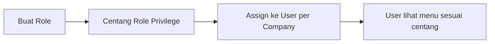

# Panduan Pengguna — Role

**Siapa yang baca:** admin yang mengatur hak akses  
**Menu:** Developer Setting → Setting → Role  
**Route:** `/gate/role`

---

## 1. Apa Itu & Kenapa Penting

**Role** adalah paket hak akses: menu mana yang boleh dilihat, ditambah, diubah, dihapus, dicetak, atau di-approve.

User tidak dapat akses langsung dari sini. Role dipasangkan ke user di menu **User** (per company). Salah centang privilege = orang bisa terlalu banyak — atau tidak bisa kerja sama sekali.

---

## 2. Overview Flow & Proses Bisnis

**Versi teks:**

1. Buat role (nama, aktif, shared atau tidak).  
2. Di tab **Role Privilege**, centang akses per menu.  
3. Assign role ke user di menu User.  
4. User login dan hanya melihat menu yang diizinkan.

### Status

| Pengaturan | Arti |
|------------|------|
| Active ON | Role bisa dipakai saat assign user |
| Show for All Company ON | Role bisa dipakai company lain (shared) |
| Role system | Biasanya tidak bisa diubah tenant biasa |

---

## 3. Sebelum Mulai

- Pahami module mana yang dipakai tim (Accounting, Supply Chain, dll.).  
- Siapkan daftar menu yang boleh View / Add / Update / Delete / Print / Approval.

🎬 [Interactive demo akan ditambahkan di sini]

---

## 4. Setelah Selesai

- Assign role ke user di menu **User**.  
- Setelah **Save** privilege, user dengan role itu **logout otomatis** — minta login ulang.  
- Ubah nama/deskripsi role saja **tidak** membuat user logout.

---

## 5. Yang Perlu Diperhatikan

- Kalau kamu belum Save role, tab Privilege belum muncul — pakai **Save & Review**.  
- Kalau kamu Save privilege, semua user role itu logout — itu normal.  
- Kalau role masih dipakai user, kamu tidak bisa hapus.  
- Satu user = **satu role per company**. Assign ulang = ganti role.  
- **Contoh:** Budi di PT Alpha = Admin. Assign lagi sebagai Manager di PT Alpha → Budi jadi Manager (bukan Admin + Manager).

---

## 6. Langkah-Langkah

1. Buka **Role** → **Create**.  
2. Isi Role Name (wajib), Description opsional; set Active / Show for All Company.  
3. Klik **Save & Review**.  
4. Tab **Role Privilege** → pilih Module di kiri → centang View (lalu Add/Update/dll. sesuai kebutuhan).  
5. **Save**.  
6. Assign role ke user di menu User.

🎬 [Interactive demo akan ditambahkan di sini]

---

## 7. Tips & Hal yang Sering Bikin Bingung

- **"Cannot delete role, role already use in user"** → pindahkan user ke role lain dulu.  
- **"Can't Modify this Role"** → role system; hubungi administrator.  
- **User tidak logout setelah rename** → by design; logout hanya saat Save privilege.  
- **Role company lain muncul di dropdown User** → perilaku saat ini; masih didiskusikan PM.  
- **Active OFF meski masih dipakai user** → saat ini masih boleh; hati-hati sampai aturan baru diputuskan.

---

## 8. Referensi

| Sumber | Untuk apa |
|--------|-----------|
| [Knowledge Base](./knowledge-base.md) | Troubleshooting |
| [Requirement](./requirement.md) | Pending PM & validasi |
| [Technical](./technical.md) | Developer |
| [User](../gate-user/user-guide.md) | Assignment company + role |
