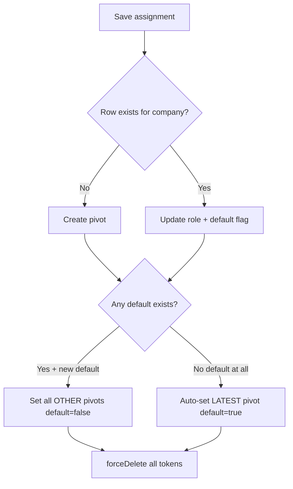
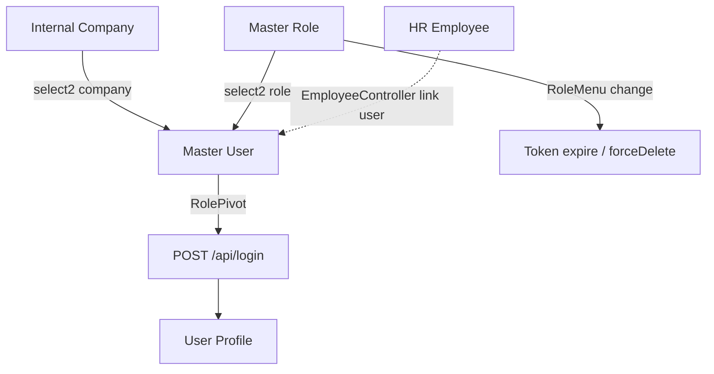

# Master User — Requirement Documentation

**Modul:** General Settings → Developer Setting  
**Audience:** PM, Operations, QA, Support, Developer  
**Status:** AS-IS verified against codebase per 2026-07-04

**UI route:** `/gate/user`  
**API base:** `{VITE_API_URL}gate/user`  
**Table:** `gate_users` · assignment `gate_role_pivots`

---

## 0. Metadata & Changelog

| Version | Date | Author | Changes |
|---------|------|--------|---------|
| 1.0 | 2026-06-19 | QA - Yemima | Initial draft (AS-IS) |
| 2.0 | 2026-07-04 | QA - Yemima | Full rewrite: merge PM requirement, codebase verification, role assignment, multi-device, gaps |
| 2.1 | 2026-07-05 | QA - Yemima | Expand §13 Known Gaps (AS-IS detail) + §14 Pending Items Registry (PM §15) |

---

## 1. Ringkasan Eksekutif

**Master User** mengelola akun login OlshopERP — identitas, kredensial, assignment **Company + Role** multi-company, dan perilaku login (default company, multi-device, verified).

| Kebutuhan Bisnis | Bagaimana Master User Menjawab |
|------------------|-------------------------------|
| Multi-company access | 1 user → banyak baris `gate_role_pivots` (company + role berbeda) |
| Default context login | Satu row `is_default_company = 1` → company/role saat login |
| Cabut akses cepat | Toggle **Is Verified OFF** tanpa hapus assignment |
| Kontrol session | Multi-device OFF → login baru revoke session lama |
| Permission refresh | Ubah Role Privilege → auto-logout user terdampak |

Login API: Sanctum Bearer token dengan `company_id` + `role_id` di `personal_access_tokens`.

---

## 2. Datalist — Kolom & Fitur

### 2.1 Kolom (AS-IS)

| Kolom FE | Visible default | Backend field / note |
|----------|-----------------|----------------------|
| FIRST NAME | false | `first_name` |
| LAST NAME | false | `last_name` |
| NAME | true | `full_name_formatted` |
| USERNAME | true | `username` |
| EMAIL | true | `email` |
| VERIFIED AT | true | `email_verified_at_formatted` |
| Assigned Employee | true | `employee_name_formatted` via `hr_employee_detail_users` |
| LAST ACTIVE | false* | `last_actived_at` — di-render juga via `form_gate_user` default columns |
| CREATED AT | false | `created_at` |
| ACTIVE | true | `status` via `renderStatus()` |
| Created By | true | `created_by_formatted` |
| Action | true | Edit only — **delete user disabled** (`render_delete: false`) |

> PM requirement menyebut kolom **ID** dan duplikasi **Last Active** — AS-IS: **tidak ada kolom ID** di FE; **Last Active** satu field (`last_actived_at`), terpisah dari Created At.

### 2.2 Column Show/Hide

- `filter_column=true` pada `DataLists.vue`
- Preferensi kolom per user via DataTablesV3 (persist + **Reset to Defaults**)

### 2.3 Export

- Export **Basic Only** via DataTablesV3 (standard)
- Kolom export: visible columns + default dari `form_gate_user` → **Active**, **Last Active**, **Created By**
- Format/nama file: pola standar DataTables export (async job jika batch)

### 2.4 Bulk Actions

- Bulk **Activate / Deactivate** status (`POST gate/user/bulk-update`)

---

## 3. Section User Information

| Field | Wajib | Default (create) | Validasi AS-IS |
|-------|-------|------------------|----------------|
| First Name | ✓ | — | max 50 |
| Last Name | ✓ | — | max 50 |
| Email | ✓ | — | email:rfc,dns, unique, max 50 |
| Username | ✓ | — | alpha_dash, unique, max 50 |
| Password | ✓ (create) | — | required max 50; **confirm min 8** |
| Re-type Password | ✓ (create) | — | required, min 8, same:password |
| Description | — | — | max 150 |
| Active | — | **ON** | `status=1` |
| Is Verified | — | **ON** | `email_verified_at` set/clear |
| Assign to Employee | — | OFF | **Toggle disabled di UI** — set dari HR |
| Show for All Company | — | **OFF** | `is_all_company` |
| Allow Multi-Device Login | — | **OFF** | `is_multi_device_allowed` |
| Upload Image | — | — | max config upload size |

**Extra (AS-IS, tidak di PM doc):** **Master User** toggle — hanya super company (`company_id < 3`); max 1 master per company (`company_id > 2`).

### 3.1 Dua Toggle yang Memblok Login

Login (`AuthController@login`) requires:

```php
->where('status', 1)
->whereNotNull('email_verified_at')
```

| Kondisi | Login |
|---------|-------|
| Active OFF | Gagal — "User Not Found" |
| Is Verified OFF | Gagal — same query |
| Keduanya ON | Lolos (jika password + assignment valid) |

**Session aktif saat Is Verified di-OFF:** Token **tidak** langsung di-delete saat update user — invalidasi via poll `GET gate/user/profile/verified` (`checkUserVerified`) yang return `auth: false`.

---

## 4. Section Role Assignment

Sub-fitur di form edit (`RoleAssignment.vue`). Entity: `RolePivot` (`gate_role_pivots`).

### 4.1 Input

| Field | Sumber |
|-------|--------|
| Company | `select2company` — internal company `status=1`, `company_type=internal` |
| Role | `select2role` — active roles (`status=1`) |
| Is Default Company | Toggle, default OFF |
| Save | `POST gate/user/{id}/assign` |

### 4.2 Datatable

| Kolom | Field |
|-------|-------|
| Company Name | `company.name` |
| Role Name | `role.role_name` |
| Default Company | `is_default_company` Yes/No |
| Created By \| Owner | default columns |
| Action | Delete (non-default) / no delete (default) |

### 4.3 Action Rules

| Row | AS-IS UI |
|-----|----------|
| `is_default_company = 0` | Delete enabled |
| `is_default_company = 1` | **Delete disabled** (`render_delete: false`) — PM label "Not Authorized" |

**Self-edit blocked:** `Cannot edit your own role data` jika assign diri sendiri.

**Post-save:** `$user->tokens()->forceDelete()` — user **wajib login ulang**.

---

## 5. Multi-Company & Default Company

### 5.1 Logic (`storeUserRoleCompany`)



| Rule | AS-IS |
|------|-------|
| Single default | ✅ Saat set default=Yes, **auto-switch** — pivot lain `is_default_company=false` |
| First assignment tanpa toggle | ✅ Jika tidak ada default, **pivot terbaru** (orderBy id DESC) auto default |
| 2 company assign tanpa toggle | Hanya **1** yang jadi default (latest row) — bukan keduanya No |
| Login default | `roles()->where(is_default_company,true)` → company; fallback first role |

### 5.2 User Profile (switch company)

Company list di User Profile = company dari assignment pivot user (bukan semua internal company).

---

## 6. Auto-Logout saat Role Berubah

| Trigger | Mekanisme |
|---------|-----------|
| **Role Privilege** disimpan | `RoleMenuController@store` → `delete_session($role_id)` — set `expires_at=now` pada semua Sanctum tokens user dengan role tersebut |
| **Role Assignment** user | `storeUserRoleCompany` → `tokens()->forceDelete()` untuk user tersebut |
| Sidebar cache | `SidebarMenuCache::invalidateForRole()` |

> Update **nama/deskripsi** role saja (tanpa ubah RoleMenu) **tidak** trigger mass logout — hanya perubahan privilege matrix.

---

## 7. Allow Multi-Device Login

| Toggle | Behavior |
|--------|----------|
| **OFF** (default) | Login baru → `tokens()->delete()` + toast logout ke device lama; `checkUserVerified` juga kill token non-latest |
| **ON** | Multiple Sanctum tokens allowed |

---

## 8. Validasi & Rules (Summary)

| ID | Rule | AS-IS |
|----|------|-------|
| V-01 | Email unique | ✅ |
| V-02 | Username unique | ✅ |
| V-03 | Password confirm match | ✅ min 8 on confirm |
| V-04 | Active OFF → login fail | ✅ |
| V-05 | Is Verified OFF → login fail | ✅ |
| V-06 | Show for All Company revert | **Partial** — `can_select`/`can_update` via private data pattern; **no explicit revert block** |
| V-07 | Default row no delete | ✅ UI |
| V-08 | Auto default first/latest | ✅ |
| V-09 | Auto-switch single default | ✅ |
| V-10 | Role privilege change logout | ✅ RoleMenu store |
| V-11 | Multi-device OFF | ✅ AuthController + checkUserVerified |

---

## 9. Audit Log

`GET gate/user/{id}/audit` — loads user with `roles` (withTrashed).

| Scope | Tracked |
|-------|---------|
| User fields | create, update (name, email, toggles, password, image) |
| Role pivots | Via relation audit (assignment changes) |

Source column: standard audit (`formatSource()` → **User**).

---

## 10. Relasi Menu Lain



| Menu | Relasi |
|------|--------|
| [Master Role](../gate-role/) | Opsi role; privilege change → mass logout |
| [Internal Company](../generalsetting-internal-company/) | Opsi company assignment |
| User Profile | Switch company dari assignment |
| HR Employee | Link user ↔ employee; set `is_employee=true` |
| Sidebar Menu | Effective menu dari role aktif |

---

## 11. Edge Cases

| Case | Expected (AS-IS) |
|------|------------------|
| Cabut semua akses tanpa hapus pivot default | Default row tidak bisa delete → gunakan **Is Verified OFF** |
| Multi-device OFF, login device B | Device A token deleted + toast |
| Role privilege updated saat user online | Token expires → re-login dengan privilege baru |
| Assign 2 company, both default OFF | Latest pivot auto-default Yes |
| Assign to Employee toggle ON di form | **Tidak bisa** — toggle disabled; HR yang link |
| Delete user dari datalist | **Tidak tersedia** — API destroy exists, UI hidden |
| Password create tanpa min di field password | **Gap** — hanya confirm_password min:8 |

---

## 12. Confirmed Design Decisions

| # | Keputusan | AS-IS |
|---|-----------|-------|
| D-01 | Active + Is Verified keduanya wajib ON untuk login | ✅ |
| D-02 | Single default company dengan auto-switch | ✅ |
| D-03 | Default pivot tidak bisa delete | ✅ |
| D-04 | Role assignment revoke tokens | ✅ forceDelete |
| D-05 | RoleMenu save revoke tokens semua user role | ✅ expires_at |
| D-06 | Multi-device OFF = single session | ✅ |

---

## 13. Known Gaps — AS-IS Detail

Setiap gap di bawah didokumentasikan **persis seperti codebase saat ini**, bukan TO-BE. Gunakan sebagai baseline sebelum fix atau PM sign-off.

---

### G-01 — Toggle Assign to Employee (HRIS integration)

| Aspek | Detail |
|-------|--------|
| **PM expectation** | Admin bisa ON/OFF toggle **Assign to Employee** dari form User untuk link ke HRIS |
| **AS-IS UI** | Toggle **selalu `disabled`** di `Form.vue` (create & edit). Tooltip: *"This toggle shows that the user is linked to an employee."* |
| **AS-IS BE flag** | Kolom `gate_users.is_employee` (boolean). Migration comment: flag untuk HR — hanya user `is_employee=true` yang eligible dibuatkan data employee |
| **Cara link aktual** | Dari modul **HR Employee** → `EmployeeController@userUpdate`: pilih user via `select2AvailableUser` (filter: `is_employee` belum punya `employee_detail_user`, `status=1`), lalu set `user.is_employee=true`, `user.employee_id`, insert `hr_employee_detail_users` |
| **Datalist** | Kolom **Assigned Employee** = `employee_name_formatted` via relasi `employee_detail_user.employee` — tampil `-` jika belum link |
| **Impact** | Operator tidak bisa assign employee dari menu User; harus ke HR Employee. PM doc §3 field #10 **belum match UI** |
| **Files** | `olshoperp-frontend/.../gate/user/Form.vue` L180–222 · `Modules/HumanResources/Http/Controllers/EmployeeController.php` `userUpdate()` · `Modules/Gate/Http/Controllers/UserController.php` `select2AvailableUser()` |

---

### G-02 — Role public/private filter di Role Assignment

| Aspek | Detail |
|-------|--------|
| **PM expectation** | Opsi Role di Section Role Assignment difilter by public/private role rules per company |
| **AS-IS BE select2** | `RoleController@select2Role`: query `Role::orderby('role_name')->where('status', 1)` — **tanpa** `withCompanyScope()`, **tanpa** filter `owned_by` / `is_all_company` |
| **AS-IS FE** | `RoleAssignment.vue` → `getRole()` maps `disabled: !item.can_select` — tetapi API response role **tidak selalu** append `can_select` (Role model extends MainModel tapi select2 return array mentah) |
| **Role owned_by logic** | Role `owned_by=null` + `is_all_company=1` = role system/public (super company). Role company-private punya `owned_by=company_id`. **Tidak ada validasi** saat assign apakah company user boleh pakai role milik company lain |
| **Commented code** | `UserController@store`/`update` punya block comment yang **dulu** cek `Role->owned_by == null` untuk non-bypass company — **tidak aktif** |
| **Impact** | Semua role active bisa muncul di dropdown; risk assign role system ke company yang seharusnya tidak boleh (tergantung kebijakan bisnis) |
| **Files** | `Modules/Gate/Http/Controllers/RoleController.php` L270–286 · `RoleAssignment.vue` L186–205 · `Modules/Gate/Entities/Role.php` |

---

### G-03 — Revert Show for All Company ke Private

| Aspek | Detail |
|-------|--------|
| **PM expectation** | Setelah `is_all_company=ON` dan dipakai company lain, **tidak bisa** kembali ke Private |
| **AS-IS BE update** | `UserController@update` menerima `is_all_company` true/false **tanpa validasi** apakah record sudah dimodifikasi company lain |
| **AS-IS visibility** | `User::canSelect()` — data private (`is_all_company=0` + `owned_by` set) dari company lain → `can_select=false` untuk company non-owner |
| **AS-IS edit** | `User::canUpdate()` — cek approved transaction / permission saja; **tidak** cek apakah revert public→private allowed |
| **Impact** | Admin bisa toggle OFF `is_all_company` via API meski PM requirement melarang; company lain mungkin kehilangan akses lihat/edit tanpa error eksplisit |
| **Files** | `Modules/Gate/Http/Controllers/UserController.php` L345–405 · `Modules/Gate/Entities/User.php` `canSelect()` L142–164 |

---

### G-04 — Password minimum strength saat create

| Aspek | Detail |
|-------|--------|
| **PM expectation** | Password wajib dengan minimum strength (implisit min 8) |
| **AS-IS validation create** | `password`: `required|string|max:50` — **tanpa `min:8`** · `confirm_password`: `required|min:8|same:password|max:50` |
| **AS-IS validation update** | `password`: `nullable|min:8|max:50|confirmed` — min 8 **hanya saat ganti password** |
| **AS-IS FE** | `vue-simple-password-meter` pada Password + Re-type — **visual indicator only**, tidak block submit |
| **Impact** | Create user dengan password 1–7 karakter **lolos BE** selama confirm match (confirm min 8 bisa gagal jika password juga harus 8 — actually if password is "abc" and confirm is "abc" confirm fails min:8). Wait: if password is "12345678" and confirm is "12345678" - OK. If password is "abc" (3 chars) confirm must be min 8 so confirm fails unless they type 8 chars in confirm only - actually same:password means both must match, confirm min 8 means both need 8+ if confirm has 8 chars password must match. So effectively create requires 8+ via confirm_password rule. **Gap is asymmetric rule** — password field itself has no min, only confirm enforces indirectly |
| **Impact (refined)** | Validasi create **de facto** min 8 via `confirm_password`; field `password` sendiri tidak punya rule min — inkonsisten & bisa membingungkan saat error message hanya di confirm |
| **Files** | `Modules/Gate/Http/Controllers/UserController.php` L165–178 · `Form.vue` L101–112 |

---

### G-05 — Invalidate session saat Is Verified / Active di-OFF

| Aspek | Detail |
|-------|--------|
| **PM expectation** | User active di sistem → admin switch Is Verified OFF → session langsung invalid |
| **AS-IS on update** | `UserController@update` set `email_verified_at=null` atau `status=0` — **tidak** memanggil `$user->tokens()->delete()` |
| **AS-IS invalidation path** | Router guard **setiap navigasi** memanggil `fetchProfileVerified()` → `GET gate/user/profile/verified` (`checkUserVerified`) |
| **checkUserVerified logic** | Return `auth:true` hanya jika `email_verified_at && status`. Jika false → HTTP 403 → `handleRedirectLogout()` clear localStorage + redirect login |
| **Multi-device branch** | Jika `!is_multi_device_allowed`, token non-latest juga di-delete saat poll |
| **Latency** | Invalidasi **bukan instant** — terjadi saat user **navigasi route berikutnya** (router beforeEach), bukan saat admin klik save |
| **Impact** | User yang sedang idle di 1 halaman tanpa navigasi **masih bisa akses** sampai poll/navigasi terjadi |
| **Files** | `UserController.php` L357–365, L698–742 · `olshoperp-frontend/src/router/index.ts` L5753–5755 · `functions.ts` `fetchProfileVerified()` |

---

### G-06 — Delete user dari datalist

| Aspek | Detail |
|-------|--------|
| **PM expectation** | Action Delete di datalist (dengan batasan) |
| **AS-IS UI** | `UserController@index` → `renderAction($row, new User(), render_delete: false)` — **delete hidden** |
| **AS-IS API** | `DELETE gate/user/{id}` **exists** + `UserPolicy` — soft delete via `User::destroy()` |
| **Bulk** | Bulk action hanya **Activate/Deactivate status**, bukan delete |
| **Impact** | Delete user hanya via API/direct — tidak exposed ke operator di UI |
| **Files** | `UserController.php` L92–94, L473–486 · `DataLists.vue` |

---

### G-07 — Kolom datalist ID & duplikasi Last Active (PM §2.1)

| Aspek | Detail |
|-------|--------|
| **PM expectation** | Kolom ID (visible=false) + Last Active (PM list item #9 dan #13 — duplikat) |
| **AS-IS FE columns** | `DataLists.vue`: FIRST NAME, LAST NAME (hidden), NAME, USERNAME, EMAIL, VERIFIED AT, Assigned Employee, LAST ACTIVE (hidden), CREATED AT (hidden). **Tidak ada kolom `id`** |
| **AS-IS default columns** | `form_gate_user=true` → DataTablesV3 append **Active (status)**, **Last Active** (`renderLastActivedAt`), **Created By** — bisa terlihat **dua kali** Last Active jika user show hidden column + default column |
| **Backend** | `last_actived_at` di-update max setiap 10 menit via cache key `last_active_user_{id}` di `checkUserVerified` |
| **Impact** | PM kolom ID belum diimplementasi; "duplikasi Last Active" = artefak FE (custom column hidden + default render), bukan dua field DB berbeda |
| **Files** | `DataLists.vue` L26–36 · `DataTablesV3.vue` L10251–10255 · `UserController.php` L67–73, L731–737 |

---

### G-08 — Field Master User (extra AS-IS, tidak di PM doc)

| Aspek | Detail |
|-------|--------|
| **PM doc** | Tidak menyebut Master User |
| **AS-IS BE** | `gate_users.is_master_user` — max **1 per company** (`company_id > 2`); validasi `"Assigned Company Already has Master User"` |
| **AS-IS FE** | **Tidak ada toggle** `is_master_user` di `Form.vue` — hanya manipulable via API atau legacy flow |
| **Self-edit guard** | Master user tidak bisa ubah role sendiri (non-bypass company) |
| **Impact** | Fitur ada di BE tapi **tidak terdokumentasi PM** dan **tidak exposed UI** — perlu PM decision: hapus, expose, atau dokumentasikan resmi |
| **Files** | `UserController.php` L186–190, L325–337, L379–381 · migration `gate_users.is_master_user` |

---

### G-09 — Export Basic — kolom & format (PM §2.3)

| Aspek | Detail |
|-------|--------|
| **PM expectation** | Export Basic Only — kolom/format/nama file perlu konfirmasi |
| **AS-IS** | DataTablesV3 `exportExcel(type)` — **Basic** = kolom **visible** saat export + kolom default dari hook `form_gate_user` (Active, Last Active, Created By) |
| **Format** | Excel via mekanisme standar DataTablesV3 (sync atau async job tergantung volume) |
| **Nama file** | Pola default DataTables (menu + timestamp) — **belum didokumentasikan exact pattern** di Gate User |
| **Impact** | Fungsional tapi **belum ada spec PM** untuk daftar kolom export resmi |
| **Files** | `DataLists.vue` · `DataTablesV3.vue` `exportExcel()` |

---

### G-10 — Audit scope Role Assignment (PM §9 / §15 item 8)

| Aspek | Detail |
|-------|--------|
| **PM expectation** | Audit log mencatat perubahan User Information **dan** Role Assignment (tambah/hapus company access) |
| **AS-IS** | `UserController@audit` → `auditDatatable($user->load(['roles' => withTrashed]))` — pivot changes via relasi `roles` on User model |
| **Gap verifikasi** | Perlu QA manual confirm: apakah create/update/delete `RolePivot` menghasilkan audit row yang readable di slideover (field diff company/role/default) |
| **Files** | `UserController.php` L143–154 · Audit trait on User/RolePivot |

---

## 14. Pending Items Registry — Harus Segera Di-Close

Registry ini mapping **PM requirement §15 Open Items** + gap di atas. Status wajib di-update saat fix/sign-off.

| ID | PM §15 | Priority | Status | Owner | Ringkasan |
|----|--------|----------|--------|-------|-----------|
| P-01 | #1 | **High** | 🔴 Open | PM + Dev | Assign to Employee — PM expects editable toggle; AS-IS HR-only flow |
| P-02 | #2 | **High** | 🔴 Open | PM + Dev | Role public/private filter di assign form belum enforced |
| P-03 | #3 | Medium | 🟢 Verified | QA | Auto-switch default company — **AS-IS sudah benar**, perlu PM sign-off |
| P-04 | #4 | Medium | 🟢 Verified | QA | Multi-assign tanpa default → latest pivot auto-default — **AS-IS sudah benar** |
| P-05 | #5 | **High** | 🔴 Open | PM + Dev | Revert `is_all_company` ke Private setelah dipakai company lain |
| P-06 | #6 | Medium | 🟡 Doc | QA | Export Basic — dokumentasikan exact kolom + nama file (AS-IS captured G-09) |
| P-07 | #7 | Low | 🟡 Doc | PM + QA | Kolom ID datalist + klarifikasi Last Active duplikat di UI |
| P-08 | #8 | Medium | 🟡 QA | QA | Audit scope Role Assignment — verifikasi E2E + dokumentasi final |
| P-09 | #9 | Medium | 🔴 Open | Dev | Password validation create — align `password` min:8 dengan confirm |
| P-10 | #10 | **High** | 🔴 Open | Dev | Instant token revoke saat Is Verified/Active OFF (bukan poll-only) |

---

### P-01 — Assign to Employee / HRIS (PM §15 #1)

**PM:** Toggle Assign to Employee harus berfungsi untuk HRIS integration.

**AS-IS detail:**
1. Form User: toggle **disabled** — bukan input, hanya indicator.
2. Flow aktual: HR → Employee edit → assign user account (`EmployeeController@userUpdate`).
3. Prasyarat user: `status=1`, belum punya `employee_detail_user`, ideally `is_employee=true` flag (di-set HR saat link).
4. Kolom datalist **Assigned Employee** read-only mirror dari relasi HR.

**Untuk close:**
- [ ] PM putuskan: (A) implement toggle + UI di User, atau (B) update PM doc — assign **hanya dari HR**
- [ ] Jika (A): enable toggle, wire ke `employee_id` / `EmployeeDetailUser`, sync `is_employee`
- [ ] Update KB operator HR + User

**Related doc:** [gate-role](../gate-role/requirement.md) tidak terdampak · HR Employee (belum ada QA doc) — code: `EmployeeController@userUpdate`

---

### P-02 — Role public/private di Role Assignment (PM §15 #2)

**PM:** Rules public/private role menentukan opsi Role di assign form.

**AS-IS detail:**
1. `select2Role` return **semua** role `status=1` globally.
2. Role public: `owned_by=null`, `is_all_company=1` (dibuat super company).
3. Role private: `owned_by=company_id`.
4. Tidak ada assert: company X hanya boleh assign role owned_by=X atau public roles.
5. FE `can_select` disable tidak reliable karena API tidak append attribute.

**Untuk close:**
- [ ] PM definisikan matrix: company A boleh assign role B public? private company B only?
- [ ] Implement filter di `select2Role` (parameter `company_id` dari assign form) atau validate di `storeUserRoleCompany`
- [ ] Verify [gate-role requirement §14 P-R03](../gate-role/requirement.md#14-pending-items-registry-pm-10) closed together

---

### P-03 — Auto-switch Default Company (PM §15 #3) ✅ Verified

**PM:** Apakah default lama auto jadi No saat row baru set Yes?

**AS-IS detail (`storeUserRoleCompany`):**
```php
if ($check_default_company) {
    $real_default = $user->roles()->where('company_id', $request->company_id)->first();
    $user->roles()->where('id', '!=', $real_default->id)
        ->update(['is_default_company' => false]);
}
```
**Kesimpulan:** **Ya — auto-switch.** Tidak perlu manual ubah dua row.

**Untuk close:**
- [ ] PM sign-off → ubah status ke **Closed**
- [ ] Sudah di §12 D-02

---

### P-04 — Dua company assign tanpa default toggle (PM §15 #4) ✅ Verified

**PM:** Apakah keduanya Default=No atau first auto Yes?

**AS-IS detail:**
```php
if (!$check_default_company) {
    $user->roles()->orderBy('id', 'DESC')->first()
        ->update(['is_default_company' => true]);
}
```
**Kesimpulan:** **Hanya 1 pivot** (terbaru by `id`) yang auto-default. Bukan keduanya No.

**Untuk close:**
- [ ] PM sign-off → **Closed**

---

### P-05 — Show for All Company — batasan modifikasi company lain (PM §15 #5)

**PM:** Setelah Public ON dan company lain modify, apakah revert Private blocked? Field apa saja yang bisa dimodifikasi company lain?

**AS-IS detail:**
1. **Revert toggle:** Tidak diblok di BE (G-03).
2. **Visibility:** Company lain bisa **lihat** user public via company scope.
3. **Edit:** `can_update` dari policy + MainModel — **tidak** differentiate field-level (semua field form same permission).
4. **Private data:** Company non-owner tidak bisa select private user rows.

**Untuk close:**
- [ ] PM definisikan: revert blocked? field-level restriction?
- [ ] Implement validation di `UserController@update` + FE disable toggle
- [ ] Align dengan pattern Unit menu jika ada keputusan seragam

---

### P-06 — Export Basic columns & filename (PM §15 #6)

**AS-IS detail (G-09):**
- Export type Basic = visible columns + default (Active, Last Active, Created By).
- Hidden columns (First/Last Name, Last Active, Created At) **excluded** unless user show via column picker.

**Untuk close:**
- [ ] QA run export → attach sample file ke doc
- [ ] PM approve daftar kolom resmi
- [ ] Document exact filename pattern

---

### P-07 — Kolom ID & Last Active duplikat (PM §15 #7)

**AS-IS detail (G-07):**
- Kolom `id` **tidak ada** di FE datalist config.
- Last Active: satu field DB `last_actived_at`; duplikat tampilan possible via hidden column + default render.

**Untuk close:**
- [ ] PM decide: tambah kolom ID (hidden default) atau update requirement
- [ ] FE fix: dedupe Last Active (either remove from custom columns OR skip default render if already present)

---

### P-08 — Audit Role Assignment scope (PM §15 #8)

**AS-IS detail (G-10):**
- Audit endpoint load user + roles withTrashed.
- Perlu konfirmasi: pivot create/update/delete muncul di slideover dengan diff readable.

**Untuk close:**
- [ ] QA test: assign company, change role, delete pivot, toggle default → cek audit rows
- [ ] Document expected audit rows di technical.md §8

---

### P-09 — Password min strength (PM §15 #9)

**AS-IS detail (G-04):**
- Create: `password` no min; `confirm_password` min:8.
- De facto min 8 via confirm, tapi error messaging asymmetric.

**Untuk close:**
- [ ] Add `'password' => ['required', 'string', 'min:8', 'max:50']` on store
- [ ] Optional: enforce PasswordMeter strength server-side
- [ ] QA test create with password < 8

---

### P-10 — Session invalidate on Is Verified OFF (PM §15 #10)

**AS-IS detail (G-05):**
- Update user tidak revoke tokens.
- Logout terjadi on next `fetchProfileVerified()` (router navigation).

**Untuk close:**
- [ ] `UserController@update`: if `email_verified_at` cleared OR `status=0` → `$user->tokens()->forceDelete()`
- [ ] Optional: broadcast logout toast (pattern sama login multi-device)
- [ ] QA: user idle di 1 page → admin OFF verified → expect forced logout within X seconds

---

## 15. FAQ

**Q: User Active ON tapi tidak bisa login?**  
A: Cek **Is Verified** — keduanya harus ON. Cek juga punya assignment company + role.

**Q: Cabut akses tanpa hapus assignment?**  
A: **Is Verified OFF**.

**Q: Kenapa tidak bisa delete row Default Company?**  
A: By design — anchor akses terakhir. Pakai Is Verified OFF.

**Q: User logout tiba-tiba?**  
A: Role privilege diupdate, assignment diubah, atau login dari device lain (multi-device OFF).

**Q: Bisa role berbeda per company?**  
A: Ya — multi pivot di Role Assignment.

---

## 16. Related Documents

| Doc | Path |
|-----|------|
| Knowledge Base | [knowledge-base.md](./knowledge-base.md) |
| Technical | [technical.md](./technical.md) |
| Master Role | [../gate-role/requirement.md](../gate-role/requirement.md) |
| Internal Company | [../generalsetting-internal-company/requirement.md](../generalsetting-internal-company/requirement.md) |
