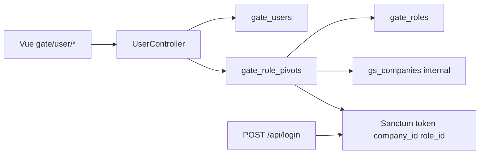

# User (Gate) — Technical Documentation

> **Draft — 2026-06-19** — Dokumentasi AS-IS dari kode production. Belum review QA/PM; jangan jadikan referensi final.

## 1. Architecture Overview

User list scoped via `withCompanyScope()`. Role assignment writes `RolePivot` and invalidates Sanctum tokens.

## 2. Frontend File Map

**Root:** `olshoperp-frontend/src/pages/gate/user/`

| File | Role | Key API |
|------|------|---------|
| `DataLists.vue` | Index datalist, bulk update | `GET/POST gate/user`, `POST gate/user/bulk-update` |
| `Form.vue` | Create/edit/profile | `POST/PUT gate/user`, `gate/user/profile/{id}` |
| `RoleAssignment.vue` | Assign company+role | `GET .../show/assign`, `POST .../assign`, `DELETE assign/delete/{pivot}` |
| `Detail.vue` | Read-only detail | `GET gate/user/{id}` |
| `Help.vue` | Help content | — |

**Router:** `src/router/index.ts` — paths `/gate/user`, `/gate/user/create`, `/gate/user/edit/:id`, `/gate/user/profile/:id`

## 3. Backend File Map

| File | Role |
|------|------|
| `Modules/Gate/Http/Controllers/UserController.php` | CRUD, assign, bulk, profile, select2 |
| `Modules/Gate/Http/Controllers/RoleAssignmentController.php` | Delete assignment |
| `Modules/Gate/Entities/User.php` | Model `gate_users` |
| `Modules/Gate/Entities/RolePivot.php` | Model `gate_role_pivots` |
| `Modules/Gate/Policies/UserPolicy.php` | Authorization |
| `Modules/Gate/Policies/RolePivotPolicy.php` | Assignment policy |
| `Modules/Gate/Database/Seeders/ModuleMenu/GateMenuSeeder.php` | Menu id 5 (User), 162 (Role Assignment) |

## 4. API Routes

Prefix: `api/gate` — middleware `auth:sanctum`, `auth_verified`

| Method | Path | Action |
|--------|------|--------|
| GET | `/user` | index (datalist) |
| POST | `/user` | store |
| GET | `/user/{user}` | show |
| PUT/PATCH | `/user/{user}` | update |
| DELETE | `/user/{user}` | destroy |
| GET | `/user/{user}/audit` | audit |
| GET | `/user/{user}/show/assign` | indexAssignUser |
| POST | `/user/{user}/assign/` | storeUserRoleCompany |
| DELETE | `/user/assign/delete/{role_pivot}` | destroyAssignUser |
| POST | `/user/bulk-update` | bulkUpdate |
| PUT | `/user/profile/{user}` | updateProfile |
| GET | `/user/profile/{user}` | showProfile |
| POST | `/user/change-password` | changePassword |
| POST | `/user/upload-image` | uploadImage |
| GET | `/user/select2`, `/user/select2/company`, `/user/select2/role` | select2 |

## 5. Database Schema

| Table | Key columns |
|-------|-------------|
| `gate_users` | username, email, password, first_name, last_name, status, is_master_user, is_employee, is_all_company, is_multi_device_allowed, email_verified_at, company_id, role_id, image |
| `gate_role_pivots` | user_id, company_id, role_id, is_default_company, owned_by |

## 6. Jobs / Observers / Events

| Component | Notes |
|-----------|-------|
| `UploadJob` / `DeleteFileJob` | Profile image upload |
| Token revoke | `$user->tokens()->forceDelete()` on role assign |

## 7. Related db-schema docs

- `gate_users`, `gate_role_pivots` — cek `docs/db-schema/` jika tersedia
