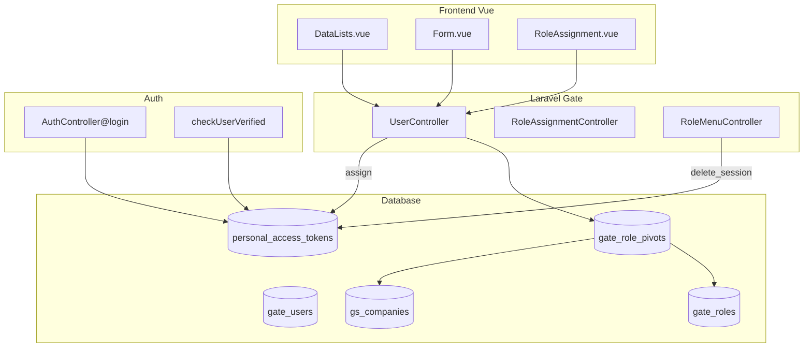

# Master User — Technical Documentation

**UI route:** `/gate/user`  
**API base:** `{VITE_API_URL}gate/user`  
**Models:** `User`, `RolePivot`

---

## 1. Architecture Overview



---

## 2. Frontend File Map

**Root:** `olshoperp-frontend/src/pages/gate/user/`

| File | Role | Key API |
|------|------|---------|
| `DataLists.vue` | Datalist, bulk status, export, column filter | `GET gate/user`, `POST bulk-update` |
| `Form.vue` | User info, toggles, image, audit | `POST/PUT gate/user/{id}` |
| `RoleAssignment.vue` | Company+role assign grid | `GET .../show/assign`, `POST .../assign` |
| `Detail.vue` | Read-only | `GET gate/user/{id}` |
| `Help.vue` | Help panel | — |

### Router

| Route | Component |
|-------|-----------|
| `gate/user` | `DataLists.vue` |
| `gate/user/create` | `Form.vue` |
| `gate/user/edit/:id` | `Form.vue` |
| `gate/user/profile/:id` | `Form.vue` (self-service) |

### FE Notes

| Feature | Implementation |
|---------|----------------|
| Datalist flags | `form_gate_user=true` → render Status, Last Active, Created By |
| Column filter | `filter_column=true` |
| Assign Employee toggle | **`disabled`** always in Form.vue |
| Password meter | `vue-simple-password-meter` (visual only) |
| Default toggles create | `status=true`, `is_verified=true`, `is_all_company=false`, `is_multi_device_allowed=false` |

---

## 3. Backend File Map

| File | Role |
|------|------|
| `Modules/Gate/Http/Controllers/UserController.php` | CRUD, assign, bulk, profile, select2, checkUserVerified |
| `Modules/Gate/Http/Controllers/RoleAssignmentController.php` | Delete pivot |
| `Modules/Gate/Entities/User.php` | Model, `createToken()`, `can_select`, employee relations |
| `Modules/Gate/Entities/RolePivot.php` | Assignment pivot |
| `Modules/Gate/Policies/UserPolicy.php` | Authorization |
| `App/Http/Controllers/Auth/AuthController.php` | Login, default company resolution |
| `Modules/Gate/Http/Controllers/RoleMenuController.php` | Privilege save + mass token expire |
| `Modules/HumanResources/Http/Controllers/EmployeeController.php` | Link user ↔ employee, set `is_employee` |

---

## 4. API Routes

Prefix: `gate/user` (middleware `auth:sanctum`, `auth_verified`)

| Method | Path | Action |
|--------|------|--------|
| GET | `/user` | index datalist |
| POST | `/user` | store |
| GET | `/user/{user}` | show |
| PUT/PATCH | `/user/{user}` | update |
| DELETE | `/user/{user}` | destroy |
| GET | `/user/{user}/audit` | audit |
| GET | `/user/{user}/show/assign` | indexAssignUser |
| POST | `/user/{user}/assign/` | storeUserRoleCompany |
| DELETE | `/user/assign/delete/{role_pivot}` | destroyAssignUser |
| POST | `/user/bulk-update` | bulkUpdate |
| PUT | `/user/profile/{user}` | updateProfile |
| GET | `/user/profile/{user}` | showProfile |
| GET | `/user/profile/verified` | checkUserVerified |
| POST | `/user/change-password` | changePassword |
| GET | `/user/select2`, `/select2/company`, `/select2/role` | dropdowns |

---

## 5. Database

### 5.1 `gate_users`

| Column | Notes |
|--------|-------|
| `username`, `email`, `password` | Login credentials |
| `first_name`, `last_name` | Display name |
| `status` | Active toggle |
| `email_verified_at` | Is Verified toggle |
| `is_all_company` | Show for All Company |
| `is_multi_device_allowed` | Multi-device |
| `is_employee` | HR flag — set from Employee module |
| `is_master_user` | One per company (company_id > 2) |
| `employee_id` | Optional direct FK |
| `image`, `description` | Profile |
| `last_actived_at` | Updated via checkUserVerified (10 min cache) |
| `owned_by` | Company scope |

### 5.2 `gate_role_pivots`

| Column | Notes |
|--------|-------|
| `user_id`, `company_id`, `role_id` | Assignment |
| `is_default_company` | Single default per user (enforced in controller) |
| `owned_by` | Data owner |

---

## 6. Business Logic

### 6.1 Login (`AuthController@login`)

1. Find user: `status=1` AND `email_verified_at NOT NULL`
2. Resolve company: default pivot → fallback first pivot (active company)
3. If `!is_multi_device_allowed` → delete all existing tokens + broadcast logout toast
4. `createToken(name, company_id, role_id)`
5. Web session: `auth.company_id`, `auth.role_id`, `auth.token_id`

### 6.2 Default Company (`storeUserRoleCompany`)

```php
// After create/update pivot:
if ($user->roles()->where('is_default_company', true)->exists()) {
    // Auto-switch: unset default on all OTHER pivots
    $real_default = $user->roles()->where('company_id', $request->company_id)->first();
    $user->roles()->where('id', '!=', $real_default->id)->update(['is_default_company' => false]);
} else {
    // Auto-default: latest pivot
    $user->roles()->orderBy('id', 'DESC')->first()->update(['is_default_company' => true]);
}
$user->tokens()->forceDelete();
```

### 6.3 Multi-Device (`checkUserVerified`)

Poll endpoint — if `!is_multi_device_allowed`, delete token if not latest.

Also requires `email_verified_at` + `status` for `auth: true`.

### 6.4 Role Privilege Mass Logout

`RoleMenuController@delete_session($role_id)`:

```php
$userIds = RolePivot::where('role_id', $role_id)->pluck('user_id');
DB::table('personal_access_tokens')
    ->whereIn('tokenable_id', $userIds)
    ->update(['expires_at' => now()]);
```

### 6.5 HR Employee Link

`EmployeeController` — assign user to employee sets `user.is_employee = true`, creates `hr_employee_detail_users`. Toggle di User form **disabled** — read-only indicator.

### 6.6 Role Select2

`RoleController@select2Role` — all active roles, **no company scope filter**. FE maps `can_select` if present on model.

---

## 7. Validation Summary

| Context | Key rules |
|---------|-----------|
| store | username alpha_dash unique; email unique; password required; confirm min:8 same |
| update | password nullable min:8 confirmed; unique ignore self |
| assign | role_id + company_id required; internal active company; active role; not self |

---

## 8. Audit

`auditDatatable($user->load(['roles' => withTrashed]))` — includes soft-deleted pivots in relation audit.

---

## 9. Integration Points

| Consumer | Usage |
|----------|-------|
| [Master Role](../gate-role/technical.md) | Role options; RoleMenu save → mass logout |
| [Internal Company](../generalsetting-internal-company/technical.md) | Company options in assignment |
| HR Employee | `employee_detail_user`, `is_employee` flag |
| Sanctum / Sidebar | Token `company_id`, `role_id`; menu from RoleMenu |
| User Profile | Switch company from pivots |

---

## 10. Known Gaps & Pending Items (Summary)

Detail lengkap AS-IS per gap: [requirement §13](./requirement.md#13-known-gaps--as-is-detail).  
Registry pending close: [requirement §14](./requirement.md#14-pending-items-registry--harus-segera-di-close).

| Gap | Pending ID | Priority | Status |
|-----|------------|----------|--------|
| Assign to Employee toggle disabled | P-01 | High | 🔴 Open |
| Role select2 no public/private filter | P-02 | High | 🔴 Open |
| Revert is_all_company not blocked | P-05 | High | 🔴 Open |
| Password create min asymmetric | P-09 | Medium | 🔴 Open |
| Session not instant on verified OFF | P-10 | High | 🔴 Open |
| Delete user UI hidden | G-06 | Medium | 🔴 Open (PM decision) |
| Datalist ID column missing | P-07 | Low | 🟡 Doc |
| Export column spec | P-06 | Medium | 🟡 Doc |
| Audit pivot E2E | P-08 | Medium | 🟡 QA |
| Auto-switch default | P-03 | — | 🟢 Verified |
| Auto-default latest pivot | P-04 | — | 🟢 Verified |
| Master User field (BE only) | G-08 | — | 🟡 PM decision |

---

## Related Documents

| Doc | Path |
|-----|------|
| Requirement | [requirement.md](./requirement.md) |
| Knowledge Base | [knowledge-base.md](./knowledge-base.md) |
| Master Role | [../gate-role/technical.md](../gate-role/technical.md) |
| Internal Company | [../generalsetting-internal-company/technical.md](../generalsetting-internal-company/technical.md) |
| API Auth | `olshoperp/.cursor/rules/06-api-authentication.mdc` |
