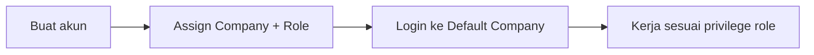

# Panduan Pengguna — User (Master User)

**Siapa yang baca:** admin / Super User yang mengatur akun login  
**Menu:** Developer Setting → Setting → User  
**Route:** `/gate/user`

---

## 1. Apa Itu & Kenapa Penting

**User** mengelola siapa yang boleh masuk OlshopERP: nama, email, password, dan **akses per company + role**.

Tanpa assignment company & role yang benar, orang tidak bisa kerja di company yang tepat — atau malah masih bisa login padahal seharusnya sudah diblok.

---

## 2. Overview Flow & Proses Bisnis

**Versi teks:**

1. Buat user (nama, email, username, password).  
2. Assign **Company + Role** (bisa lebih dari satu company).  
3. User login masuk ke **Default Company**.  
4. Hak menu mengikuti role di company itu.

### Status yang sering dipakai

| Pengaturan | Arti |
|------------|------|
| Active ON + Is Verified ON | Bisa login |
| Active OFF atau Is Verified OFF | Tidak bisa login |
| Allow Multi-Device OFF | Login baru menggantikan device lama |
| Default Company | Company yang dipakai otomatis saat login |

---

## 3. Sebelum Mulai

- Company internal sudah ada (Internal Company).  
- Role sudah dibuat di menu **Role**.  
- Siapkan email & username yang unik.

🎬 [Interactive demo akan ditambahkan di sini]

---

## 4. Setelah Selesai

- User bisa login ke Default Company.  
- Kalau assignment atau privilege role diubah, user biasanya **logout otomatis** — minta mereka login lagi.  
- Tidak ada tombol Delete user di daftar — nonaktifkan atau cabut verifikasi.

---

## 5. Yang Perlu Diperhatikan

- Kalau kamu matikan **Active** atau **Is Verified**, user tidak bisa login.  
- Kalau kamu tidak set Default Company, sistem memakai baris assignment pertama/terbaru.  
- Kalau kamu assign ulang user ke company yang sama, role **diganti**, bukan ditambah.  
- Kalau kamu tidak izinkan multi-device, login di HP baru bisa mengeluarkan session di laptop.  
- Kalau kamu coba hapus baris Default Company, sistem menolak — pindahkan default dulu.  
- Toggle **Assign to Employee** tidak bisa diklik di sini — link karyawan dari modul HR.

---

## 6. Langkah-Langkah

1. Buka **User** → **Create**.  
2. Isi First Name, Last Name, Email, Username, Password + ketik ulang.  
3. Pastikan Active dan Is Verified ON (kecuali akun belum boleh login).  
4. **Save & Next** → isi Role Assignment: pilih Company, pilih Role, set Default bila perlu → **Save**.  
5. Ulangi assignment untuk company lain jika perlu.

🎬 [Interactive demo akan ditambahkan di sini]

---

## 7. Tips & Hal yang Sering Bikin Bingung

- **Login gagal padahal Active ON** → cek Is Verified; keduanya harus ON.  
- **User logout sendiri** → normal setelah ubah role/assignment, atau ada yang login di device lain (multi-device OFF).  
- **"Cannot edit your own role data"** → minta admin lain yang ubah.  
- **Tidak bisa hapus user dari daftar** → by design; pakai Deactivate / Is Verified OFF.  
- **Contoh:** Budi Admin di PT A dan Staff di PT B → boleh. Assign lagi Budi di PT A sebagai Manager → Budi jadi Manager di PT A (bukan Admin + Manager).

---

## 8. Referensi

| Sumber | Untuk apa |
|--------|-----------|
| [Knowledge Base](./knowledge-base.md) | Troubleshooting operator |
| [Requirement](./requirement.md) | Validasi & pending items |
| [Technical](./technical.md) | Developer |
| [Role](../gate-role/user-guide.md) | Privilege menu |
