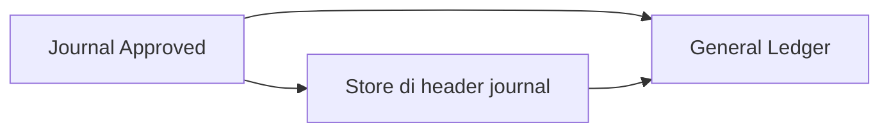

# General Ledger Report — Panduan Pengguna

**Siapa yang baca:** finance, accounting ops, support  
**Menu:** Accounting → Report → **General Ledger**  
**Route:** `/accounting/general-ledger`

---

## 1. Apa Itu & Kenapa Penting

General Ledger (GL) menampilkan **semua baris jurnal** per akun (Chart of Account) dalam periode yang kamu pilih. Ini laporan baca saja — kamu tidak membuat transaksi di sini, tapi **memantau mutasi debit/kredit** yang sudah **Approved**.

Kolom **Store** membantu melihat transaksi terkait toko/platform mana, asalkan store sudah tercatat di **header journal** (bukan langsung dari invoice/payment).

---

## 2. Overview — dari journal ke GL

**Versi teks:**

1. Transaksi (invoice, payment, manual journal, dll.) menerbitkan **journal** berstatus **Approved**.
2. Store (jika ada) tercatat di **header journal**.
3. GL menampilkan baris detail jurnal per COA, termasuk kolom **Store** dari header itu.

---

## 3. Sebelum Mulai

- [ ] Punya akses menu General Ledger  
- [ ] Journal yang ingin dilihat sudah **Approved**  
- [ ] Siapkan rentang tanggal (default: **bulan berjalan**)  
- [ ] (Opsional) Siapkan nama store atau kode COA untuk filter

---

## 4. Langkah-Langkah

1. Buka **General Ledger**. Data default = transaksi **bulan berjalan**.
2. Baca baris per COA — header group menampilkan **kode dan nama akun**.
3. Kolom **STORE**: nama toko dari header journal; `-` = journal tanpa store di header.
4. Klik **TRX. CODE** untuk membuka journal sumber.
5. **Global search** atau **Advanced Filter** → kolom **Store** untuk cari nama store.
6. **Export All** jika perlu file Excel (kolom Store ikut ter-export).

**Contoh:** Cari mutasi akun Kas yang terkait store Shopee bulan ini → filter tanggal + Advanced Filter Store contains "Shopee".

---

## 5. Yang Perlu Diperhatikan

| Kalau kamu… | Maka… |
|-------------|--------|
| Tidak melihat transaksi | Cek status journal harus **Approved**; cek filter tanggal dan company |
| Kolom Store `-` padahal invoice punya store | Store belum masuk **header journal** — bukan bug filter GL; hubungi tim dev jika transaksi seharusnya punya store |
| Satu journal, banyak store | Nama store tampil dipisah koma; hover tooltip untuk daftar lengkap |
| Filter Store tidak menemukan baris | GL hanya baca store di header journal, bukan field store di menu lain |
| Settlement — baris AR Store `-` | Journal AR dari settlement saat ini sering belum menulis store ke header (gap sistem — lihat FAQ) |
| Reject settlement | Tidak ada journal AR; baris SI/OB yang sudah jurnal **tetap ada** di GL |

---

## 6. Tips & Hal yang Sering Bikin Bingung

**Store vs menu sumber**  
GL **tidak** membaca store langsung dari Customer Invoice atau Payment. Yang tampil = store di **Journal → Basic Information**.

**Multi-store satu journal**  
Satu nomor journal bisa punya lebih dari satu store (mis. invoice gabungan beberapa order). GL menampilkan semua nama store terkait header itu.

**Opening / Ending Balance (export)**  
Di export Excel, saldo awal/akhir per baris masih **level akun (COA)**, bukan saldo berjalan per transaksi — improvement terpisah (requirement TO-BE).

**Settlement Approve vs Reject**  
- **Approve** → journal penerimaan (AR) terbit (store di GL AR bisa `-` sampai gap dev diperbaiki).  
- **Reject** → tidak ada journal AR; journal SI/OB dari upload **tetap** di GL.

---

## 7. Referensi

| Dokumen | Untuk |
|---------|-------|
| [requirement.md](./requirement.md) | Aturan bisnis, gap store pivot, TO-BE saldo |
| [knowledge-base.md](./knowledge-base.md) | FAQ operator & troubleshooting |
| [technical.md](./technical.md) | Detail API/filter/export |
| [Journal](../journal/user-guide.md) | Cara isi store di header journal manual |
| [feature-map.md](./feature-map.md) | Indeks capability + Lingo |
