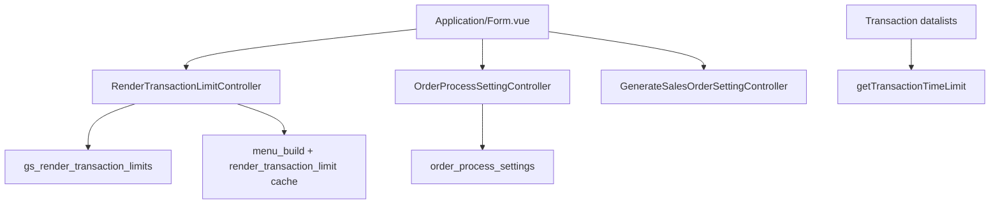

# Application (General Settings) — Technical Documentation

> **Draft — 2026-06-19** — Dokumentasi AS-IS dari kode production. Belum review QA/PM; jangan jadikan referensi final.

## 1. Architecture Overview

## 2. Frontend File Map

**Root:** `olshoperp-frontend/src/pages/master/Application/`

| File | Role | Key API |
|------|------|---------|
| `Form.vue` | All settings sections | See below |

**Router:** `/generalsetting/application` (name: `generalsetting_application_index`)

| FE action | API |
|-----------|-----|
| Load transaction window | `GET generalsetting/render-transaction-limit` |
| Save transaction window | `POST generalsetting/render-transaction-limit` |
| Audit | `GET generalsetting/render-transaction-limit/audit` |
| Load SO toggles | `GET generalsetting/order-process-setting` |
| Save SO toggles | `POST generalsetting/order-process-setting` |
| Generate SO settings | `GET/POST generalsetting/generate-so-setting` |
| Global broadcast | `POST generalsetting/global-broadcast` |

## 3. Backend File Map

| File | Role |
|------|------|
| `Modules/GeneralSetting/Http/Controllers/RenderTransactionLimitController.php` | Transaction window |
| `Modules/GeneralSetting/Http/Controllers/OrderProcessSettingController.php` | SO process toggles |
| `Modules/GeneralSetting/Http/Controllers/GenerateSalesOrderSettingController.php` | Generate SO dev tool |
| `Modules/GeneralSetting/Http/Controllers/NotificationController.php` | global-broadcast |
| `Modules/GeneralSetting/Entities/RenderTransactionLimit.php` | Model |
| `Modules/GeneralSetting/Entities/OrderProcessSetting.php` | Model |

## 4. API Routes

| Method | Path | Controller |
|--------|------|------------|
| GET | `/render-transaction-limit` | index |
| POST | `/render-transaction-limit` | store (upsert) |
| GET | `/render-transaction-limit/audit` | audit |
| GET | `/render-transaction-limit/get-transaction-time-limit` | getTransactionTimeLimit |
| GET | `/order-process-setting` | OrderProcessSetting index |
| POST | `/order-process-setting` | OrderProcessSetting store |
| GET/POST | `/generate-so-setting` | GenerateSalesOrderSetting resource |
| POST | `/global-broadcast` | NotificationController send |

## 5. Database Schema

| Table | Columns |
|-------|---------|
| `gs_render_transaction_limits` | in_days, include_virtual_wh_void, owned_by |
| `order_process_settings` | auto_approve, process_to_wave, instant_processing, owned_by |

## 6. Jobs / Observers / Events

| Job | Trigger |
|-----|---------|
| `GenerateSODetailRandomJob` | process_to_wave changed |
| Cache forget | render limit + menu_build on save |

## 7. Related db-schema docs

- `gs_render_transaction_limits`, `order_process_settings`
