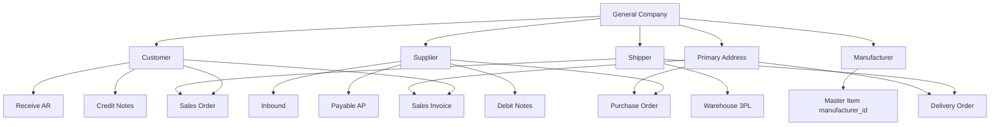

# General Company — Requirement Detail

**Modul:** General Setting (Master Data)  
**Audience:** PM, QA, Developer  
**Status:** Draft — diverifikasi terhadap codebase per 2026-06-24; item **GAP** perlu keputusan PM/dev.

> Sumber: konsolidasi `general_company_requirement_1.md` (23 Jun 2026) + audit AS-IS backend `GeneralCompanyController` & frontend `Form.vue` / `DataListGeneralCompany.vue`.

---

## Daftar Isi

1. [Fungsi & Tujuan](#1-fungsi--tujuan)
2. [Datalist — Kolom & Fitur](#2-datalist--kolom--fitur)
3. [Tab General — Field Detail](#3-tab-general--field-detail)
4. [Tab Contacts](#4-tab-contacts)
5. [Tab Address](#5-tab-address)
6. [Tab Documents](#6-tab-documents)
7. [Tab Accounting Setting](#7-tab-accounting-setting)
8. [Tab Payment Type & Currency](#8-tab-payment-type--currency-setting)
9. [Tab Shipper (Warehouse 3PL)](#9-tab-shipper-warehouse-3pl)
10. [Tab Audit Log](#10-tab-audit-log)
11. [Toggle Default Shipper & Default Customer](#11-toggle-default-shipper--default-customer)
12. [Default Data Onboarding](#12-default-data-onboarding)
13. [Import General Company](#13-import-general-company)
14. [Validasi yang Berjalan](#14-validasi-yang-berjalan)
15. [UI/UX — Tombol & Perilaku](#15-uiux--tombol--perilaku)
16. [Relasi Menu Lain](#16-relasi-menu-lain)
17. [Acceptance Criteria](#17-acceptance-criteria)
18. [Known Gaps / Open Items](#18-known-gaps--open-items)
19. [Changelog](#19-changelog)

---

## 1. Fungsi & Tujuan

### 1.1 Apa itu General Company?

**General Company** menyimpan data perusahaan/pihak eksternal yang berinteraksi dengan internal company — **Customer**, **Supplier**, **Manufacturer**, dan **Shipper**.

### 1.2 Konsep Multi-Role

Satu baris data dapat mengaktifkan **lebih dari satu** toggle Recognize As secara bersamaan (contoh: Customer + Supplier) tanpa duplikasi master.

> **Pengecualian import:** file import hanya mendukung **satu** nilai Recognize As per baris (lihat §13).

### 1.3 Nilai Bisnis

| Kebutuhan | Jawaban |
|-----------|---------|
| Single source of truth mitra eksternal | Multi-role tanpa duplikasi |
| Default COA transaksi | Tab Accounting Setting per role |
| Autofill shipper/customer di SO | Toggle Default Shipper / Default Customer |
| Audit trail | Tab Audit Log |
| Integritas finansial | Validasi saldo & relasi transaksi |

---

## 2. Datalist — Kolom & Fitur

### 2.1 Kolom datalist (AS-IS)

| # | Kolom UI | Field backend | Keterangan |
|---|----------|---------------|------------|
| 1 | CODE & NAME | `code_name_formatted` | Gabungan code + name (kolom export) |
| 2 | CODE | `code` | Hidden default (`noVis`) |
| 3 | NAME | `name` | Hidden default |
| 4 | BUSINESS FIELD | `business_field_formatted` | Dari pivot `company_business_field` |
| 5 | AS CUSTOMER | `is_customer` | Badge Yes/No |
| 6 | AS SUPPLIER | `is_supplier` | Badge Yes/No |
| 7 | AS MANUFACTURER | `is_manufacturer` | Badge Yes/No |
| 8 | AS SHIPPER | `is_shipper` | Badge Yes/No |
| 9 | AS DEFAULT SHIPPER | `is_default_shipper` | Hidden default; filter SearchBuilder |
| 10 | AS DEFAULT CUSTOMER | `is_default_customer` | Hidden default; filter SearchBuilder |
| 11 | ACTIVE | `status_formatted` | Dari trait datalist standar |
| 12 | CREATED BY | `created_by_formatted` | Standar |
| 13 | DATA OWNER | `owner_company_formatted` | `owned_by` |

### 2.2 Fitur datalist (AS-IS — terverifikasi `DataListGeneralCompany.vue`)

| Fitur | Status | Catatan |
|-------|--------|---------|
| Global search | ✅ | Via DataTablesV3 |
| Advanced filter (SearchBuilder) | ✅ | Kolom role Yes/No pakai opsi 0/1 |
| Column show/hide | ✅ | `filter_column: true` |
| Export | ✅ | Standar DataTablesV3 |
| Show Deleted Data | ✅ | `is_show_deleted: true` |
| Bulk delete | ✅ | Checkbox multi-select |
| Row action (edit/delete) | ✅ | `action_button: true` |
| **Import** | ⚠️ **GAP** | API backend ada; **belum di-wire** di datalist FE |
| Create | ✅ | Tombol Create → `/generalsetting/general-company/create` |

### 2.3 Filter role Yes/No

Filter kolom `as_customer`, `as_supplier`, dll. menerima keyword: `y`, `ye`, `yes` atau `n`, `no` (case-insensitive). Keyword lain → hasil kosong.

---

## 3. Tab General — Field Detail

Panel **Basic Information** (`SimpleDisclosure` id `BasicInformation`).

| Field | Wajib? | Max | Keterangan |
|-------|--------|-----|------------|
| Code | **Ya** | 50 | Unique per `owned_by` |
| Name | **Ya** | 50 | |
| GST Number | Opsional | 50 | **GAP UI:** field di-comment di template FE; backend masih terima |
| NPWP Number | Opsional | 50 | |
| Business Field | Opsional | max **3** pilihan | Multiselect dari Master Business Field (active) |
| Description | Opsional | 150 | |
| Recognize As: Customer | — | — | Tooltip: *"Enable this toggle to designate the created company as your customer."* |
| Recognize As: Supplier | — | — | Tooltip: *"...as your supplier."* (bukan "customer" — typo requirement lama sudah diperbaiki di UI) |
| Recognize As: Shipper | — | — | Tooltip: *"...as a vendor for your logistics company."* |
| Recognize As: Manufacturer | — | — | Tooltip: *"...as your manufacturer."* |
| Set as Default Customer | — | — | Hanya jika `is_customer` ON (§11) |
| Set as Default Shipper | — | — | Hanya jika `is_shipper` ON (§11) |
| Active | — | — | Tooltip: data inactive tidak bisa dipakai relasi transaksi |

**Side effect saat create (AS-IS):**

- `is_shipper = 1` → auto-create warehouse 3PL child + pivot `gs_company_3pl_warehouse_pivots`
- `is_customer` atau `is_supplier` → auto-create `CompanyPaymentAndCurrencySetting` (currency IDR default)
- Role baru → copy COA default dari internal company (`createCompanyAccounting`)

---

## 4. Tab Contacts

Multi-contact; datalist nested + modal create/edit.

| Field | Wajib? | Max | Keterangan |
|-------|--------|-----|------------|
| Label | Opsional | 50 | |
| Name | Opsional | 50 | |
| Email | Opsional | 50 | Format email jika diisi |
| Mobile Number | Opsional | 50 | |
| Office Number | Opsional | 50 | |
| Fax Number | Opsional | 50 | |
| Other Number | Opsional | 50 | |
| Website | Opsional | 50 | |
| Active | — | — | Toggle status |

---

## 5. Tab Address

| Field | Wajib? | Max | Keterangan |
|-------|--------|-----|------------|
| Label | Opsional | 50 | |
| Country | **Ya** (create) | — | Master Country status Active |
| Province | **Ya** (create) | — | Terfilter by country |
| City | **Ya** (create) | — | Terfilter by province |
| District | Opsional | — | Terfilter by city |
| Subdistrict (Village) | Opsional | — | Validasi struktur region jika district+village diisi |
| Street | Opsional | 50 | |
| Post Code | Opsional | 50 | |
| Longitude / Latitude | Opsional | 50 | |
| Description | Opsional | 150 | |
| Set as Primary | — | — | **Single-primary rule** per company (§14) |
| Active | — | — | |

### 5.1 Cascading region

`Country → Province → City → District → Subdistrict`

### 5.2 Primary address (AS-IS — terverifikasi)

- Hanya **satu** alamat `is_primary = 1` per company pada satu waktu
- Saat set primary ON → semua alamat lain di company di-reset `is_primary = 0`
- Jika tidak ada primary dan user tidak centang primary → alamat pertama otomatis primary
- Saat hapus alamat primary → alamat terbaru (latest id) otomatis jadi primary
- **GAP:** inactive address yang masih primary — tidak ada auto-revoke primary saat inactive

---

## 6. Tab Documents

| Field | Wajib? | Max | Keterangan |
|-------|--------|-----|------------|
| Title | **Ya** | 50 | |
| Description | Opsional | 150 | |
| Release Date | **Ya** | date | |
| Valid Until | **Ya** | date | |
| Attach Document | **Ya** (create) | **2048 KB** (2 MB) | `config('upload.size.file')` |
| Active | — | — | |

**GAP:** tidak ada job/notifikasi reminder dokumen mendekati `valid_until_date`.

---

## 7. Tab Accounting Setting

### 7.1 Tujuan

Default COA untuk auto-journal. Field yang tampil bergantung Recognize As aktif. COA diambil dari **internal company** (`owned_by`).

### 7.2 Field per role (Transaction COA List)

**As Customer** (`company-as-customer` tagging):

| Field | Transaksi terkait |
|-------|-------------------|
| Account Receivable COA | Sales Invoice, Receive (AR) |
| Sales Discount COA | Sales Invoice |
| Customer's Deposit COA | Credit Notes |
| Deposit of Sales Return | Sales Return / deposit flow |

**As Supplier** (`company-as-supplier` tagging):

| Field | Transaksi terkait |
|-------|-------------------|
| Account Payable COA | Inbound, Payable (AP) |
| Purchase Discount COA | Inbound |
| Deposit to Supplier COA | Debit Notes |
| Deposit of Purchase Return | Purchase Return deposit |

### 7.3 Filter COA Class (AS-IS — `InternalCompanyController@select2Coa`)

Sistem memfilter COA child (bukan parent) status Active milik internal company. Class memakai field `chart_of_account_class.position` dengan istilah legacy **Activa** / **Passiva**.

| Field | TCL ID | Filter | Class diizinkan |
|-------|--------|--------|-----------------|
| Account Receivable COA | 1 | `DEFAULT_COMPANY_COA_ACTIVA` | **Activa** |
| Sales Discount COA | 2 | `DEFAULT_COMPANY_COA_ACTIVA_PASSIVA` | **Activa** atau **Passiva** |
| Customer's Deposit COA | 3 | `DEFAULT_COMPANY_COA_PASSIVA` | **Passiva** saja |
| Deposit of Sales Return | 31 | `DEFAULT_COMPANY_COA_PASSIVA` | **Passiva** |
| Account Payable COA | 4 | `DEFAULT_COMPANY_COA_PASSIVA` | **Passiva** |
| Purchase Discount COA | 5 | `DEFAULT_COMPANY_COA_ACTIVA_PASSIVA` | **Activa** atau **Passiva** |
| Deposit to Supplier COA | 6 | `DEFAULT_COMPANY_COA_ACTIVA` | **Activa** |
| Deposit of Purchase Return | 32 | `DEFAULT_COMPANY_COA_ACTIVA` | **Activa** |

> Istilah class di DB: `chart_of_account_class.position` = `Activa` / `Passiva`.

### 7.4 Auto Add VAT (AS-IS)

Bukan dropdown Master Tax per company — setting di kolom `gs_companies`:

| Field DB | Label UI | Nilai |
|----------|----------|-------|
| `auto_add_transaction_supplier` | Auto Add VAT as Supplier | `yes` / `no` / `default_by_product` |
| `auto_add_transaction_customer` | Auto Add VAT as Customer | `yes` / `no` / `default_by_product` |

Default saat create/import: `default_by_product`. Endpoint: `POST /general-company/{id}/vat`.

> Tabel `gs_company_vat_settings` ada di schema; assign `tax_id` per company di controller **di-comment** — tidak dipakai production.

### 7.5 Dampak Auto Add VAT di transaksi (SO & PO)

Mengontrol **apakah pajak produk otomatis terisi** saat tambah baris detail. Tarif dari **Product Tax** pivot / Default VAT produk — bukan satu tax default di header company.

#### Sales Order (customer)

| `auto_add_transaction_customer` | Perilaku |
|--------------------------------|----------|
| `yes` | Pajak penjualan produk selalu di-auto-add |
| `no` | Tidak auto-add; operator pilih manual |
| `default_by_product` | Auto-add hanya jika pivot produk `auto_add_transaction = true` |

**Kode:** `SalesOrderDetailController` (store detail, bundle, `select2Tax` + `customer_id`).  
**FE:** `SalesOrderGeneral/DatalistDetail.vue` — `select2-tax?customer_id=...`; auto-pilih tax dengan `auto_add_transaction = true`.

#### Purchase Order (supplier)

| `auto_add_transaction_supplier` | Perilaku |
|--------------------------------|----------|
| `yes` | Pajak pembelian produk selalu di-auto-add |
| `no` | Skip semua purchase tax pivot |
| `default_by_product` | Auto-add hanya pivot `auto_add_transaction = true` |

**Kode:** `PurchaseOrderDetailController` (bulk add, load PR detail).  
**Catatan:** PO `select2Tax` delegasi ke SO controller; FE PO belum kirim `supplier_id` — auto-add utama di backend saat store detail.

### 7.6 Select2 Customer/Supplier di transaksi

Dropdown customer/supplier di form transaksi hanya menampilkan company yang **sudah melengkapi semua COA wajib** untuk role tersebut (`select2Customer`, `select2Supplier`).

---

## 8. Tab Payment Type & Currency Setting

Komponen `PaymentType.vue` — inline save per field (`onInlineModelUpdate`).

| Field | Muncul jika | Fungsi |
|-------|-------------|--------|
| Default Currency | customer atau supplier | Satu field dipakai untuk PO & SO currency (`default_currency_id`) |
| Payment Term (Days) | customer atau supplier | `due_date_days` di `gs_companies` |
| Default PO Payment Type | supplier | `po_payment_type` → Master Payment Type |
| Default SO Payment Type | customer | `so_payment_type` → Master Payment Type |

**Sumber opsi:** Currency dari Master Currency; Payment Type dari tabel `scm_payment_types` (semi-master, bukan form master terpisah).

---

## 9. Tab Shipper (Warehouse 3PL)

Muncul jika `is_shipper` ON dan mode edit. Menampilkan `DataListShipperWarehouse` — tree warehouse 3PL yang ter-bind ke shipper.

Saat shipper dibuat/diaktifkan pertama kali, sistem otomatis:
1. Membuat (atau reuse) parent warehouse `3PL`
2. Membuat child warehouse dengan code/name = shipper company
3. Menyimpan pivot `Company3PLWarehousePivot`

---

## 10. Tab Audit Log

Slideover **Audit Log** dari side nav — komponen `AuditLogTables.vue`.

| Kolom (standar audit) | Keterangan |
|-----------------------|------------|
| Date | Timestamp perubahan |
| Source | Field / relasi yang berubah |
| Old Value / New Value | Nilai sebelum & sesudah |
| Action | create / update / delete |
| User | `created_by` / user audit |

Endpoint: `GET /general-company/{id}/audit` — memuat relasi contacts, addresses, documents, business field, accounting.

---

## 11. Toggle Default Shipper & Default Customer

### 11.1 Visibility

| Toggle | Syarat tampil |
|--------|---------------|
| Default Shipper | `is_shipper = 1` |
| Default Customer | `is_customer = 1` AND `page_type = general` |

### 11.2 Single-default rule (scope: per `owned_by`)

- Hanya **1** default shipper dan **1** default customer aktif per internal company
- Mengaktifkan default di company B → auto `is_default_* = 0` di company lain (pola sama Product COA Group)

### 11.3 Validasi tambahan (AS-IS, tidak di requirement PM)

- Tidak boleh **menonaktifkan** company yang sedang default shipper/customer
- Tidak boleh **mematikan** toggle default jika hanya tersisa 1 default di scope (`At least one default shipper/customer must remain active`)
- Tidak boleh **delete** company yang menjadi default shipper/customer

### 11.4 Integrasi Sales Order

| Skenario | Behavior AS-IS |
|----------|----------------|
| Create SO General manual | FE autofill `shipper_id` dari company `is_default_shipper = 1` (`SalesOrderGeneral/Form.vue`) |
| Clone SO Platform → General | BE set `customer_id` dari `is_default_customer = 1`; shipper dari default shipping service / platform binding |
| Import SO | Error terkait **Default Shipper Service** (bukan General Company shipper langsung) — lihat [Sales Order General](../sales-order-general/requirement.md) |

---

## 12. Default Data Onboarding

Saat internal company baru dibuat (`InternalCompanyController@generateGeneralCompany`), sistem seed 3 General Company:

| Code | Name | Role | Default Shipper |
|------|------|------|-----------------|
| CAHAYA | PT Cahaya Terang Bersinar | Customer | — |
| BUMI | PT Bumi Hijau Lestari | Supplier | — |
| OSERP | OLSHOPERP Shipper | Shipper | **ON** (+ warehouse 3PL) |

| Atribut | Nilai |
|---------|-------|
| `owned_by` | ID internal company baru |
| `is_all_company` | `0` (= data private per company, bukan shared global) |
| `created_by` | `0` (system) |

---

## 13. Import General Company

> **Catatan:** Import ini adalah template **tunggal** untuk bulk create General Company — **bukan** template per platform e-commerce. Template platform (Shopee, Tokopedia, dll.) ada di menu lain (mis. Sales Order Import, Settlement Upload).

### 13.1 Status implementasi

| Lapisan | Status |
|---------|--------|
| Backend `GeneralCompanyImport` | ✅ Implemented |
| API routes import/history/log | ✅ |
| UI datalist (tombol Import, download template) | ❌ **GAP — belum di FE** |

### 13.2 Format file

| Item | Nilai |
|------|-------|
| Ekstensi | `.xlsx`, `.xls`, `.csv` |
| Baris 1 (opsional) | Group header merge |
| Baris header data | Lihat tabel §13.3 |
| Encoding nilai sel | String explicit (PhpSpreadsheet binder) |

**Group header (baris 1, jika ada):**

| Kolom index | Teks |
|-------------|------|
| A | General Information |
| E | Accounting Setting as Customer |
| I | Accounting Setting as Supplier |

**Header kolom (baris 1 atau 2):**

| # | Header | Wajib | Keterangan |
|---|--------|-------|------------|
| A | Code | Ya | Max 50; unique per `owned_by` (non-deleted) |
| B | Name | Ya | Max 50 |
| C | Recognize As | Ya | **Satu** nilai: `customer`, `supplier`, `shipper`, `manufacture` |
| D | Description | Tidak | Max 150 |
| E | Account Receivable COA | Ya jika customer | Code COA (bukan ID) |
| F | Sales Discount COA | Ya jika customer | |
| G | Customer's Deposit COA | Ya jika customer | |
| H | Deposit of Sales Return | Ya jika customer | |
| I | Account Payable COA | Ya jika supplier | |
| J | Purchase Discount COA | Ya jika supplier | |
| K | Deposit to Supplier COA | Ya jika supplier | |
| L | Deposit of Purchase Return | Ya jika supplier | |

### 13.3 Validasi import (AS-IS)

| Rule | Pesan error (contoh) |
|------|----------------------|
| File kosong / header tidak match | `The file format does not match the General Company import template.` |
| Code kosong | `Row N: Code is required.` |
| Code duplikat dalam file | `Row N: Code {code} is duplicated in the import file.` |
| Code sudah ada di DB | `Row N: Code {code} has already been taken.` |
| Recognize As bukan satu nilai valid | `Row N: Recognize As must be only one value from customer, supplier, shipper, manufacture.` |
| COA wajib kosong | `Row N: {COA name} is required.` |
| COA tidak ditemukan | `Row N: {COA name} {code} was not found.` |
| COA adalah parent | `Row N: {COA name} {code} is parent COA.` |
| Format file salah | `The uploaded data format does not match the system template.` |

**Mode import:** all-or-nothing — jika ada error, seluruh batch gagal; log per baris disimpan ke `gs_general_company_import_logs`.

**Yang TIDAK dibuat saat import (GAP vs create manual):**

- Tidak set default shipper/customer
- Tidak create warehouse 3PL untuk shipper
- Tidak create contact/address/document
- Tidak multi-role per baris

### 13.4 API import

| Method | Path | Fungsi |
|--------|------|--------|
| POST | `/general-company/import` | Upload `file_attachment` |
| GET | `/general-company/import-history` | Riwayat import |
| GET | `/general-company/import-log` | Log error per baris |
| GET | `/general-company/check-import-log` | Cek ada log gagal |

---

## 14. Validasi yang Berjalan

### 14.0 Dua cara “menonaktifkan” — jangan dicampur

Di form ada **dua kontrol terpisah** dengan validasi berbeda:

| Kontrol UI | Field DB | Apa yang berubah |
|------------|----------|------------------|
| Toggle **Active** | `status` 1→0 | Company tidak bisa dipakai transaksi; **role Recognize As tetap** (Customer/Supplier/Shipper masih ON) |
| Toggle **Recognize As** OFF | `is_customer` / `is_supplier` / `is_shipper` / `is_manufacturer` 1→0 | Role/peran dicabut dari company |

**Contoh G-02 (saldo piutang/hutang & lock role customer):**

- User mematikan **Active** saat company masih **Customer** → saldo piutang **dicek**; ditolak jika masih outstanding. (Supplier: saldo hutang.)
- User mematikan toggle **Recognize As Customer** (customer 1→0):
  - Jika company **sudah pernah dipakai** di transaksi (SO, Customer Invoice, Delivery Order, Credit Note, PPC Work Order) → **ditolak**; toggle di UI **disabled** (`role_customer_locked`).
  - Jika belum dipakai di transaksi tetapi masih ada saldo piutang → **ditolak** (validasi existing).

### 14.1 Ringkasan validasi

| Validasi | Trigger | Behavior AS-IS |
|----------|---------|----------------|
| Active OFF saat default shipper/customer | `status` → 0 | **Ditolak** |
| Active OFF saat shipper punya shipping service | `status` → 0 + `is_shipper` | **Ditolak** |
| Active OFF dengan saldo piutang (masih Customer) | `status` → 0 + `is_customer` | **Ditolak** jika outstanding |
| Active OFF dengan saldo hutang (masih Supplier) | `status` → 0 + `is_supplier` | **Ditolak** jika outstanding |
| Recognize As Customer OFF saat sudah dipakai transaksi | `is_customer` 1→0 | **Ditolak**; toggle disabled di UI (`role_customer_locked`) |
| Recognize As Customer OFF | `is_customer` 1→0 | Cek saldo piutang → ditolak jika outstanding |
| Recognize As Supplier OFF | `is_supplier` 1→0 | Cek saldo hutang → ditolak jika outstanding |
| Recognize As Shipper OFF saat default shipper | `is_shipper` 1→0 + `is_default_shipper` | **GAP — tidak ditolak**; `is_default_shipper` di-reset ke 0 |
| Recognize As Shipper OFF saat ada shipping service | `is_shipper` 1→0 | **Tidak dicek** (hanya dicek saat Active OFF) |
| Recognize As Manufacturer OFF | `is_manufacturer` 1→0 | Tidak ada validasi relasi |
| Delete | `shipper_id` dipakai di Sales Order | **Ditolak** (satu-satunya cek relasi transaksi eksplisit) |
| Delete | default shipper / default customer | **Ditolak** |
| Delete | dipakai sebagai customer/supplier di PO, invoice, dll. | **Tidak dicek eksplisit** di `destroy()` (lihat §14.3) |
| Business Field > 3 | save | Error |
| Code unique | per `owned_by` | Enforced |

### 14.3 Delete — apa yang benar-benar dicek (G-03)

Method `GeneralCompanyController@destroy` hanya menjalankan **3 guard** sebelum soft-delete:

1. Ada record `SalesOrder` dengan `shipper_id` = company ini
2. `is_default_shipper = 1`
3. `is_default_customer = 1`

**Tidak ada** pengecekan eksplisit untuk misalnya:

- `customer_id` di Sales Order / Sales Invoice / Credit Note
- `supplier_id` di Purchase Order / Supplier Invoice / Debit Note
- `manufacturer_id` di Item
- Relasi lain

Artinya: requirement bisnis “tidak bisa hapus jika sudah dipakai transaksi” **lebih luas** daripada implementasi saat ini. Delete customer/supplier yang pernah dipakai di PO/invoice **bisa lolos** guard di atas (kecuali ada constraint DB lain saat runtime).

Pesan error delete yang muncul dari guard #1: `Cannot delete this data because it is already used in transaction.`

### 14.2 Pesan error utama

| Pesan |
|-------|
| `Cannot deactivate this company because it is set as the default shipper/customer.` |
| `Cannot deactivate this shipper because it is already associated with shipping services.` |
| `Cannot deactivate this company due to an outstanding customer receivable balance.` |
| `Cannot deactivate this company due to an outstanding supplier payable balance.` |
| `At least one default shipper/customer must remain active.` |
| `Cannot delete this data because it is already used in transaction.` (shipper SO) |

---

## 15. UI/UX — Tombol & Perilaku

### 15.1 Datalist (`DataListGeneralCompany.vue`)

| Tombol / Aksi | Fungsi |
|---------------|--------|
| **Create** | Navigasi ke form create |
| **Edit** (row action) | Buka `/generalsetting/general-company/edit/{id}` |
| **Delete** (row / bulk) | Soft delete via API; validasi §14 |
| **Show Deleted Data** | Toggle datalist include trashed |
| **Export** | Export visible columns |
| **Advanced Filter** | SearchBuilder pada kolom terdaftar |
| **Column visibility** | Show/hide kolom |

### 15.2 Form — Side navigation

| Item nav | Section | Checklist hijau |
|----------|---------|-----------------|
| Basic Information | Header company | `required_basic` |
| Contacts | Datalist contact | `required_contact` |
| Address | Datalist address | `required_address` |
| Documents | FormDocument | `required_document` |
| Accounting Setting | COA + Payment | `required_accounting` |
| Shipper | Warehouse tree | `required_shipper` (jika shipper) |
| Audit Log | Slideover | — |

Checklist dari `GET /general-company/{id}/required`.

### 15.3 Form — Tombol utama

| Tombol | Kapan | Fungsi |
|--------|-------|--------|
| **Save & Next** | Create general company | Submit create → redirect edit |
| **Save All** | Edit | Submit update semua field Basic Information |
| **Create** (Contacts/Address) | Edit + permission | Buka modal tambah |
| **Update / Delete** (modal nested) | Per baris contact/address/document | CRUD nested |
| **Bulk Delete** | Nested datalist | Hapus multi contact/address/document |

Accounting COA & VAT: **auto-save inline** saat pilih nilai (tidak menunggu Save All).

Payment Type fields: **auto-save inline** via `PaymentType.vue`.

### 15.4 Dialog konfirmasi

| Dialog | Trigger |
|--------|---------|
| Incomplete data | Save saat checklist belum lengkap — user bisa lanjut atau cancel |
| Delete confirmation | Hapus contact/address/document |

---

## 16. Relasi Menu Lain

### 16.1 Diagram

### 16.2 Tabel relasi (AS-IS)

| Menu | Field / relasi | Role GC | Wajib? |
|------|----------------|---------|--------|
| Purchase Order | `supplier_id`, currency, payment type, address | Supplier | Supplier wajib |
| Sales Order (General/Platform) | `customer_id`, `shipper_id`, currency, payment | Customer, Shipper | Sesuai tipe SO |
| Sales Invoice | `customer_id`, COA AR/discount | Customer | Ya |
| Customer Invoice / AR Receive | `customer_id` | Customer | Ya |
| Supplier Invoice / Inbound / AP | `supplier_id` | Supplier | Ya |
| Credit Notes | `customer_id`, deposit COA | Customer | Ya |
| Debit Notes | `supplier_id`, deposit COA | Supplier | Ya |
| Delivery Order | `customer_id`, `shipper_id`, address | Customer, Shipper | Shipper wajib |
| Master Item | `manufacturer_id` | Manufacturer | Opsional |
| PPC Work Order | `customer_id` | Customer | Opsional |
| PPC Aircraft Type | `manufacturer_id` | Manufacturer | Opsional |
| Shipping Service | `shipping_id` (shipper company) | Shipper | Ya untuk layanan kurir |
| Instant Settlement | via SO shipped WH 3PL | Shipper (rantai gudang) | Prasyarat settlement |
| Vendor Audit (QA) | `company_id` | General | Opsional |
| Point of Sales | referensi company | General | Konteks POS |

---

## 17. Acceptance Criteria

### 17.1 Default Shipper / Customer

- [ ] Toggle hanya muncul jika role induk aktif
- [ ] Single default per `owned_by` dengan auto-revoke
- [ ] SO General autofill shipper dari default
- [ ] Clone platform SO memakai `is_default_customer`
- [ ] Tidak bisa inactive/delete default tanpa mengganti default lain

### 17.2 Onboarding

- [ ] OSERP shipper terbuat dengan `is_default_shipper = 1` + warehouse 3PL

### 17.3 Validasi finansial

- [ ] Role customer/supplier tidak bisa OFF jika masih outstanding
- [ ] **TO-BE:** Active OFF juga cek outstanding (GAP saat ini)

### 17.4 Import

- [ ] Template header sesuai §13.3
- [ ] Validasi COA child & exists
- [ ] **TO-BE:** UI Import + download template di datalist

### 17.5 Accounting

- [ ] COA class filter sesuai §7.3
- [ ] Customer/supplier muncul di select2 transaksi hanya jika COA lengkap

---

## 18. Known Gaps / Open Items

| # | Item | Status | Catatan |
|---|------|--------|---------|
| G-01 | UI Import di datalist | Accepted | Backend cukup |
| G-02 | Saldo piutang/hutang saat **Active OFF**; lock **Recognize As Customer** jika sudah dipakai transaksi | **Resolved** | §14.0–14.1; `role_customer_locked` di `show` |
| G-03 | Delete hanya guard SO `shipper_id` + default flags | Open (manual QA) | §14.3 — dibiarkan AS-IS |
| G-04 | **Recognize As Shipper OFF** saat masih default shipper | **TO-BE** | Active OFF sudah ditolak; toggle role Shipper OFF masih lolos |
| G-04b | Shipper OFF saat punya shipping service | Open | Hanya dicek saat Active OFF |
| G-05 | Auto Add VAT di SO/PO | Documented | §7.5 |
| G-06 | Customer's Deposit = Passiva | Resolved | Selaras codebase |
| G-07 | GST hidden di UI | Low | |
| G-09 | Document expiry reminder | Accepted AS-IS | |
| G-10 | Primary address saat inactive | Low | |

---

## 19. Changelog

| Version | Date | Perubahan |
|---------|------|-----------|
| 2.2 | 2026-06-24 | Implement G-02: Active OFF cek saldo; lock customer role jika sudah dipakai transaksi |
| 2.1 | 2026-06-24 | Klarifikasi G-02/G-03/G-04; perluas §7.5 VAT transaksional SO/PO; selaraskan G-06 |
| 2.0 | 2026-06-24 | Konsolidasi requirement PM + verifikasi codebase; tambah §13 Import, §15 UI/UX, §18 Gaps |
| 1.1 | 2026-06-23 | Cross-reference Instant Settlement |
| 1.0 | 2026-06-19 | Draft AS-IS awal |

## Related Documents

| Doc | Path |
|-----|------|
| Knowledge Base | [knowledge-base.md](./knowledge-base.md) |
| Technical | [technical.md](./technical.md) |
| Instant Settlement | [../accounting-settlement-upload/requirement.md](../accounting-settlement-upload/requirement.md) |
| Sales Order General | [../sales-order-general/requirement.md](../sales-order-general/requirement.md) |
